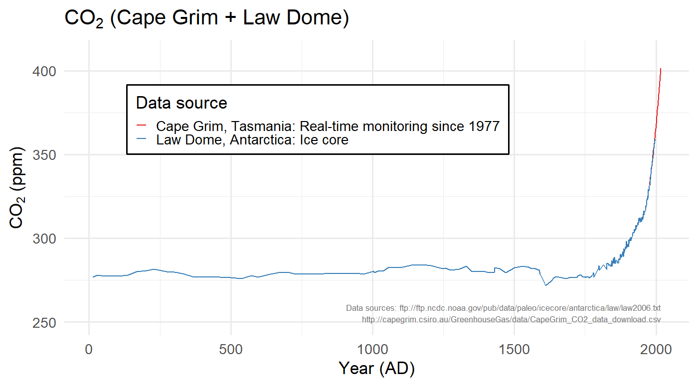

## Some Housekeeping: {.eighty .leftslide}

* The main class website is at <https://ees3310.jgilligan.org>
* Copies of the 
    * syllabus, 
    * reading assignments, 
    * lab assignments,
      * readings
      * instructions
      * files you will use for the labs
    * slides from class (also link from QR code on title slide)
* Links to helpful resources.
* {+} Slides:
  * The title slide has QR code with link to online version.
  * PDF versions are also posted to course web site (link on title slide)
  * Slides have two-dimensional navigation (in a browser, hit "?" for help)

# Is the Climate Changing? {data-transition="fade-out" .center}

## Is the Climate Changing? {data-transition="fade"}

> -   What does it mean for climate to change?
> -   How would you know whether it's changing?

## Is the Climate Changing? {.center data-transition="fade-in" data-background="#FF1010" style="color:yellow;"}

::: {style="color: yellow;"}

> * 2020 was the hottest year on record.
> * 2016 was the second hottest (statistical tie).
> * 2019 was the third hottest.
> * 2017 was the fourth hottest.
> * 2015 was the fifth hottest.
> * 2018 was the sixth hottest.

[The last six years were the hottest six years on record.]{.fragment}

[19 of the 20 hottest six years on record happened in the last 20 years.]{.fragment}

:::

## Nashville {.center}

> * This January morning is 52&deg;F.
> * Before 1980, it used to go below 0&deg;F an average of once a winter
> * The last time it went below 0 was Feb. 1996
> * Before 1980, the average winter got 12 inches of snow
> * Since 2000, we only get a little more than 4 inches on average.

## Are People Causing Climate to Change?

> -  How can we tell?
> -  How certain can we be?

------

### How Will Climate Change Affect Our Lives in Years to Come? 

> -  What kinds of changes might affect us?
> -  How can we tell whether they will happen?
>     -  And when?
>     -  And how severely?

<!--- dummy for formatting --->{data-transition="fade-in" data-background="#FF1010"}
------

::: {style="color: yellow;"}

### Dangerous heat waves becoming more common. {style="color:yellow;"}

> * Two of the ten deadliest heat waves in history happened in 2015.
> * Six of the ten deadliest heat waves happened since 2000.
> * Huge heat wave May/June 2017 stretching from Middle East to
>   Europe and across Asia.
> * June 2017 heat wave in Phoenix AZ was too hot for many airplanes to fly.
>   More than 40 flights grounded.
> * Summer 2020: Record-breaking temperatures in California, Siberia, etc.

:::

# What Does Science Say?  {.center}

## How Can We Answer These Questions?

> *  How can you know whether climate is changing?
> *  How can you know what's causing it?
> *  How can you know what it will do in the future?

 

> *  How can you persuade someone else?
> *  What would you need to know to be more certain?
> *  If it is a problem ...
>     -  What can we do about it?
>     -  What should we do about it?

<!-- --> {.center}
------

{height="800px"}

# Nuts and Bolts about the Course  {.center}

## Goals for the Course

 

::: {.fragment style="vertical-align:top; display:inline-block;"}

* Scientific Understanding:
    * What do we know about climate?
    * How do we know it?
    * How certain are we?

:::
::: {.fragment style="vertical-align:top; display:inline-block;"}

* Applied to:
    * Past climate conditions
    * Causes of climatic change
    * Predictions of future climate change
    * Impact of climate on people's lives

:::

## Structure of the Course {.ninetyfive}

::::::{style="text-align: left; margin-left: 20%;"}
::: {.fragment}

* Science
  * What determines the earth's temperature?
  * What are people doing that might change this?
  * What do we observe?
  * How will things change in the future?

:::
::: {.fragment}

* Policy:
  * How will these changes affect people's lives?
  * What can we do?
  *  **How much will it cost?**
  * What actions will others agree to?

:::
::::::

# Overview of the Semester  {.center}

<!--- dummy for formatting ---> {data-background="#FFF0F0"}
------

### Textbooks

<table>
<tr style="vertical-align:middle; text-align:center"><td></td><td style="vertical-align:middle;">David Archer, <i>Global Warming: Understanding the Forecast (2nd&nbsp;Edition)</i></td></tr>
<tr style="vertical-align:middle; text-align:center"><td></td><td style="vertical-align:middle;">William Nordhaus, <i>The Climate Casino</i></td></tr>
<tr style="vertical-align:middle; text-align:center"><td></td><td style="vertical-align:middle;">Roger A. Pielke, Jr., <i>The Climate Fix</i></td></tr>
<tr style="vertical-align:middle; text-align:center"><td></td><td style="vertical-align:middle;">Hadley Wickham & Garrett Grolemund, <i>R for Data Science</i> (Free web version online at <a href="http://r4ds.had.co.nz/" target="_blank"><code>http://r4ds.had.co.nz/</code></a>)</td></tr>
</table>

## Laboratory {.seventy}

:::::: {.columns}
::: {.column style="width:49%"}

* Goals:
  * Download and analyze climate data
  * Work with interactive computer models
  * Learn about __reproducible research__
* {+} Computational Tools:
  * Free, open source
  * R and RStudio for data analysis
  * Markdown and RMarkdown for writing reports
  * git and Github for managing files

:::
::: {.column style="width:49%"}

* {+} Today in lab:
  * Introduction to software tools
  * Be ready to use your computer to follow along.
  * Sign up for free account on github.com
* {+} Later this week...
  * Read introductory documentation for lab tools
  * Start playing with R and RStudio
  * This week's lab is low-stakes: full credit for trying.
* {+} Next Monday, we will begin learning R in depth and applying it to 
  analyzing climate data.

:::
::::::

## Class and Lab Material {.eighty}

* Main source of material: [ees3310.jgilligan.org](https://ees3310.jgilligan.org)
  * Syllabus
  * Reading assignments for the semester
    * Do the assigned reading **before** class on the day it's assigned for.
  * Reading and assignments for Lab
* Slides from class:
  * Web-based and PDF versions
  * Posted on [ees3310.jgilligan.org/schedule/](https://ees3310.jgilligan.org/schedule/)
  * {+} Slides:
    * The title slide has QR code with link to online version.
    * PDF versions are also posted to course web site (link on title slide)
    * Web-based slides have two-dimensional navigation (in a browser, hit "?" for help)

## Participation

* Brightspace discussion boards:
  * Boards for asking questions about readings, labs, lectures
  * Board for weekly discussions
    * Each week, I will post a discussion question
    * Participation credit for making at least 2 posts:
      1. Starting a thread or making a very substantive comment on someone 
         else's thread  (by noon on Thursday)
      2. Responding to someone else (before the end of the day Sunday)
    * Be civil, respectful, and kind. It's fine to disagree, but do so 
      constructively and respectfully.
      
## This week's discussion

Two things to do:

1. Introduce yourself to the class: Who are you, what are your insterests,
   why are you interested in climate change?

2. The weekly discussion: Two questions about the readings for Wednesday.
   Choose one to respond to.

# Science, Policy, and Climate {.center}

## Science of Climate

> * What determines earth’s temperature?
>   -  Sunlight
>   -  Greenhouse effect
>   -  Other factors
> * Chemistry of the atmosphere:
>   -  What are greenhouse gases?
>   -  What happens when people release them into the atmosphere?
> * Consequences of climate change

## Climate Policy

> * What are consequences of climate change?
>   -  What alternatives to fossil fuels?
>   -  What would they cost?
> * How to transition to low-carbon energy?
> * Who should pay?
> * How to build political agreement?

# How Politicians Talk about Climate Change {.center data-transition="fade-out"}

## Stereotype of Democrats {data-transition="fade"}

<video width=1200 height=800 controls>
<source src="/static/video/Clinton.mp4" type="video/mp4">
Video of Hillary Clinton in 2016, saying, "We're going to put a lot of coal miners
and coal companies out of business"
</video>

## Stereotype of Republicans {data-transition="fade"}

<video width=1200 height=800 controls>
<source src="/static/video/Blackburn_on_climate.mp4" type="video/mp4">
Video of Marsha Blackburn in 2016, saying, "The earth is no longer warming, and has
not for the past 13 years. It has begun to cool."
</video>

## It Wasn't Always Like This {data-transition="fade"}

<video width=1200 height=800 controls>
<source src="/static/video/gop_warming_statements.mp4" type="video/mp4">
Video of many Republicans, including Newt Gingrich, Rudy Giuliani,
Mitt Romney, and John McCain, saying that global warming is real and is a
serious problem that we need to address.
</video>

## It Wasn't Always Like This {data-transition="fade"}

<video width=1200 height=800 controls>
<source src="/static/video/Christie.mp4" type="video/mp4">
Video of Chris Christie saying that when more than 90% of the
scientists say global warming is real, we should listen to the experts.
</video>

## It Wasn't Always Like This {data-transition="fade"}

<video width=1200 height=800 controls>
<source src="/static/video/McCain_Better_Way.mp4" type="video/mp4">
A John McCain campaign ad from 2008, saying that global warming is real,
caused by people, and is a threat to national security, and calling
for cap-and-trade regulations.
</video>

## Today's GOP Climate Activists {.eighty data-transition="fade-out"}

* Arthur Laffer (Economic Adviser to President Reagan)
* Bob Inglis (Former Republican Congressman from South Carolina)

<!--- this is to break up the list -->

<video id="inglis_video" width=1400 height=700 controls>
<source src="/static/video/change_what_we_tax.mp4" type="video/mp4">

Video of Arthur Laffer and Bob Inglis saying that putting a tax on carbon emissions
would be a good conservative way to deal with global warming without hurting
the economy.

</video>

# What Do You Want To Know About Climate Change? {.center data-background="#FFF0F0"}

# What Do We Know About Climate Change?  {.center data-background="#FFF0F0"}

## What's Happening?

-----

<!--- dummmy: Keeling curve --->      {data-transition="fade-out"}
------

## Past 2000 Years     {data-transition="slide"}

## 800,000 years of CO~2~ {data-transition="fade-out"}

