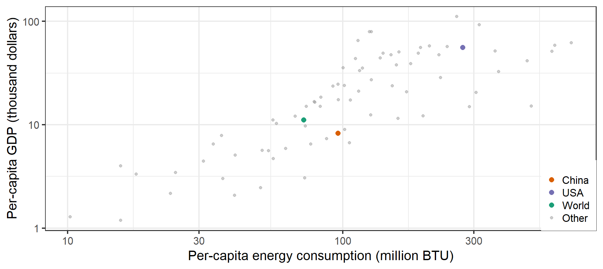

# Housekeeping {.center}

Remember when you email me to include "EES 3310" or "EES 5310" in your
subject line.

# Aral Sea  {.center}

<!-- dummy for formatting--> {id="aral.sea" data-transition="fade" background-transition="fade"}
------

{style="height:1000px;"}

# Questions from Reading? {id="questions" .center}

# Important Concepts: {.center}

## Important Concepts:

* What kinds of things can cause the global temperature to change?
  * {+} Energy Balance:
    * Temperature is steady when \(\text{Heat}_{\text{in}} = \text{Heat}_{\text{out}}\).
  * {+} What happens when \(\text{Heat}_{\text{in}} > \text{Heat}_{\text{out}}\)?
  * {+} What kinds of things can cause \(\text{Heat}_{\text{in}}\) to change?
  * {+} What kinds of things can cause \(\text{Heat}_{\text{out}}\) to change?

## Temperature Change 

* How much has earth warmed in the last century or so?
  * {+} About 1.0&deg;C (1.8&deg;F)
* {+} If CO~2~ emissions keep rising on their current path, how much do 
  scientists expect it to warm in the next century?
  * {+} Somewhere around 3--6&deg;C (5--11&deg;F)
* {+} What is the seasonal temperature change in Nashville (winter to summer)?
  * {+} Around 23&deg;C (42&deg;F) 47&deg;F in January, 89&deg;F in August.
* {+} What is the average daily temperature range in Nashville (night to day)?
  * {+} Around 11&deg;C (20&deg;F)

<!-- dummy -->

> *  **So why do people worry about global warming?**

## Predictions

> * Meteorologists can't predict whether it will rain three weeks from today
>   with any confidence.
> * So how can I trust predictions about the climate 100 years 
>   from now?

# Economy-Energy-Environment {.center}

## Wealth & Energy Use {.center}

## Wealth & CO~2~ Emissions {.center}

## US Emissions

:::::: {.columns .vcenter}
::: {.column width="59%"}
* {+ 1} 5 billion metric tons CO~2~ per year total
* {+ 2} 15 metric tons CO~2~ per person per year
* {+ 3} 25 pounds carbon per 
  person per day
:::
::: {.column width="39%"}
{.fragment data-fragment-index="3"}
:::
::::::

------

## Economics, Policy, Climate

:::::: {.columns .vcenter}
::: {.column width="59%"}
* Why don't markets manage greenhouse gas emissions well?
  * {+1} Pollution is an **externality**
* {+2} How does Nordhaus propose to fix this problem?
  * {+3} Ronald H. Coase (1920--2013): 
    * {+4} Solve externality problems by assigning property rights
      * {+5} Cap-and-trade: Permits
      * {+5} Emissions tax: Put price on emissions
:::
::: {.column width="39%" .fragment data-fragment-index="3"}
{style="height:600px;"}

Ronald H. Coase
:::
::::::

## Economics and Vulnerability

> *  For an economist, what are the big dangers associated with climate change?
>     -  **Managed** vs. **unmanaged**, **unmanageable** resources

::: {.fragment}
### Breakout Room Discussion (5 minutes) {style="margin-top:3em;"}

* Can you think of examples of **managed**, **unmanaged**, and **unmanageable**
  resources?
* How would you respond to climate change differently for the 3 kinds of 
  resources?
:::

# What Earth's History  Tells Us {.center}

## 800,000 years of CO~2~ {data-transition="fade-out"}

## 800,000 years of CO~2~ and Temperature {data-transition="fade-in"}

## Using Past Climates to Test Theory

::::::{.bare .mtop-3}
{width="1900px;"}

::: {.credit}

Source: 
J. Hansen _et al._, Phil. Trans. Roy. Soc. A **371**, 20120394 (2013).
:::
::::::

# Tipping Points {.center}

## Tipping Points

* Consider a wooden stick
* {+} Bend it a little
  * {+} When you let it go, it springs back to its original shape
* {+} Bend it too far
  * {+} It snaps
  * {+} When you let it go, it does not return to its original shape

## Amplification of Climate Change

{style="height:900px;"}

## Climate Tipping Points

* {+} Unknown, uncertain, but dangerous
* {+} We may have crossed a tipping point in sea-level rise
  * West Antarctic ice sheet may be past saving
* {+} Less likely:
  * {+} Runaway warming
    * Temperature rises
    * Biomass in Arctic tundra thaws and decays
    * Releases methane & CO~2~
    * Further warming
* {+} Climate tipping points:
  * {+} We don't know if they exist
  * {+} We don't know where they are
  * {+} How do we make policy for those risks?

