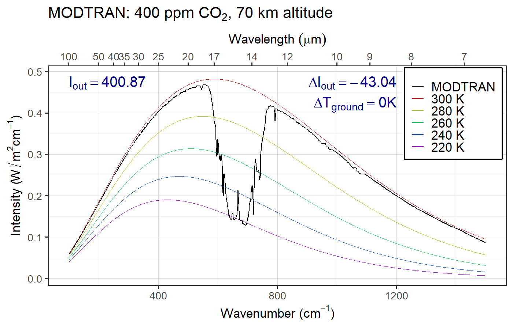
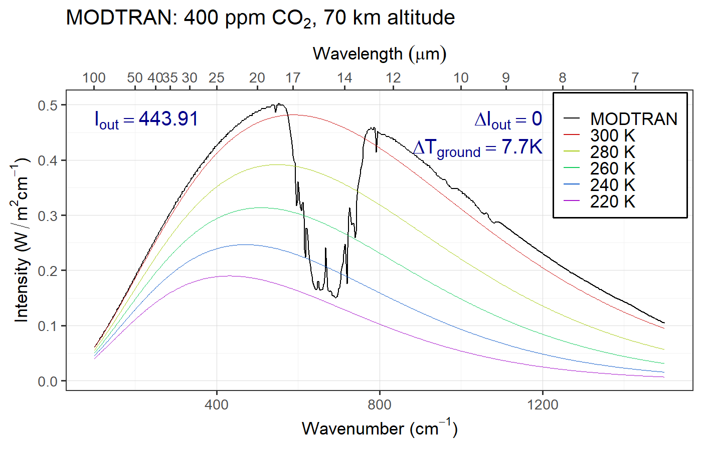
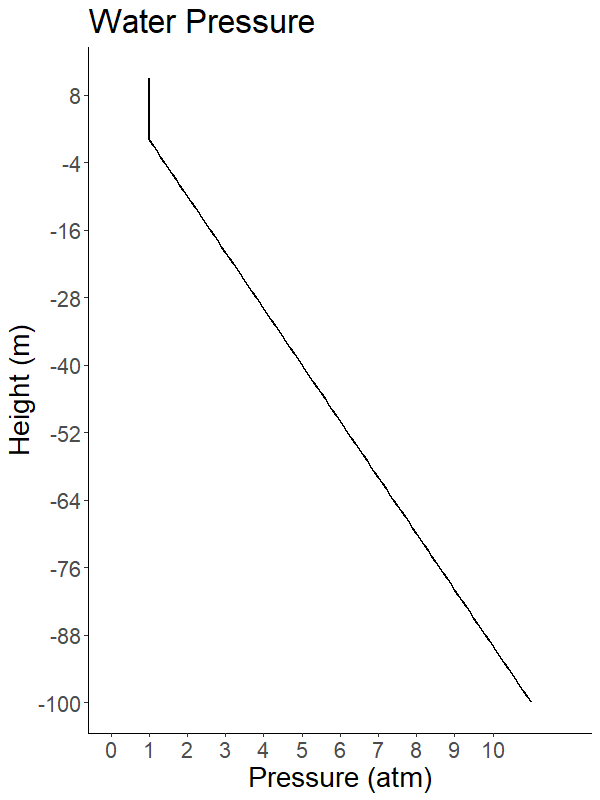
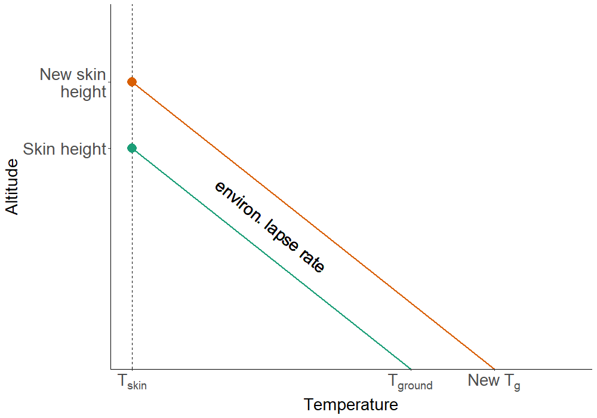
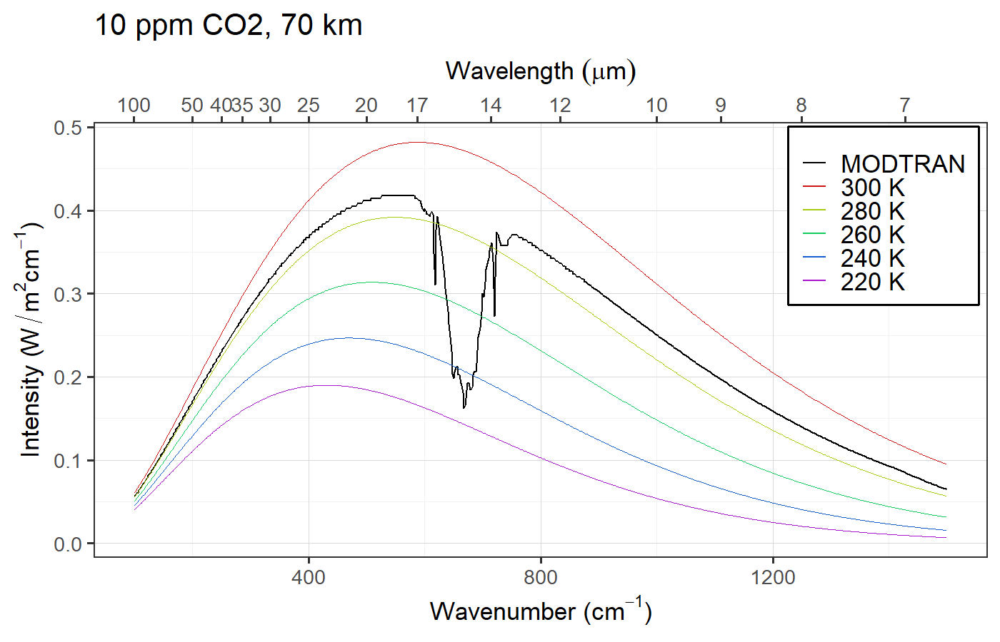
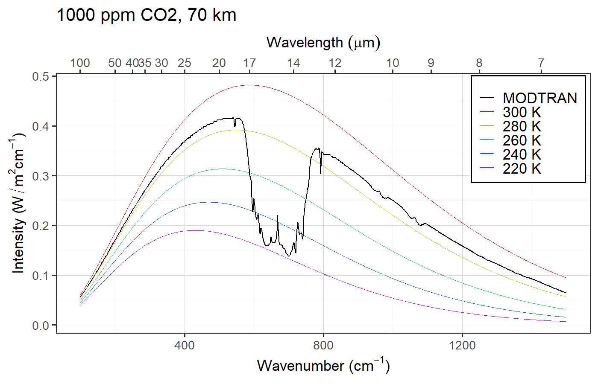
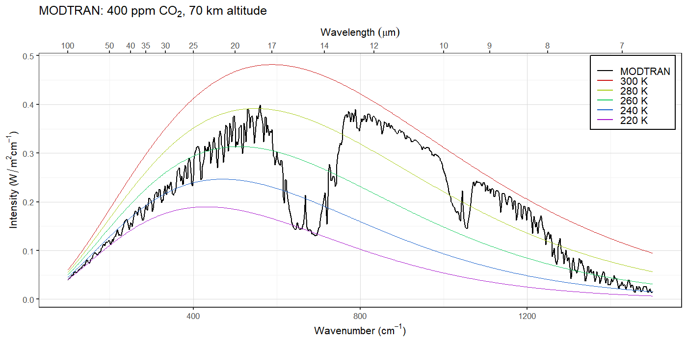

## Review Question   {#ghg_review_questions}

### What is the "atmospheric window"?

1. Regions where there are few clouds to block radiation.
2. Desert regions with very little water vapor.
3. Tropical regions with low CO~2~ concentrations.
4. [A range of wavelengths where no greenhouse gases absorb much.]{.fragment .highlight-blue}

# Measuring Greenhouse Effect: {#greenhouse_effect_sec .center }

## Measuring Greenhouse Effect: {#greenhouse_effect data-transition="fade-out"}

* Go to MODTRAN, set CO~2~ to 0 ppm, and set all other gases to zero.
* {+} Set altitude to 70 km and location to "Tropical Atmosphere".
* {+} Press "Save this run to background"
* {+} Note _I_~out~
* {+} Set CO~2~ to 400 ppm and note the change in _I_~out~
* {+} Adjust the temperature offset to make the difference in  
  \(I_{\text{out}} (\text{New} - \text{BG})\) equal zero.

## No Greenhouse Gases {#greenhouse_effect_00 data-transition="fade"}

## 400 ppm  {#greenhouse_effect_400 data-transition="fade"}

## Adjust temperature  {#greenhouse_effect_400_warm data-transition="fade"}

# Calculating Global Warming {#calc_warming_sec .center data-transition="fade"}

## Calculating Global Warming  {#calc_warming data-transition="fade"}

* "Climate sensitivity" = \(\Delta T_{2x}\)
  * Temperature rise for doubled CO~2~.
  * Uncertain (because of feedbacks)
  * Best estimate: $\Delta T_{2x} \sim$ 3.2K (range  2.0--4.5 K)
* {+} Every time you double CO~2~, \(T\) rises by \(\Delta T_{2x}\).
* {+} For arbitrary change in CO~2~:

  ::: {style="background-color:ghostwhite;margin:20px;border:10px;color:darkblue;"}
  $$\Delta T = \Delta T_{2x} \times 
  \frac{\ln\left(\frac{\text{new}~p\COO}{\text{old}~p\COO}\right)}{\ln 2}$$
  :::

## Global Warming Potential {#gwp}

* Absorption by CO~2~ and water vapor are very saturated
* {+} Absorption in the atmospheric window is not saturated
* {+} Therefore, molecule-for-molecule, gases that absorb in the window 
  have a much bigger effect on the climate than adding more CO~2~.
  * {+} One chlorofluorocarbon molecule = thousands of CO~2~ molecules
* {+} Global Warming Potential (GWP)  of _x_ = how many CO~2~ molecules 
  cause the same warming as one molecule of _x_

# Evolving theory of greenhouse effect {#evolving_theory_sec .center}

## Greenhouse effect {#evolving_theory .eighty}

1. Purely radiative (no convection) 
   * Each layer has uniform temperature
     a. {+} Single-layer, uniform spectrum [(Mon. 2/1)]{style="color:blue;"}
        * Absorbs 100% longwave light
     b. {+} Multi-layer, uniform spectrum [(Lab #2)]{style="color:blue;"}
        * More layers \(\Rightarrow\) greater greenhouse effect.
     c. {+} Realistic spectrum [(Wed. 2/3 & today)]{style="color:blue;"}
        * More realistic
        * Harder to do calculations (need computer)
2. {+} Introduce convection [(Today & Monday 2/8)]{style="color:blue;"}
   * Temperature changes with height
   * Convection moves heat up and down
   * Radiative-convective models are very accurate
     * But require computers

# The Vertical Structure of the Atmosphere {#vertical_structure_sec .center}

## Greenhouse effect  {#evolving_theory_2 .eighty}

::: {style="color:#a8a8c0;"}
1. Purely radiative (no convection) 
   * Each layer has uniform temperature
     a. Single-layer, uniform spectrum
        * Absorbs 100% longwave light
     b. Multi-layer, uniform spectrum
        * More layers \(\Rightarrow\) greater greenhouse effect.
     c. Realistic spectrum
        * More realistic
        * Harder to do calculations (need computer)
:::
::: {style="color:#006080;"}
2. Convection:
   * Temperature changes with height
   * Convection moves heat up and down
   * Radiative-convective models are very accurate
     * But require computers
:::

## Radiative-Convective Equilibrium  {#radiative_convective .center}

{style="height:850px;"}

## Normal Atmosphere: {#normal_atmosphere .center}

## Vertical Structure {#lapse-rate .center data-transition="fade"}

$$ \text{Lapse rate} = \frac{- \Delta T}{\Delta \text{height}} $$

* Positive lapse rate: Air overhead is cooler 
  (normal for troposphere)

* Negative lapse rate: Air overhead is warmer 
  (abnormal, "inversion")

## Air vs. Water {#air_water .center}

:::::: {.columns}
::: {.column .rightcol}

:::
::: {.column .leftcol }

:::
::::::

## Air vs. Water {#air_water_2}

:::::: {.columns}
::: {.column style="padding-top:3rem;"}

* {+} Pressure = weight of everything overhead.
* {+} Air is compressible, water isn't.
* {+} 1 cubic meter of water weighs 1000&nbsp;kg
* {+} 1 cubic meter of dry air at sea-level density weighs 1.3&nbsp;kg
* {+} 1 cubic meter of dry air 10 km above sea level weighs 0.4&nbsp;kg

:::
::: {.column}

{style="height:900px;"}

:::
::::::

## Air Pressure {#air_pressure}

:::::: {.columns}
::: {.column .ninety}

* {+} Pressure at height \(h\):
  $$
  \begin{aligned}
  P(h) & = P_0\: e^{-h/8.0 \text{km}} \\
  &= P_0\: 2^{-h / 5.5 \text{km}} \\
  &= P_0 \left(\frac{1}{2}\right)^{h / 5.5 \text{km}}
  \end{aligned}
  $$
  
  * {+} Half the air in the atmosphere is below 5.5 km.
  * {+} 3/4 is below 11 km
  * {+} 7/8 is below 16.5 km
* {+} **NOTE:** The number 5.5 km is not exact,  
  but it's  consistent with the textbook.

:::
::: {.column}

:::
::::::

## Why is the air cooler higher up? {#review_q_lapse .ninety}

{style="height:900px;"}

## Terminology {#terminology}

* **Environmental Lapse**
  * Measured temperature of actual atmosphere
  * Compares one bit of air at one height with another bit at another height.
  * Changes from one time and place to another.
* {+} **Adiabatic Lapse**
  * Change in a single parcel of air as it moves up or down
  * "**Adiabatic**" means no heat flowing in or out
    * **Adiabatic changes</b> are reversible**
    * **Heat flow** is irreversible

# Overview of Convection {#convection_overview_sec .center}

## Overview of convection {#convection_overview data-transition="fade-out"}

{style="height:700px;margin-top:1em;"}

* Closer to vertical = smaller lapse rate (vertical = zero)
* Closer to horizontal = larger lapse rate

## Stable Atmosphere  {#stable_atm_1 data-transition="fade"}

### Initial State

{style="height:700px;"}

* [green = adiabatic lapse]{style="color:darkgreen;"}
* [blue = environmental lapse]{style="color:darkblue;"} < [adiabatic]{style="color:darkgreen;"}

## Stable Atmosphere {#stable_atm_heated data-transition="fade"}

### Parcel is heated

{style="height:700px;"}

## Stable Atmosphere  {#stable_atm_rise data-transition="fade"}

### Rises to new equilibrium

{style="height:700px;"}

## Stable Atmosphere   {#stable_atm_cool data-transition="fade"}

### Parcel is cooled

{style="height:700px;"}

## Stable Atmosphere   {#stable_atm_sink data-transition="fade-in"}

### Sinks to new equilibrium

{style="height:700px;"}

# Unstable Atmosphere {#unstable_atm_sec .center}

## Unstable Atmosphere   {#unstable_atm data-transition="fade-out"}

### Initial State

{style="height:700px;"}

* [green = adiabatic lapse]{style="color:darkgreen;"}
* [blue = environmental lapse]{style="color:darkblue;"} > [adiabatic]{style="color:darkgreen;"}

## Unstable Atmosphere   {#unstable_atm_heat data-transition="fade"}

### Parcel is heated

{style="height:700px;"}

## Unstable Atmosphere    {#unstable_atm_rise data-transition="fade"}

### Rises without stopping

{style="height:700px;"}

# Summary of Stability {#summary_stability_sec .center}

## Summary of stability: {#summary_stability}

* Stable conditions:
  * Adiabatic Lapse > Environmental Lapse
    
* Unstable conditions:
  * Adiabatic Lapse < Environmental Lapse

<!--- --->

* Why is stability important?
  * {+} A stable atmosphere does not move heat around
  * {+} An unstable atmosphere undergoes **convection**:
    * Hot air rises, cold air sinks
    * Redistributes heat

# Moist Convection  {#moist_convection_sec .center}

## Moist Convection  {#moist_convection data-transition="fade-out"}

{style="height:550px;"}

*  {+} Dry air rises and cools
*  {+} Cooling \(\Rightarrow\) water vapor condenses to liquid
*  {+} Condensation releases latent heat
*  {+} Latent heat warms air

## Moist Convection    {#moist_stability data-transition="fade"}

{style="height:550px;"}

* {+} Latent heat warms air
* {+} Heat reduces adiabatic cooling
* {+} Moist adiabatic lapse < Dry adiabatic lapse
* {+} Smaller lapse = less stable
* {+} **Humid air is less stable than dry air**

## Perspective {#stability}

* {+} Stable:
  * Environmental lapse \(\le\) adiabatic lapse
* {+} Unstable:
  * Environmental lapse > adiabatic lapse
* {+} Adiabatic lapse:
  * Dry: 10 K/km
  * Moist: 4-8 K/km (depends on humidity)
* {+} Pure radiative equilibrium:
  * Would produce lapse of **16 K/km**: unstable
* {+} Radiative-Convective equilibrium:
  * Convection modifies environmental lapse
  * Normal environmental lapse is roughly **6 K/km**
     (typical *moist adiabatic lapse rate*)

# Greenhouse effect {#convective_greenhouse_sec .center}

## Greenhouse effect {#gw-baseline .ninety data-transition="fade"}

* Skin temp: 
  $T_{\text{skin}} = T_{\text{bare rock}} = 254~\text{K}$.
* Ground temp: 
  $T_{\text{ground}} = T_{\text{skin}} + h_{\text{skin}} \times \text{ELR}$
  * ELR = Environmental Lapse Rate

## Global warming {#gw-convect .ninety data-transition="fade"}

* Greater CO~2~ $\rightarrow$ greater skin height.
* Warming: $\Delta T_{\text{ground}} = \Delta h_{\text{skin}} \times \text{env. lapse}$

# Vertical Structure and Saturation {#vertical-saturation-sec .center}

## Set up MODTRAN: {#setup-modtran .eighty}

### Go to MODTRAN ([http://climatemodels.uchicago.edu/modtran/](http://climatemodels.uchicago.edu/modtran/))

<!-- -->

* {+} Set altitude to **70 km** and location to "1976 U.S. Standard Atmosphere".
* {+} Set CO~2~ to 0.1 ppm, all other gases to zero.
* {+} Now increase by factors of 10 (1, 10, 100, 1000, 10000)

## 0.1 ppm CO~2~  {#vert-co2-00001 data-transition="fade-out"}

## 1 ppm CO~2~  {#vert-co2-00001 data-transition="fade"}

## 10 ppm CO~2~  {#vert-co2-00010 data-transition="fade"}

## 100 ppm CO~2~  {#vert-co2-00100 data-transition="fade"}

## 1000 ppm CO~2~  {#vert-co2-01000 data-transition="fade"}

## 10,000 ppm CO~2~  {#vert-co2-10000 data-transition="fade-in"}

## Question {#question-3 data-transition="fade-out"}

* Why do we see the spike in the middle of the CO~2~ absorption feature?

## Answer {#answer-3 data-transition="fade"}

::::::: {.columns}
::: {.column .eighty style="width:49%;padding-top:1em;"}

:::
::: {.column .eighty style="width:49%;padding-top:1em;"}

:::
::::::

## Answer {#answer-3b data-transition="fade-in"}

::::::: {.columns}
::: {.column .eighty style="width:49%;padding-top:1em;"}

:::
::: {.column .eighty style="width:49%;padding-top:1em;"}

:::
::::::

## Question {#question-4 data-transition="fade-out"}

* Water vapor absorption is completely saturated.
  * Why does water vapor emit at warmer temperatures than CO~2~?

## Answer {#answer-4 data-transition="fade-in"}

::: {.bare style="margin-top:1rem;"}

:::
::: {.bare .eighty}
* {+} Near the ground, there is much more water vapor (10 times more)
* {+} Above about 7 km, there is much more CO~2~ (100 times more at 20 km)
  * {+} Water vapor concentrations become small enough to be transparent to space
     at a much lower altitude than CO~2~
:::
