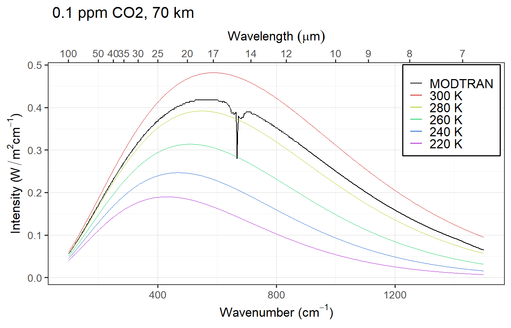
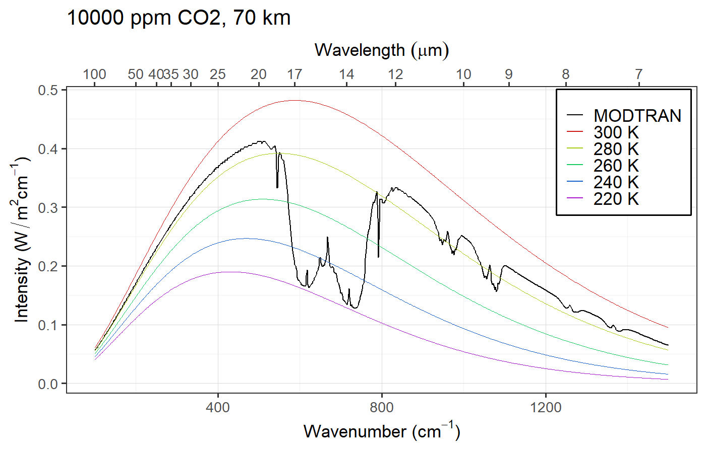

# Review of Lapse Rates and Stability {#lapse-rate-review-sec .center}

## Terminology {#terminology}

* **Environmental Lapse**
  * Measured temperature of actual atmosphere
  * Compares one bit of air at one height with another bit at another height.
  * Changes from one time and place to another.
* {+} **Adiabatic Lapse**
  * Change in a single parcel of air as it moves up or down
  * "**Adiabatic**" means no heat flowing in or out
    * **Adiabatic changes</b> are reversible**
    * **Heat flow** is irreversible

## Perspective {#stability}

* {+} Stable:
  * Environmental lapse \(\le\) adiabatic lapse
* {+} Unstable:
  * Environmental lapse > adiabatic lapse
* {+} Adiabatic lapse:
  * Dry: 10 K/km
  * Moist: 4-8 K/km (depends on humidity)
* {+} Pure radiative equilibrium ( Layer models):
  * Would produce lapse of **16 K/km**: unstable
* {+} Radiative-Convective equilibrium:
  * Convection modifies environmental lapse
  * Normal environmental lapse is roughly **6 K/km**
     (typical *moist adiabatic lapse rate*)

# Band Saturation {#saturation-sec .center}

## Band Saturation {#band-saturation .eightyfive}

* Small concentrations of greenhouse gas
  * {+} Small absorption
  * {+} Absorption rises rapidly as more gas is added
  * {+} Doubling the amount of gas doubles the absorption
* {+} Saturation
  * {+} Absorption can't be more than 100%
  * {+} As absorption gets large, adding more gas has a diminishing effect
* {+} "Band" saturation
  * {+} Gases absorb in "bands"
    * Strong absorption in the middle of the band
      * This saturates first
    * {+} Weak absorption on both sides
      * The "wings" of the band
      * These saturate more slowly
  * {+} After the center of the band saturates, the wings gradually become
    more saturated
    * The saturated region of the spectrum gradually gets wider and wider
  * {+} Total absorption rises by the same amount every time the amount of 
    gas doubles

## Set up MODTRAN: {#setup_modtran .eighty}

* Open MODTRAN <http://climatemodels.uchicago.edu/modtran>
* Set "Location" to "1976 U.S. Standard Atmosphere".
* Set altitude to 20 km.
* Set all greenhouse gases to zero.

<iframe src="https://climatemodels.jgilligan.org/modtran/" style="height:750px;width:1500px;"></iframe>

## No CO~2~ {#co2_00000 data-transition="fade-out"}

## 1 ppm CO~2~ {#co2_00001 data-transition="fade"}

## 2 ppm CO~2~ {#co2_00003_125 data-transition="fade"}

## 4 ppm CO~2~ {#co2_00004 data-transition="fade"}

## 8 ppm CO~2~ {#co2_00008 data-transition="fade"}

## 16 ppm CO~2~ {#co2_00016 data-transition="fade"}

## 32 ppm CO~2~ {#co2_00032 data-transition="fade"}

## 64 ppm CO~2~ {#co2_00064 data-transition="fade"}

## 128 ppm CO~2~ {#co2_00128 data-transition="fade"}

## 256 ppm CO~2~ {#co2_00256 data-transition="fade"}

## 512 ppm CO~2~ {#co2_00512 data-transition="fade"}

## 1024 ppm CO~2~ {#co2_01024 data-transition="fade"}

## 2048 ppm CO~2~ {#co2_02048 data-transition="fade-in"}

# Vertical Structure and Saturation {#vertical-saturation-sec .center}

## Set up MODTRAN: {#setup-modtran .eighty}

* Open MODTRAN <http://climatemodels.uchicago.edu/modtran/>
* Set location to "1976 U.S. Standard Atmosphere".
* Set altitude to **70 km**.
* Set CO~2~ to 0.1 ppm, all other gases to zero.
* Now increase CO~2~ by factors of 10 (1, 10, 100, 1000, 10000)
* Notice differences between **70 km** and **20 km**.

## 0.1 ppm CO~2~  {#vert-co2-00001 data-transition="fade-out"}

## 1 ppm CO~2~  {#vert-co2-00001 data-transition="fade"}

## 10 ppm CO~2~  {#vert-co2-00010 data-transition="fade"}

## 100 ppm CO~2~  {#vert-co2-00100 data-transition="fade"}

## 1000 ppm CO~2~  {#vert-co2-01000 data-transition="fade"}

## 10,000 ppm CO~2~  {#vert-co2-10000 data-transition="fade-in"}

## Question {#question-3 data-transition="fade-out"}

* Why do we see the spike in the middle of the CO~2~ absorption feature?

## Answer {#answer-3 data-transition="fade"}

::::::: {.columns}
::: {.column .eighty style="width:49%;padding-top:1em;"}

:::
::: {.column .eighty style="width:49%;padding-top:1em;"}

:::
::::::

## Answer {#answer-3b data-transition="fade-in"}

::::::: {.columns}
::: {.column .eighty style="width:49%;padding-top:1em;"}

:::
::: {.column .eighty style="width:49%;padding-top:1em;"}

:::
::::::

## Question {#question-4 data-transition="fade-out"}

* Water vapor absorption is completely saturated.
  * Why does water vapor emit at warmer temperatures than CO~2~?

## Answer {#answer-4 data-transition="fade-in"}

::: {.bare style="margin-top:1rem;"}

:::
::: {.bare .eighty}
* {+} Near the ground, there is much more water vapor (15 times more)
* {+} Above about 7 km, there is much more CO~2~ (100 times more at 20 km)
  * {+} Water vapor concentrations become small enough to be transparent to space
     at a much lower altitude than CO~2~
:::

# Convection and the Greenhouse Effect {#convective_greenhouse_sec .center}

## Another Perspective on Band Saturation {#band-saturation-perspective .ninety}

* Instead of thinking of saturation as increasing absorption ...
* {+} Think of saturation as raising the skin height
  * {+} Skin height = the height at which the atmosphere becomes transparent 
    enough to radiate out to space
    * The height of the top of the atmospheric layer in a layer model
  * {+} The atmosphere becomes opaque at a certain wavelength when there are
    more than a certain number of molecules per square meter of an absorbing gas 
    overhead.
    * {+} The higher you go, the fewer molecules are overhead and the more are
      below your feet.
    * {+} The atmosphere gradually becomes more transparent, but we pretend that this
      happens suddenly at a certain height.
    * {+} Pressure and density fall exponentially as you go higher, so this 
      approximation is reasonable.
* {+} After band saturation sets in, adding more greenhouse gas raises the skin
  height.

## Saturation, Convection, and the Greenhouse Effect {#gw-baseline .ninety data-transition="fade"}

* Skin temp: 
  $T_{\text{skin}} = T_{\text{bare rock}} = 254~\text{K}$.
* Ground temp: 
  $T_{\text{ground}} = T_{\text{skin}} + h_{\text{skin}} \times \text{ELR}$
  * ELR = Environmental Lapse Rate

## Global warming {#gw-convect .ninety data-transition="fade"}

* Greater CO~2~ $\rightarrow$ greater skin height.
* Warming: $\Delta T_{\text{ground}} = \Delta h_{\text{skin}} \times \text{env. lapse}$

# Review of the Greenhouse Effect {#greenhouse-review-sec .center}

## Review of the Greenhouse Effect {#greenhouse-review .eighty}

:::::: {.columns .vtop}
::: {.column}
#. **Start with bare-rock temperature**
   * This becomes skin temperature
#. {+} **Add simple layer atmosphere:**
   * {+} Completely black to longwave radiation
   * {+} Top of atmosphere: skin temperature (same as bare-rock)
   * {+} Atmosphere insulates surface $\Rightarrow$ surface heats up
   * {+} More layers $\Rightarrow$ bigger greenhouse effect
#. {+} **Realistic longwave absorption:** 
   * Atmosphere is not black
   * Absorption depends on wavelength
:::
::: {.column}
4. {+} **Radiative-Convective equilibrium:**
   * {+} Pure radiative equilibrium would have _huge_ environmental lapse rate
     * 16 K/km
   * {+} Big lapse rate is unstable $\Rightarrow$ convection
     * {+} ELR (16 K/km) > ALR (6--10 K/km)
     * {+} Convection mixes hot & cold air $\Rightarrow$
       reduces environmental lapse until it becomes stable
     * {+} Reduces greenhouse effect
   * {+} **Alternate perspective:**
     * Think of greenhouse effect in terms of raising the skin height instead
       of blocking heat flow.
     * T~skin~ is always T~bare rock~
     * T~ground~ = T~skin~ + h~skin~ &times; Environmental Lapse Rate
:::
::::::

# Questions & Discussion of Greenhouse Effect {#discussion-sec .center}
