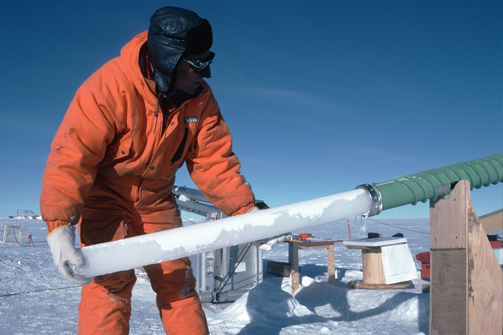

```{r setup, cache = F, echo = F, eval = T, message=F, warning=F}
knitr::opts_chunk$set(cache=TRUE, 
                      echo=FALSE, message=FALSE, warning=FALSE,
                      fig.height=9, fig.width=14, dpi=100,
                      dev='png',fig.path='assets/fig/',cache.path='./cache/')

library(rprojroot)

semester_dir <- find_rstudio_root_file()
data_dir <- file.path(semester_dir, "data")
script_dir <- file.path(semester_dir, "lecture_scripts")

source_semester_script <- function(script) {
  script_file <- file.path(script_dir, script)
  message("Running script", script_file)
  source(script_file, chdir = T)
}

eval_in_sem_script_dir <- function(expr, loc = script_dir) {
  this_dir <- getwd()
  setwd(loc)
  retval <- eval(expr)
  setwd(this_dir)
  invisible(retval)
}

library(magrittr)
library(tidyverse)

source_semester_script('lecture_utils.R')
source_semester_script('knit_keeling.R')
```
# Biosphere Feedbacks {#biosphere-feedback-sec .center}

## Hydrological Cycle

:::::::::::: {.columns }
::::::::: {.column style="margin-top:8rem;"}
* Transpiration in plants:
  * {+ 1} Roots take water from ground
  * {+ 1} Leaves emit water vapor
    * {+ 2} Evaporation cools the air
    * {+ 2} Can be an important source of water vapor
:::::::::
::::::::: {.column}
:::::: {.bare style="margin-top:3rem;"}
{style="height:550px;"}

::: {.credit}
Image credit: NASA/JPL-Caltech <https://climatekids.nasa.gov/heat-islands/>
:::
::::::
:::::::::
::::::::::::

## Transpiration and CO~2~

::::::::::::::: {.columns }
:::::::::::: {.column style="padding-top:8rem;"}
* Transpiration occurs through "stomata" in leaves
* {+} Tradeoff: stomata
  * Allow plant to get CO~2~
  * Cause plant to lose water
* {+} More CO~2~ in atmosphere:
  * Fewer stomata
  * Less transpiration
::::::::::::
:::::::::::: {.column style="padding-top:2rem;"}
::::::::: {.bare}
{style="width:750px;"}

{style="width:750px;"}

:::::: {.credit}

::: {.leftalign .hundred}
Image credit: 
:::

* Photo of stomata on duckweed: Micrographia <http://www.micrographia.com/specbiol/plan/planaq/plaq0100/lemna-01.htm>.
* Diagram of response to CO~2~:  University of California Museum of Paleontology's Understanding Evolution <http://evolution.berkeley.edu>.
::::::
:::::::::
::::::::::::
:::::::::::::::

## Carbon Cycle Feedbacks

:::::::::::: {.columns}
::::::::: {.column style="padding-top:5rem;"}
* {+} Dead organic matter in ground (leaves, roots, etc.) stores carbon
* {+} Warming temperatures accelerate decomposition
  * Bacterial/fungal metabolism
* {+} Huge amounts of dead organic matter in arctic tundra & permafrost
  * {+} Concerns about accelerated greenhouse gas emissions as ground thaws & warms
:::::::::
::::::::: {.column style="padding-top:1rem;"}
:::::: {.bare}
{.bare style="height:900px;"}

::: {.credit}
Image credit: K. Schaefer _et al._, Environ. Res. Lett. **9**, 085003 (2014). doi: [10.1088/1748-9326/9/8/085003](https://doi.org/10.1088/1748-9326/9/8/085003)
:::
::::::
:::::::::
::::::::::::

## CO~2~ in the Atmosphere {#keeling}

```{r keeling, echo=FALSE, cache=TRUE, message=FALSE, warning=FALSE}
co2 <- get.co2()
plot.co2(co2, base_size = 25, inset = FALSE)
```

# Carbon Chemistry {#carbon-chemistry-sec .center}

## What does the oxidation state tell you about<br/>a molecule containing carbon? {#oxidation-question .center .ninety}

::: {.mtop-3}
* {+:blue} The energy you can get from burning it.
* Whether the carbon came from natural or human sources.
* Large oxidation state \(\rightarrow\) large greenhouse effect.
* Large oxidation state \(\rightarrow\) small greenhouse effect.
:::

## Carbon {#carbon-oxidation .center}

### Oxidation states:

<table>
<thead>
<tr>
<th style="text-align:center;"> Chemical State </th><th style="text-align:center;"> Oxidation </th>
</tr>
</thead>
<tbody>
<tr>
<th style="text-align:left;"> Simple carbon </th><th style="text-align:right;"> 0 </th>
</tr><tr>
<th style="text-align:left;"> Bound to oxygen </th><th style="text-align:right;"> +2 </th>
</tr><tr>
<th style="text-align:left;"> Bound to hydrogen </th><th style="text-align:right;">  &minus;1 </th>
</tr>
</tbody>
</table>

<!--- ---> {#oxidation-examples .center}
-------- 

### Examples

<table>
<thead>
<tr>
<th style="text-align:center;"> Chemical </th>
<th style="text-align:center;"> Oxidation </th>
<th style="text-align:left;"> Name </th>
</tr>
</thead>
<tbody>
<tr>
<th style="text-align:center;"> 
CH~4~
</th><th style="text-align:right;">   
&minus;4
</th><th style="text-align:left;">   
methane
</th>
</tr><tr>
<th style="text-align:center;"> 
 (CH~2~)~n~
</th><th style="text-align:right;">   
&minus;2
</th><th style="text-align:left;">   
long-chain alkane
</th>
</tr><tr>
<th style="text-align:center;"> 
 CO~2~
 </th><th style="text-align:right;">   
+4
</th><th style="text-align:left;">   
carbon dioxide
</th>
</tr><tr>
<th style="text-align:center;"> 
 (CH~2~O)~n~
</th><th style="text-align:right;">   
0
</th><th style="text-align:left;">   
carbohydrate
</th>
</tr>
</tbody>
</table>

## Carbon {#carbon-energy .ninety}


<table>
<thead>
<tr>
<th style="text-align:center;"> Category </th>
<th style="text-align:center;"> Oxidation State   </th>
<th style="text-align:center;"> Examples </th>
</tr>
</thead>
<tbody>
<tr>
<td style="text-align:left;">
**Mineral carbon**
</td><td style="text-align:center;">
&geq; 0
</td><td style="text-align:center;">
\[
\COO: +4
\]
</td>
</tr>
<tr>
<td style="text-align:left;">
**Organic carbon**
</td><td style="text-align:center;">
&leq; 0
</td><td style="text-align:left;">

\[\begin{align*}
\methane &: -4 \quad \text{(methane)} \\
\ce{(CH2O)_6} &: \hphantom{-}0 \quad \text{(sugar)}
\end{align*}\]

</td>
</tr>
<tr>
</tbody>
</table>

[ ]{style="line-height:0.5em;"}

### **Energy:**

::: {.ninety}
* Negative oxidation \(\rightarrow\) greater energy
* Positive oxidation \(\rightarrow\) lower energy
* Photosynthesis: <br/> \(\COO + \water + \mathrm{energy} \Rightarrow \ce{(CH2O)_{n}} + \ce{O2}\)
* Respiration:  <br/> \(\ce{(CH2O)_{n}} + \ce{O2} \Rightarrow \COO + \water + \mathrm{energy}\)
:::

## Carbon {#oxidation-history .eighty}

### **Energy:** {.mtop-3}

* Negative oxidation \(\rightarrow\) greater energy
* Positive oxidation \(\rightarrow\) lower energy
* Photosynthesis: <br/> \(\COO + \water + \mathrm{energy} \Rightarrow \ce{(CH2O)_{n}} + \ce{O2}\)
* Respiration: <br/> \(\COO + \water + \mathrm{energy} \Leftarrow \ce{(CH2O)_{n}} + \ce{O2}\)

### **History of oxidation on earth:** {.mtop-3}

* Buried organic carbon could suck up all the <br/>
  oxygen in the atmosphere many times over.

## Where is most of the carbon on earth? {#carbon-reservoir-question .center}

1. The atmosphere.
1. The oceans.
1. Living and dead biomass at the land surface.
1. Deeply buried biomass.
1. Fossil fuels.
1. {+:blue} Carbonate rocks.</span>

# Carbon Reservoirs  {#carbon-reservoir-sec .center data-transition="fade-out" data-state="skip_slide"}

## Carbon Reservoirs   {#carbon-reservoirs .center data-transition="fade"}

:::::: {.bare .mtop-3}
{style="height:900px;"}

::: {.credit}
Image credit: D. Archer, _Global Warming: Understanding the Forecast_
:::
::::::

## Carbon Pathways   {#carbon-pathways .center data-transition="fade"}

:::::: {.bare .mtop-3}
{ style="height:900px;"}

::: {.credit}
Image credit: D. Archer, _Global Warming: Understanding the Forecast_
:::
::::::

## The Planet's Lungs {#planets-lungs .center}

::: {.mtop-3}
* The land breathes
  * 1 year
* The oceans breathe
  * Hundreds to thousands of years
* The rocks breathe
  * Hundreds of thousands to millions of years
:::

# More complete picture  {#complete-carbon-cycle .yellowtitle data-background="assets/images/carbon_cycle_small.jpg" data-transition="fade-out" data-background-transition="fade-out" data-state="skip_slide"}

## Complete Carbon Cycle {#Complete-Carbon-Cycle .yellowtitle data-background="assets/images/carbon_cycle_small.jpg" data-background-color="black" data-background-size="contain" data-transition="fade-in" data-background-transition="fade-in"}

:::::: {style="height:980px;"}
::: {.credit style="position:absolute;bottom:0;right:0;"}
Image credit: NASA Earth Observatory<br/><https://commons.wikimedia.org/wiki/File:Carbon_cycle.jpg>
:::
::::::

------

## CO~2~ Over Time

```{r keeling_seas, echo=FALSE, cache=TRUE, message=FALSE, warning=FALSE}
co2 <- get.co2()
plot.co2(co2, base_size = 30, inset = TRUE)
```

## Why the difference in wiggles? {#wiggles .ninety data-background-transition="fade" data-transition="fade"}

::::::::: {.columns}
:::::: {.column style="text-align:right;margin-top:150px;"}
a.  ::: {style="margin-bottom:360px;"}
    Hawaii
    :::
b.  New Zealand
::::::
:::::: {.column .bare}
{ style="height:900px;"}

::: {.credit}
Image credit: D. Archer, _Global Warming: Understanding the Forecast_
:::
::::::
:::::::::

## Northern vs. Southern Hemisphere {#north-south-seasonality}

:::::: {.columns}
::: {.column .bare}
{ style="height:900px;" }
:::
::: {.column .bare}
{ style="height:900px;" }
:::
::::::
::: {.credit}
Image Credit: Pearson Education, Inc.
:::
 
# Fate of CO~2~ Emissions  {#fate-sec .center data-transition="fade-out"}

## Fate of CO~2~ Emissions  {#fate-1 data-transition="fade"}

:::::: {.bare .mtop-3}
{ style="height:900px;" }

::: {.credit}
Image credit: J. Houghton, _Global Warming: The Complete Briefing, 4th ed. (Cambridge, 2009), Fig. 3.4
:::
::::::

## Fate of CO~2~ Emissions  {#fate-2 data-transition="fade"}

:::::: {.bare .mtop-3}
{ style="height:900px;" }

::: {.credit}
Image credit: J. Houghton, _Global Warming: The Complete Briefing, 4th ed. (Cambridge, 2009), Fig. 3.4
:::
::::::

## Fate of CO~2~ Emissions  {#fate-3 data-transition="fade"}

:::::: {.bare .mtop-3}
{ style="height:900px;" }

::: {.credit}
Image credit: J. Houghton, _Global Warming: The Complete Briefing, 4th ed. (Cambridge, 2009), Fig. 3.4
:::
::::::

## Fate of CO~2~ Emissions  {#fate-4 data-transition="fade"}

:::::: {.bare .mtop-3}
{ style="height:900px;" }

::: {.credit}
Image credit: J. Houghton, _Global Warming: The Complete Briefing, 4th ed. (Cambridge, 2009), Fig. 3.4
:::
::::::

## Fate of CO~2~ Emissions  {#fate-5 data-transition="fade"}

:::::: {.bare .mtop-3}
{ style="height:900px;" }

::: {.credit}
Image credit: J. Houghton, _Global Warming: The Complete Briefing, 4th ed. (Cambridge, 2009), Fig. 3.4
:::
::::::

## Fate of CO~2~ Emissions  {#fate-6 data-transition="fade"}

:::::: {.bare .mtop-3}
{ style="height:900px;" }

::: {.credit}
Image credit: J. Houghton, _Global Warming: The Complete Briefing, 4th ed. (Cambridge, 2009), Fig. 3.4
:::
::::::

## Fate of CO~2~ Emissions  {#fate-7 data-transition="fade"}

:::::: {.bare .mtop-3}
{ style="height:900px;" }

::: {.credit}
Image credit: J. Houghton, _Global Warming: The Complete Briefing, 4th ed. (Cambridge, 2009), Fig. 3.4
:::
::::::

# Source of CO~2~  {#co2_source .center data-transition="fade"}

## Source of CO~2~: O~2~ and ^13^C {#keeling-c13 data-transition="fade"}

```{r keeling_isotopes, echo=FALSE, message=F, warning=F}
source_semester_script('Keeling_C13.R')
print(plot.scripps())
```

## Source of CO~2~: ^13^C and ^14^C  {#co2-isotopes data-transition="fade"}

```{r niwot_isotopes, echo=FALSE, message=F, warning=F}
print(plot.nwr())
```

## Fossil Fuels vs. CO~2~ {#fossil-emissions .ninety}

:::::: {.bare .mtop-3}
{style="height:850px;margin:0px;"}

::: {.credit}
Image credit: W. Knorr, Geophys. Res. Lett. **36**, L21710 (2009) doi: [10.1029/2009GL040613](https://doi.org/10.1029/2009GL040613)
:::
::::::

* Concentrations match 46% of fossil fuel consumption

## Assessing the Evidence {#assessing-evidence}

* {+} Decreasing \(\ce{O2}\): \(\COO\) produced by burning.
   * {+} Not a mineral source (volcanoes).
* {+} \(\ce{^{13}C}/\ce{^{12}C}\): \(\COO\) must have biological origin.
* {+} \(\ce{^{14}C}\): The fuel must be thousands of years old.
* {+} Possible sources: Burning billions of tons per year of very old organic matter.
* {+} Rate of rise matches fossil fuel consumption.
* {+} **Therefore: Dominant source must be fossil fuels.**

# The Oceans Breathe<br/>Centuries to Millennia  {#oceans-breathe-sec .center}

## Studying Ancient Climates  {#ice-drilling}

:::::: {.bare}
{ style="height:900px;"}

::: {.credit}
Image Credit: [R Mulvaney/British Antarctic Survey](https://discoveringantarctica.org.uk/oceans-atmosphere-landscape/atmosphere-weather-and-climate/climate-change-past-and-future/)
:::
::::::

## Ice Cores  {#ice-cores}

:::::: {.columns style="padding-top:150px;"}
::: {.column .bare}
{ style="width:900px;margin-top:50px;" }

:::
::: {.column .bare}
{ style="width:900px;" }
:::
::::::
::: {.credit}
Image credits: [Pete Bucktrout/British Antarctic Survey](https://discoveringantarctica.org.uk/oceans-atmosphere-landscape/atmosphere-weather-and-climate/climate-change-past-and-future/)
:::

## Inside the Ice Core  {#ice-layers}

:::::: {.bare}
{ style="height:900px;" }

::: {.credit}
Image credit: National Ice Core Laboratory
:::
::::::

## Inside the Ice Core {#ice-bubbles}

:::::: {.bare}
{style="height:900px;"}

::: {.credit}
Image credit: [Pete Bucktrout/British Antarctic Survey](https://discoveringantarctica.org.uk/oceans-atmosphere-landscape/atmosphere-weather-and-climate/climate-change-past-and-future/)
:::
::::::

## The Oceans Breathe  {#oceans-breathe data-transition="fade"}

```{r 800kyrCO2, echo=FALSE, cache=TRUE, message=FALSE}
source_semester_script('paleo_co2.R')

epica_co2 <- load_epica_co2(data_dir = data_dir)
epica_t <- load_epica_temp(data_dir = data_dir)
epica_t_plot <- plot_epica_co2_temp(epica_co2, epica_t)
epica_t_plot
```


# Ice Ages {#ice-age-sec .center}

## 25,000 years ago  {#lgm-america data-transition="fade-out"}

:::::: {.bare}
{ style="height:900px;" }

::: {.credit}
Image credit: Ron Blakey
:::
::::::

## 25,000 years ago  {#lgm-world data-transition="fade"}

:::::: {.bare}
{ style="height:900px;" }

::: {.credit}
Image credit: Ron Blakey
:::
::::::
 
## Causes {#milankovitch}

{ style="height:900px;" }

## Insolation {#milankovitch-insolation}

{ style="height:900px;" }

## Question {#insolation-question .center}

Why would the summer sunlight in the <br/> 
far northern hemisphere be so important?
 
## Northern vs. Southern Hemisphere {#north-south-milankovitch}

:::::: {.columns}
::: {.column .bare}
{ style="height:900px;" }
:::
::: {.column .bare}
{ style="height:900px;" }
:::
::::::
::: {.credit}
Image Credit: Pearson Education, Inc.
:::
 
 
## Timing of Ice Ages {#ice-age-timing}

{ style="height:900px;" }


# Ice Age Feedbacks  {#ice-age-feedbacks-sec .center data-transition="fade-out" data-state="skip_slide"}

## Ice Age Feedbacks  {#ice-age-feedbacks data-transition="fade"}

::: {style="margin-top:3rem;"}
* Orbital cycles match timing of ice ages
* Changes in sunlight are too small to explain temperature changes
* There must be positive feedbacks to amplify them
:::
 
## Theory of Feedbacks {#hansen-pleistocene-attribution}

:::::: {.bare .ptop-3}
{ style="height:900px;margin:0px;" }

::: {.credit}
Image credit: J. Hansen _et al_., Phil. Trans. Royal Soc. A **371**, 20120294 (2013) doi:[10.1098/rsta.2012.0294](https://doi.org/10.1098/rsta.2012.0294 )
:::
::::::

## Theory vs. Observations {#hansen-theory-obs}

:::::: {.bare .ptop-3}
{ style="height:900px;" }

::: {.credit}
Image credit: J. Hansen _et al_., Phil. Trans. Royal Soc. A **371**, 20120294 (2013) doi:[10.1098/rsta.2012.0294](https://doi.org/10.1098/rsta.2012.0294 )
:::
::::::

## Ice-Age Feedbacks: {#ice-age-feedbacks-review .ninety}

*  {+} Temperature starts to fall
   *  Glaciers grow \(\rightarrow\) higher albedo
   *  \(\COO\) drops \(\rightarrow\) weaker greenhouse
   *  Colder
*  {+} Temperature starts to rise
   *  Glaciers retreat \(\rightarrow\) higher albedo
   *  \(\COO\) rises \(\rightarrow\) stronger greenhouse
   *  Warmer
*  {+} Without \(\COO\) and ice-albedo feedbacks, ice-ages couldn't happen
*  {+} Ice ages can't happen with today's \(\COO\) levels.

<!--- --->{#plass}
------

{ style="border:0px; box-shadow:none; height:900px;" }
