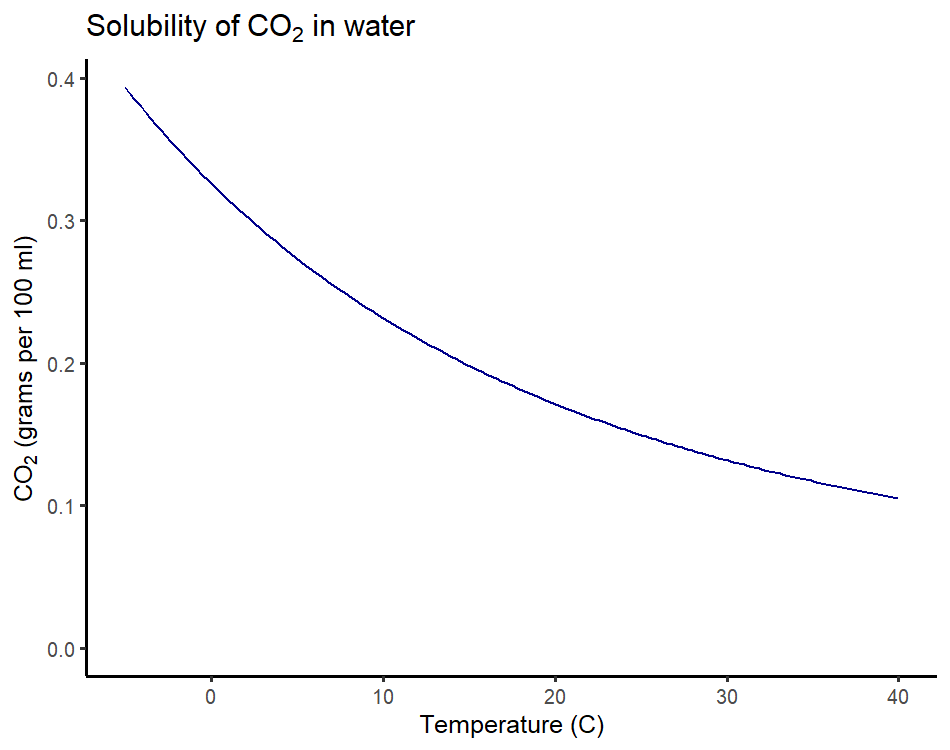
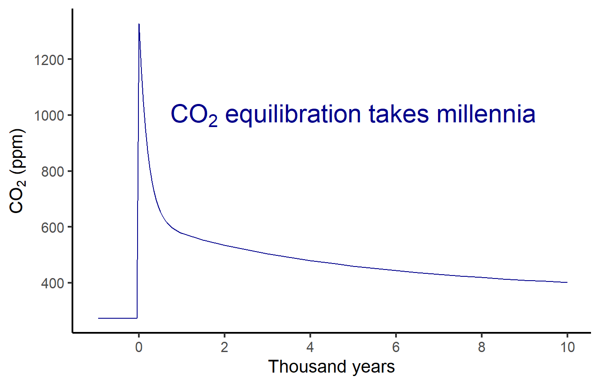

# Ice Ages {#ice-age-sec .center}

## 25,000 years ago  {#lgm-america data-transition="fade-out"}

:::::: {.bare}
{ style="height:900px;" }

::: {.credit}
Image credit: Ron Blakey
:::
::::::

## 25,000 years ago  {#lgm-world data-transition="fade"}

:::::: {.bare}
{ style="height:900px;" }

::: {.credit}
Image credit: Ron Blakey
:::
::::::
 
## Causes {#milankovitch}

{ style="height:900px;" }

## Timing of Ice Ages {#ice-age-timing}

{ style="height:900px;" }

## Question {#insolation-question .center}

Why would the summer sunlight in the   
far northern hemisphere be so important?
 
## Northern vs. Southern Hemisphere {#north-south-milankovitch}

:::::: {.columns}
::: {.column .bare}
{ style="height:900px;" }
:::
::: {.column .bare}
{ style="height:900px;" }
:::
::::::
::: {.credit}
Image Credit: Pearson Education, Inc.
:::
 
# Ice Age Feedbacks  {#ice-age-feedbacks-sec .center data-transition="fade-out" data-state="skip_slide"}

## Ice Age Feedbacks  {#ice-age-feedbacks data-transition="fade"}

::: {style="margin-top:3rem;"}
* Orbital cycles match timing of ice ages
* Changes in sunlight are too small to explain temperature changes
* There must be positive feedbacks to amplify them
:::
 
## Ice-Age Feedbacks: {#ice-age-feedbacks-review .ninety}

*  {+} Temperature starts to fall
   *  Glaciers grow \(\rightarrow\) greater albedo
   *  \(\COO\) drops \(\rightarrow\) weaker greenhouse
   *  Colder
*  {+} Temperature starts to rise
   *  Glaciers retreat \(\rightarrow\) smaller albedo
   *  \(\COO\) rises \(\rightarrow\) stronger greenhouse
   *  Warmer
*  {+} Without \(\COO\) and ice-albedo feedbacks, ice-ages couldn't happen
*  {+} Ice ages can't happen with today's \(\COO\) levels.

## Theory of Feedbacks {#hansen-pleistocene-attribution}

:::::: {.bare .ptop-3}
{ style="height:900px;margin:0px;" }

::: {.credit}
Image credit: J. Hansen _et al_., Phil. Trans. Royal Soc. A **371**, 20120294 (2013) doi:[10.1098/rsta.2012.0294](https://doi.org/10.1098/rsta.2012.0294 )
:::
::::::

## Theory vs. Observations {#hansen-theory-obs}

:::::: {.bare .ptop-3}
{ style="height:900px;" }

::: {.credit}
Image credit: J. Hansen _et al_., Phil. Trans. Royal Soc. A **371**, 20120294 (2013) doi:[10.1098/rsta.2012.0294](https://doi.org/10.1098/rsta.2012.0294 )
:::
::::::

<!--- --->{#plass}
------

{ style="border:0px; box-shadow:none; height:900px;" }

# The Oceans Breathe  {#oceans-breathe-sec .center data-transition="fade"}

## The Oceans Breathe  {#solubility-pump data-transition="fade"}

:::::: {.columns}
::: {.column style="width:60%;"}

:::
::: {.column .leftslide .eighty .ptop-3 style="width:39%;color:darkblue;"}
### **Solubility pump:**

* {+} Temperature rises:
  * CO~2~ moves from ocean to atmosphere.
* {+} Temperature falls:
  * CO~2~ moves from atmosphere to ocean.

### **Positive feedback** {.fragment .mtop-2 style="color:darkred;"}
:::
::::::

## Biological Pump {#biological-pump}

:::::: {.bare .mtop-3}
{style="height:900px;"}

::: {.credit}
Image credit: US Joint Global Ocean Flux Study
:::
::::::

# Structure of the ocean  {#ocean-structure-sec .center}

## Structure of the ocean  {#ocean-structure}

::::::::: {.columns}
:::::: {.column .ninety .ptop-2}
### **Lower Atmosphere:**

* {+} Heated from bottom
  * Sunlight absorbed at bottom (ground)
* {+} Warmer at bottom
* {+} Unstable $\rightarrow$ well-mixed

### **Ocean:** {.fragment .mtop-2}

* {+} Heated from top
  * Sunlight absorbed at top (sea-surface)
* {+} Warmer at top
* {+} Thermocline as barrier to mixing
* {+} Surface layer mixed by wind
* {+} Deep ocean poorly mixed
::::::
:::::: {.column .bare}
{style="height:900px;"}

::: {.credit}
Image credit: [Wikimedia](https://commons.wikimedia.org/wiki/File:THERMOCLINE.png)
:::
::::::
:::::::::

## Ocean Carbon Cycle  {#ocean-carbon-cycle}

### Numbers:

* {+} **Air $\Leftrightarrow$ Upper ocean:**
  * 1000 GT carbon in upper ocean
  * Very fast: 92 GT/year from atmosphere
* {+} **Upper $\Leftrightarrow$ Deep ocean:**
  * 38,000 GT carbon in deep ocean
  * Slow: 6 GT/year from upper ocean

::: {.eighty .mtop-3}
* GT = billion metric tons
  * 1 GT water is a cube 1 kilometer on each side
  * 1000 GT water is a cube 10 km (6 miles) on each side
:::

--- 

# The Rocks Breathe  {#rocks-breathe-sec .center data-transition="fade"}

## The Rocks Breathe  {#rocks-breathe data-transition="fade"}

* {+} Carbonate vs. Silicate minerals
* {+} Urey Reaction:
  $$ \mathrm{CaSiO_3} + \COO \Leftrightarrow \mathrm{CaCO_3} + \mathrm{SiO_2}$$
  * $\Rightarrow$ **weathering** (reactions near surface)
  * $\Leftarrow$ **metamorphism** (high temp./pressure deep beneath surface)
* {+} Silicate minerals formed at high temperature (igneous)
* {+} Carbonate minerals formed at low temperature (sedimentary)

## Why this is important {#weathering-importance .eightyfive}

* {+} Rain falls on silicate minerals
  * {+} CO~2~ dissolves into rainwater
  * {+} Dissolved CO~2~ makes rainwater is acidic
* {+} Acidic water dissolves silicate minerals
  * {+} Dissolved ions ($\mathrm{Ca^{+2}}$, $\mathrm{SiO_3^{-2}}$, etc.)
* {+} In oceans, plankton convert dissolved CO~2~ & ions to calcite
  (calcium carbonate)
* {+} Calcite ends up as limestone on sea floor
* {+} **Bottom line:**
  * Weathering silicate minerals transforms atmospheric CO~2~ to rocks on sea floor.
  * Detailed chemistry on Friday

## Weathering as Thermostat {#weathering-thermostat .ninety}

CO~2~ is balance of volcanic outgassing and chemical weathering

::: {.mtop-3}
* {+} **Temperature rises:**
  * {+} More rain, faster chemical reactions
  * {+} Faster weathering
  * {+} Atmospheric CO~2~ falls
  * {+} Temperature falls
* {+} **Temperature falls**
  * {+} Less rain, slower chemical reactions
  * {+} Slower weathering
  * {+} Atmospheric CO~2~ rises
  * {+} Temperature rises
* {+} Net effect:
  * Keeps temperature stable near some "set point"
  * Set-point is determined by geology
:::
 
## Temperature of Earth {#earth-thermostat}

* As long as outgassing is constant, weathering acts as thermostat.
* Earth's temperature has been remarkably stable over time.
* Change of volcanic outgassing changes "setting" of thermostat.

## Temperature of Mars and Venus {#mars-venus .ninety}

* {+} Mars used to be warm.
  * {+} Now it is frozen.
  * {+} Why?
    * {+} Volcanic outgassing stopped.
      * {+} All CO~2~ converted to rocks.
      * {+} No new CO~2~ from volcanoes.
* {+} Venus is scorching hot
  * {+} Why?
    * {+} Runaway greenhouse:
      * All water evaporated
      * Chemical weathering stopped
      * Volcanic outgassing/metamorphism converted all carbonate minerals to CO~2~ gas. 

