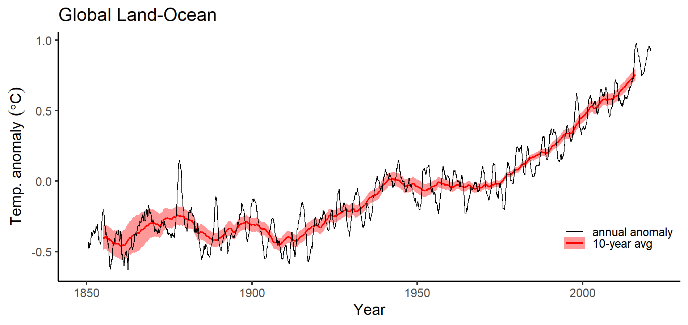
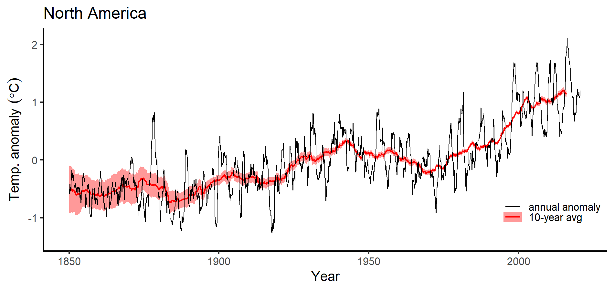
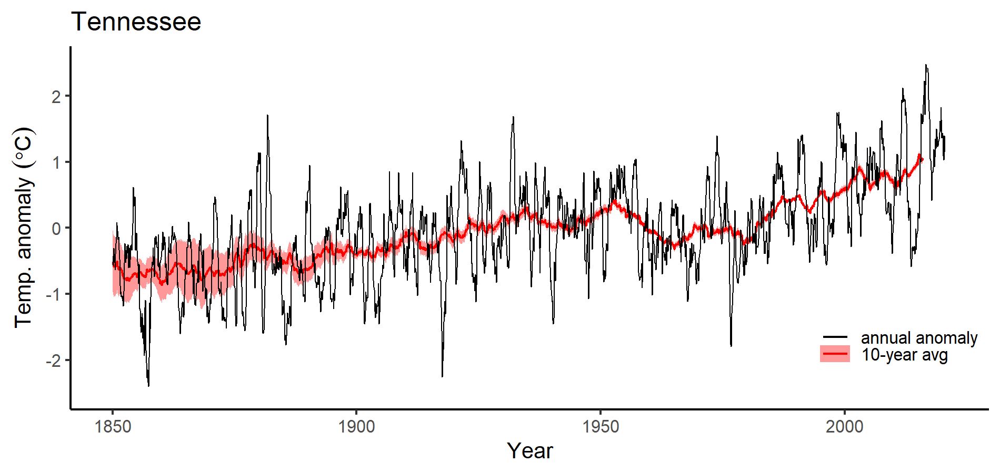
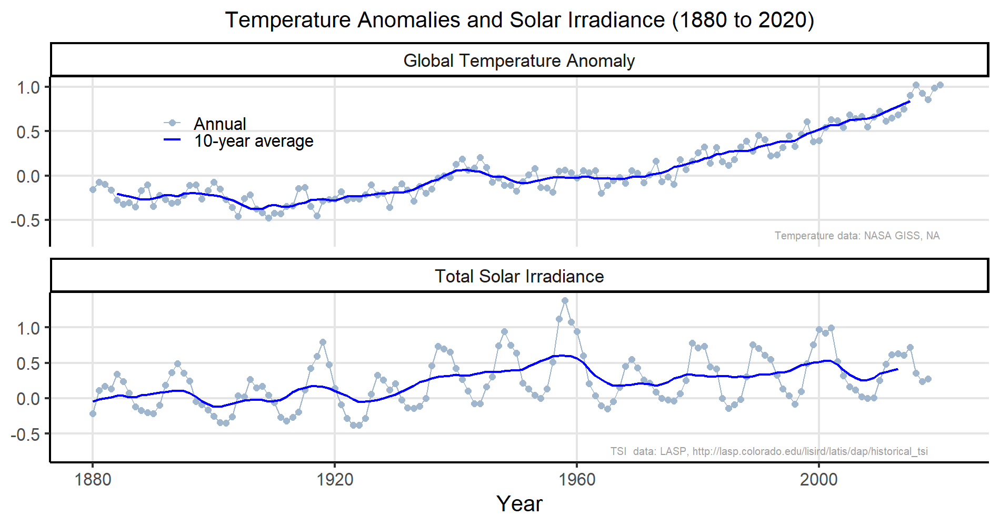
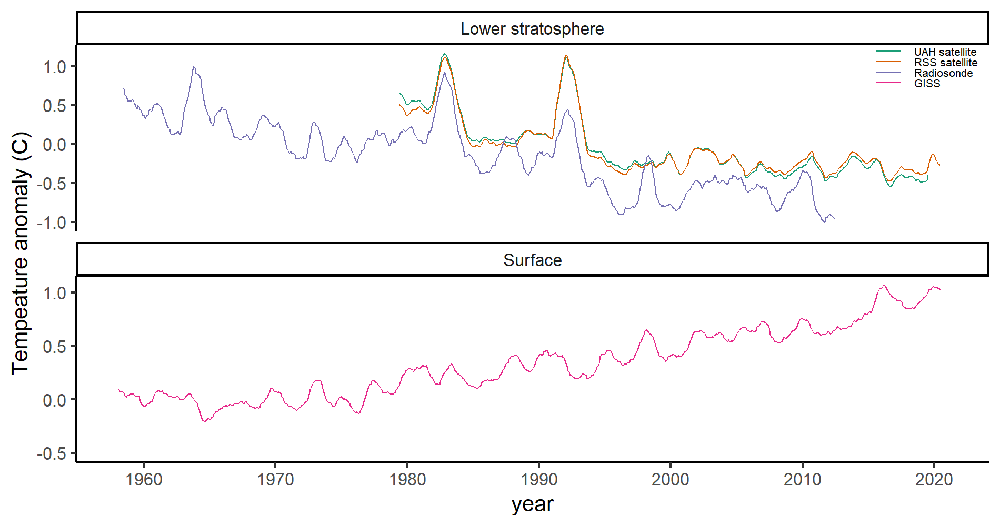

# Mineral Weathering {#weathering-sec .center}

## Carbonate vs. Silicate Weathering {#carbonate-silicate-comparison .eighty}

* {+} **Carbonate Weathering:**
  * {+} Dissolves carbonate minerals on land
  * {+} Increases ocean carbonate
    * {+} Adds _twice as much carbonate_ to oceans as silicate weathering
    * {+} Relieves ocean acidification
    * {+} Increases transfer of CO~2~ from atmosphere to ocean
    * {+} Creates carbonate rocks on sea floor 
      with carbon that originated on land
  * {+} Does not transform atmospheric CO~2~ to rocks
* {+} **Silicate Weathering:**
  * {+} Transforms carbon dioxide in atmosphere into rocks
    * Creates carbonate rocks on sea floor with 
      carbon that originated in atmosphere

## Weathering as Thermostat  {#thermostat-2-1 .eightyfive}

CO~2~ concentration is controlled by the balance of
 volcanic outgassing and chemical weathering

::: {.mtop-3}
* {+} **Higher temperatures:**
  * More rain, faster chemical reactions
  * Faster weathering
  * Atmospheric \(\COO\) falls
* {+} **Lower temperatures**
  * Less rain, slower chemical reactions
  * Slower weathering
  * Atmospheric \(\COO\) rises
:::

## Temperature of Earth {#temperature-recap}

::: {.mtop-3}
* Weathering acts as thermostat.
* {+} Earth's temperature has been remarkably stable over time.
  * {+} 4 billion years ago, sun was 30% dimmer...
  * {+} With today's greenhouse effect the earth would have been frozen
  * {+} But there has constantly been liquid water.
  * {+} Early earth had more greenhouse gases (thermostat)
* {+} Geologic change alters thermostat "setting":
  * {+} Volcanic outgassing
  * {+} Land surface (e.g., mountain ranges)
  * {+} Vascular plants
* {+} In the long run, silicate thermostat will fix global warming...
  * {+} ...but it will take tens to hundreds of thousands of years.
:::

## Prospects for future: {#future-prospects}

* {+} **Oceanic sinks:**
  * {+} A few centuries:
    * Around 50% of excess \(\COO\) dissolves into oceans
    * {+} Dissolution stops as oceans acidify
  * {+} A few thousand years:
    * Reactions with limestone restore \(\pH\), \(\COO\) solubility
  * {+} Hundreds of thousand of years
    * Silicate-mineral weathering removes and buries excess \(\COO\).
* {+} **Bottom line:**
  * CO~2~ stays in the atmosphere many thousands of years after we stop
    burning fossil fuels.

# {#co2-lifetime-plot data-background-color="white" data-background="assets/images/ar10f03.png" data-background-size="contain"}

# CO~2~ vs. Methane {#methane.lifetime}

* \(\COO\):
  * After 1000 years, around 30%
    of excess \(\COO\) remains in atmosphere
  * After 10,000 years, 13% remains
  * After 100,000 years, 6% remains
* {+} Methane (\(\methane\)):
  * 31 times more powerful (molecule-for-molecule) than \(\COO\)
  * {+} Atmospheric lifetime: 12.4 years:
    * {+} After 25 years, 13% remains.
    * {+} After 100 years, 0.031% remains.

# Climates of the Past  {#past_climates_sec .center data-transition="fade-out"}

## Climates of the Past  {#past_climates_0 data-transition="fade"}

{style="height:900px;"}

## Climates of the Past  {#past_climates_1 data-transition="fade"}

{style="height:900px;" }

## Climates of the Past  {#past_climates_2 data-transition="fade-in"}

{style="height:900px;" }

# Digging into the past  {#digging_sec data-transition="fade-out"}

## Digging into the past:   {#digging data-transition="fade-in"}

:::::: {.columns .vcenter}
::: {.column .centertext .pright-1}
Temperature measuring stations over the last 
130 years.
:::
::: {.column .textleft}
{.bare style="height:900px;"}
:::
::::::

## Surface Temperature Monitoring

:::::: {.columns }
::: {.column style="width:75%;"}

:::
::: {.column style="width:24%;vertical-align:bottom;font-size:75%;margin-bottom:1em;"}
* 7280 stations
* 2277 active
* 1656 > 100 years
:::
::::::

## Temperature Anomaly   {#anomaly_def .ninety data-transition="fade-out"}

* {+} **Global temperature change:**
  * {+} Average temperatures are different at different places.
  * {+} Temperatures change with the seasons
  * {+} How to compare temperature change between places with different climates?
* {+} **Temperature anomaly:**
  * {+} Define a reference time period (several decades)
  * {+} Anomaly = 
    [**actual temperature** at a place and time]{style="color:darkgreen;"}
    _minus_ 
     [**average temperature** at that place during reference period]{style="color:darkblue;"}

## Temperature Anomaly  {#anomaly_example .ninety data-transition="fade"}

* Anomaly = [**actual temperature** at a place and time]{style="color:darkgreen;"}
  _minus_ 
   [**average temperature** at that place during reference period]{style="color:darkblue;"}
* {+} **Example: Anomaly for Nashville, January, 2020**
  *  Monthly avg. temp. for [January, 2020 = \(7.2^\circ\mathrm{C}\)]{style="color:darkblue;"}
  *  [Average January temp 1950--1979 = \(3.0^\circ\mathrm{C}\)]{style="color:darkgreen;"}
  *  Anomaly = \({\color{darkblue}7.2^\circ\mathrm{C}} - {\color{darkgreen}3.0^\circ\mathrm{C}} = 4.3^\circ\mathrm{C}\)

## Global Anomaly 1850--2020 {.ninety data-transition="fade"}

## North America 1850--2020 {.ninety data-transition="fade"}

## Continental US Anomaly 1850--2020 {.ninety data-transition="fade"}

## Tennessee Anomaly 1850--2020 {.ninety data-transition="fade"}

## Nashville Anomaly 1850--2020 {.ninety data-transition="fade"}

# Ocean Temperatures {#ocean-tem-sec .center data-transition="fade-out"}

## Ocean Temperatures {#ocean-temp-argo-1 data-transition="fade"}

{style="height:900px;"}

## Ocean Temperatures {#ocean-temp-argo-deployment data-transition="fade"}

{style="height:900px;"}

## Ocean Heat Content {#ocean-heat-content data-transition="fade"}

{style="height:900px;"}

# Searching for a Smoking Gun: {#smoking-gun-sec .center}

## What caused the warming? {.center}

# Sunspots?  {#sunspots_sec data-transition="fade-out"}

## Sunspots?  {#sunspots data-transition="fade"}

:::::: {.columns .bare}
::: {.column .bare style="width:435px;"}
{style="height:400px;"}
:::
::: {.column .ptop-3 .seventyfive style="width:66%;"}
### **Sunspots**

* Discovered 1611 by Galileo and J. Fabricius
* More sunspots \(\rightarrow\) brighter
* 11 year cycle
* Intensity changes:
  * <1% for 11-year cycle
  * <0.1% change in decadal average from little ice age to present
:::
::::::

## Sunspots didn't cause recent warming {.ninety}

# Fingerprints: Predictions and Patterns {#fingerprint-sec .center}

## Predictions: 1967

{style="height:900px;"}

## Stratosphere vs. Surface:

## Day vs. Night 

{style="height:900px;"}

