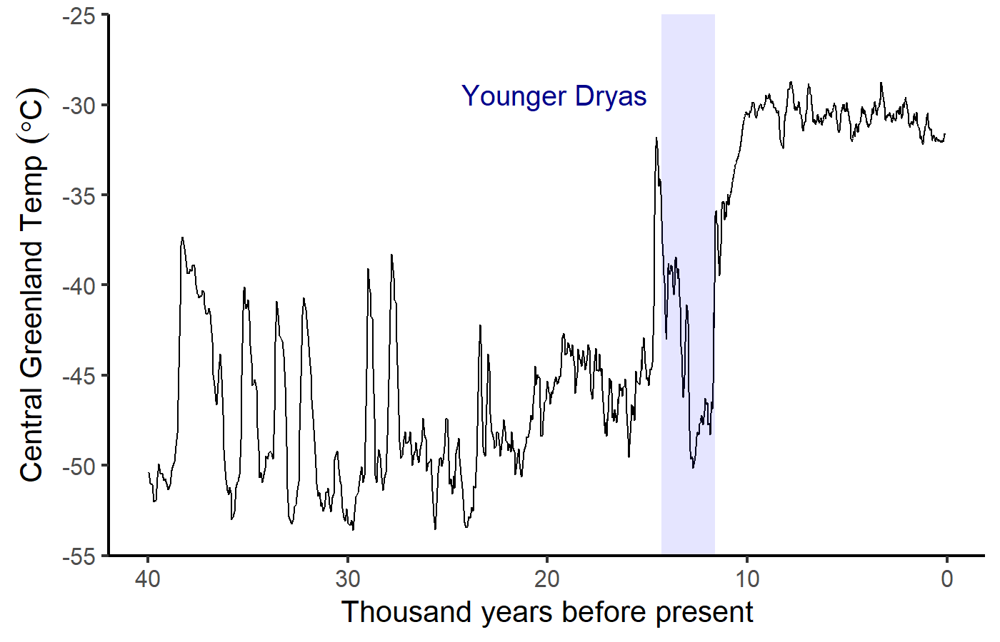
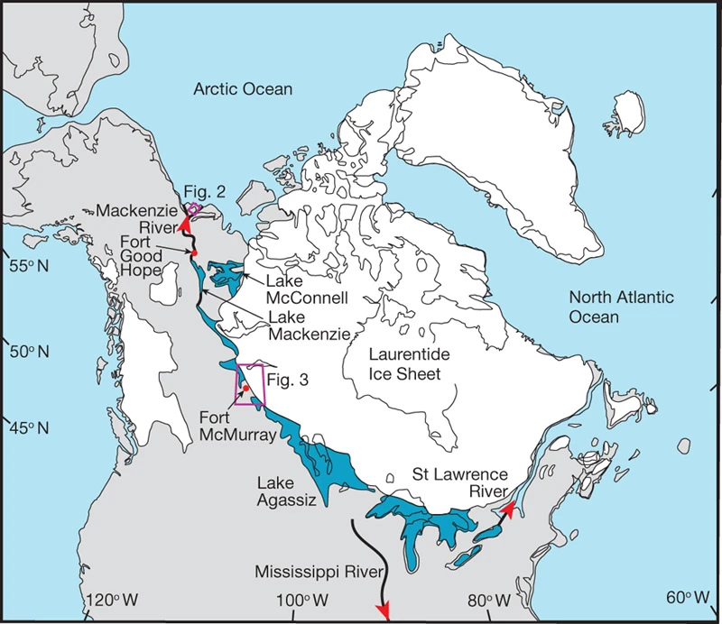
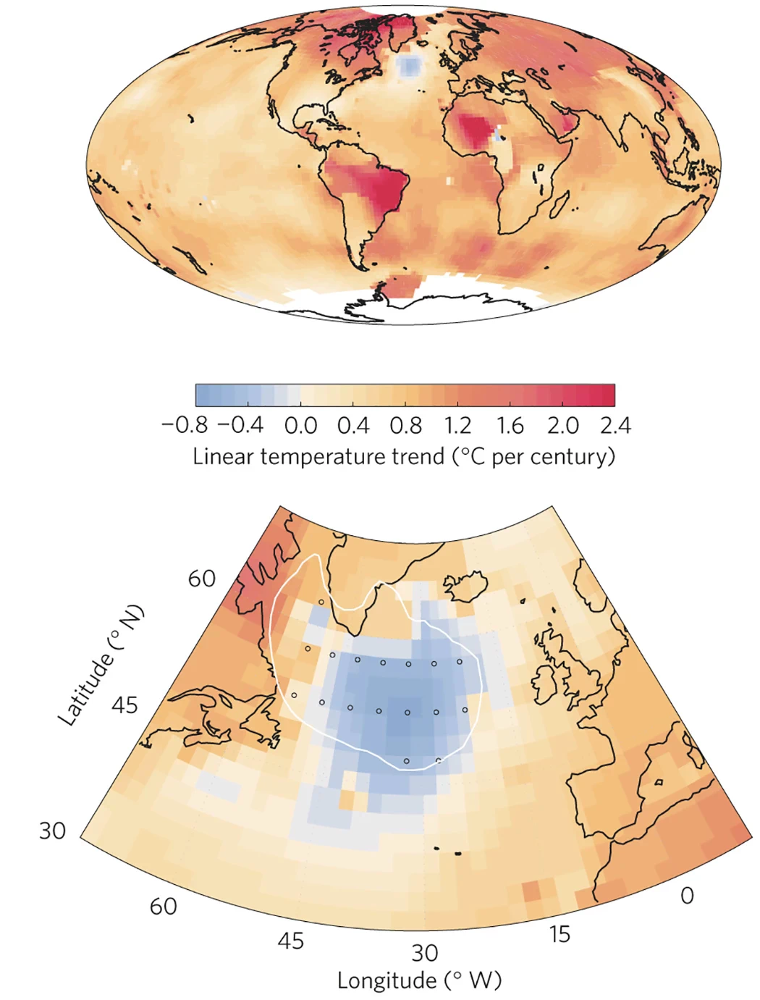

#  Oxygen & Hydrogen Isotopes {.center}

## Oxygen & Hydrogen Isotopes {.center .ninety}

::: {style="margin-bottom:1em;"}
$$\delta \ce{^{18}O} = \left(\frac{
\left(\frac{\ce{^{18}O}}{\ce{^{16}O}}\right)_{\text{sample}} -
\left(\frac{\ce{^{18}O}}{\ce{^{16}O}}\right)_{\text{ref}}}
{
\left(\frac{\ce{^{18}O}}{\ce{^{16}O}}\right)_{\text{ref}}
}
\right) \times 1000 \permil$$
:::

* $\delta\ce{^{18}O}$ compares measured concentration of $\ce{^{18}O}$ to the
  concentration in a reference sample.
* {+} Lighter isotopes (^1^H and ^16^O) evaporate faster
  * Vapor has less of heavier isotopes (smaller \(\delta\ce{^{18}O}\), 
    \(\delta\ce{D}\))
  * Ocean is richer in heavier isotopes (greater \(\delta\ce{^{18}O}\), 
    \(\delta\ce{D}\))
  * Warmer \(\rightarrow\) greater \(\delta\ce{^{18}O}\), \(\delta\ce{D}\) in 
    vapor

## Rain, Snow, Ice  {#rain_snow_ice_1 data-transition="fade"}

{style="height:900px;" }

## Rain, Snow, Ice  {#rain_snow_ice_2 data-transition="fade"}

:::::: {.columns}
::: {.column .eighty .mtop-1}
* {+} Rain, snow are richer in heavier isotopes
  * More precipitation \(\rightarrow\)
     less deuterium and \(\ce{^{18}O}\) left in vapor
  * Farther from source region \(\rightarrow\) 
     smaller \(\delta D\) and \(\delta \ce{^{18}O}\).
* {+} Reduction in \(\delta D\) and \(\delta \ce{^{18}O}\) depends
  on air temperature.
  * Different for H and O.
* {+} Comparing \(\delta D\) and \(\delta \ce{^{18}O}\) can tell us
  about both sea-surface temperature and air temperature over glaciers.
* {+} [**Higher air temperature over glacier
  \(\rightarrow\) 
  greater \(\delta D\) and \(\delta \ce{^{18}O}\)
  in glacier snow/ice.**]{style="color:#506BC2;"}
:::
::: {.column}
{style="width:600px;}
:::
::::::

## Sediments and History {#ocean_coring_1 .center data-transition="fade-in"}

{style="height:900px;"}

Bottom \(\rightarrow\) top = oldest \(\rightarrow\) youngest

<!--- ---> {#ocean_coring_3 .center data-transition="fade" }
------

{style="height:900px;"}

<!--- ---> {#ocean_coring_4 .center data-transition="fade" }
------

{style="width:900px;vertical-align:middle;"}
{style="width:900px;vertical-align:middle;"}

## Ocean Cores for Past Climates  {#ocean_coring_5 .center data-transition="fade"}

{}

## Deep-Sea Sediments {#ocean_coring_2 .center data-transition="fade"}

{style="height:900px;"}

## Past Sea Levels  {#sea_levels_1}

:::::: {.columns}
::: {.column .eighty style="padding-top:0.5em;padding-right:0.5em;"}
* Water vapor, rain, snow is always isotopically lighter than sea water
* {+} Snow, ice on land remove light isotopes from ocean
* {+} Bigger glaciers:
    * Lower sea-level
    * Greater (positive) \(\delta \ce{^{18}O}\) in ocean sediments
* {+} Smaller glaciers:
    * Higher sea-level
    * Smaller \(\delta \ce{^{18}O}\) in ocean sediments
:::
::: {.column}
{style="width:820px;" }
:::
::::::

## Sediment Climate Record  {#ocean_coring_6 .center data-transition="fade-in"}

{style="height:900px;"}

## Summary of Oxygen Isotopes {#o2-isotope-summary .eighty}

* Two different uses:
  * $\delta \ce{^{18}O}$ in **glacial ice** tells us about **air temperature**: 
    * Greater $\delta \ce{^{18}O}$ means warmer temperature.
  * $\delta \ce{^{18}O}$ in **sea-floor sediments** (skeletons of deep-sea 
    organisms) tells us about **sea level**:
    * Greater $\delta \ce{^{18}O}$ means lower sea-level.
* During ice-age cycles:
  * [**_cold temperatures_**]{style="color:darkblue;"} 
    go with 
    [**_low sea-level_**]{style="color:darkblue;"}
    * $\delta \ce{^{18}O}$ is _lower_ than usual in glaciers, 
      _greater_ in sea-floor sediments.
  * [**_warm temperatures_**]{style="color:darkred;"} 
    go with 
    [**_high sea-level_**]{style="color:darkred;"}:
    * $\delta \ce{^{18}O}$ is _greater_ than usual in glaciers, 
      _lower_ in sea-floor sediments.
  * But sea-level changes more slowly than temperature, so changes in sediments
    usually lag behind changes in glaciers.

# Questions about Carbon Cycle? {#q-carbon-cycle .center}

# Questions about MODTRAN? {#q-modtran .center}

## MODTRAN: {.ninetyfive}

* MODTRAN calculates _emissions_ and _absorption_ of longwave light in the 
  atmosphere.
* {+} Things that don't change during a run:
  * Heat from the sun
    * Set by "locality" of the atmosphere
  * Temperature of the ground and every layer of the atmosphere.
    * Set by "locality" of the atmosphere and "temperature offset"
    
      ::: {.eighty .mtop-1 .leftslide}
      | Locale | I~out~ (W/m^2^) | T~ground~ (K) |
      |:------:|----------------:|--------------:|
      | U.S. Standard Atmosphere | 267.98 | 288.2 |
      | Tropical | 298.67 | 299.7 |
      | Midlatitude winter | 235.34 | 272.2 |
      :::

* {+} For every wavenumber, MODTRAN calculates heat emission and absorption up and 
  down at each layer.

## MODTRAN: {.ninetyfive}

:::::: {.columns .ninety}
::: {.column}
* Emissivity ($\varepsilon$) = absorption
  * {+} Fraction absorbed by layer $= \varepsilon$
  * {+} Radiation emitted by layer $= \varepsilon \sigma T^4$
* {+} $\varepsilon$ small (near zero): 
  * Little absorption or emission.
* {+} $\varepsilon$ large (near one): 
  * Almost all incoming radiation is absorbed
  * Emission close to black body at temperature _T_.
* {+} $\varepsilon$ is large for wavenumbers where greenhouse gases absorb
  strongly.
  * Greater concentration $\rightarrow$ larger $\varepsilon$
* {+} $\varepsilon$ is small where there is little absorption
  * Atmospheric window
:::
::: {.column}
* {+} **Looking down from space:**
  * You see emission at the temperature of the **_highest layer_ with large $\varepsilon$**.
  * {+} In atmospheric window, that layer is near the ground
  * {+} With clouds, it's the top of the highest cloud
* {+} **Looking up from ground:**
  * You see emission at the temperature of the **_lowest layer_ with large $\varepsilon$**.
  * {+} In atmospheric window, there's no such layer, so you see very little emission
    * You're seeing emission from outer space, which is very cold.
  * {+} With clouds, it's the bottom of the lowest cloud
:::
::::::

# Abrupt Climate Change  {#abrupt-sec .center}

## Abrupt Climate Change  {#abrupt-1 data-transition="fade-out"}

## Abrupt Climate Change  {#abrupt-2 data-transition="fade-in"}

## Younger Dryas

::::::::: {.columns}
::::::: {.column .bare .mtop-2}

::: {.credit}
J.B. Murton _et al._, Nature **464**, 740 (2010). 
doi: [10.1038/nature08954](https://doi.org/10.1038/nature08954)
:::
::::::
:::::: {.column .eightyfive .mtop-3}
* About 14,000 years ago there was rapid warming
* {+} Giant Glacial Lake Agassiz
  * {+} When enough ice melted, Lake Agassiz drained into Arctic and Atlantic
    Oceans
  * {+} Fresh water diluted salt water
    * Less dense, wouldn't sink
    * Stopped deep-water formation
    * Blocked conveyor belt current
  * {+} Warm currents (Gulf stream, Mediterranean current) bring lots of
    heat to North Atlantic, Western Europe.
    * Without that heat, cold temperatures returned

::::::
:::::::::

## Cold Pool in North Atlantic {#cold-spot}

::::::::: {.columns}
::::::: {.column .bare .mtop-2}
[Warming Trend: 1900--2013]{.eighty}

{.bare style="height:850px;"}

::: {.credit}
S. Rahmstorf _et al._, _Nature Climate Change_ **5**, 475 (2015).
doi: [10.1038/nclimate2554](https://doi.org/10.1038/nclimate2554)
:::

::::::
:::::: {.column .mtop-3 .eightyfive}
* Atlantic circulation (Gulf stream, etc.) has slowed down
* {+} Without that heat, a pool of water in the North Atlantic is cooling
* {+} Fresh water from melting ice on Greenland may be partially responsible.
::::::
:::::::::

# Climate in the Last Millennium  {#millennium-sec .center data-transition="fade-out"}

## Walker River  {#walker-river}

{style="height:900px;vertical-align:top;margin-right:10px;"}
{style="vertical-align:top;margin-left:10px;"}

## Relict Tree Stumps  {#walker-relicts data-transition="fade"}

{style="height:900px;"}

## Relict Tree Stumps  {#walker-relicts-2 data-transition="fade"}

{style="height:900px;"}

## Lake Tanaya, Yosemite  {#yosemite data-transition="fade"}

{style="height:900px;"}

## Chaco Canyon  {#chaco data-transition="fade"}

{style="height:900px;"}

## Reconstructing Megadroughts  {#megadroughts}

::: {.bare .mtop-3}
{style="height:500px;"}

{style="height:430px;"}
:::

## Dust Bowl vs. Megadroughts  {#dust-bowl .yellowtitle .ninety data-background="assets/images/dust_bowl_1.jpg"}

 

<ul>
<li>1930s &quot;Dust Bowl&quot;
<ul>
<li>6 years</li>
<li>25% reduction in rainfall in plains states</li>
<li>Hundreds of thousands of refugees</li>
</ul></li>
<li class="fragment fade-in">Medieval Megadroughts:
<ul>
<li>Multiple droughts</li>
<li>60 years or longer (up to 240)</li>
<li>40% reduction of rainfall in plains states</li>
</ul></li>
</ul>

