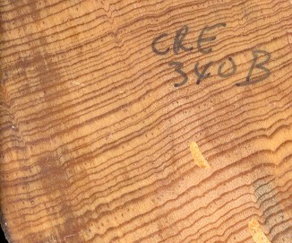

## Solving the Ice-Age Puzzle  {#ocean_coring_5 .center data-transition="fade"}

{}

## Deep-Sea Sediments {#ocean_coring_2 .center data-transition="fade"}

{style="height:900px;"}

## Past Sea Levels  {#sea_levels_1}

:::::: {.columns}
::: {.column .eighty style="padding-top:0.5em;padding-right:0.5em;"}
* Water vapor, rain, snow is always isotopically lighter than sea water
* {+} Snow, ice on land remove light isotopes from ocean
* {+} Bigger glaciers:
    * Lower sea-level
    * Greater (positive) \(\delta \ce{^{18}O}\) in ocean sediments
* {+} Smaller glaciers:
    * Higher sea-level
    * Smaller \(\delta \ce{^{18}O}\) in ocean sediments
:::
::: {.column}
{style="width:820px;" }
:::
::::::

## Sediment Climate Record  {#ocean_coring_6 .center data-transition="fade-in"}

{style="height:900px;"}

# Florida Through History  {#florida_sea_level-sec .center data-transition="fade-out"}

## Florida 10,000 years ago  {#florida_sea_level_1 data-transition="fade"}

### End of last ice age: <br/>Sea level 400 feet lower

{style="height:750px;"}

## Florida 5 million years ago  {#florida_sea_level_2 data-transition="fade"}

### Last time CO~2~ was at today's levels. <br/>Sea level \~20 meters higher

{style="height:750px;"}

## Florida 50 million years ago  {#florida_sea_level_3 data-transition="fade"}

### CO~2~ levels we might reach around 2100. <br/>Sea level >70 meters higher

{style="height:750px;"}

## Summary of Past Sea Levels {#summary_sea_level}

{style="height:900px;"}

# Other Evidence<br/>of Past Climates ...   {#petm_sec .center data-transition="fade-out"}

## Other Evidence of Past Climates ...   {#petm_1 .center data-transition="fade-in"}

:::::: {.columns .mtop-2}
::: {.column .mtop-3 style="width:1100px;"}
* Sediments tell us about history:
    * Bottom \(\rightarrow\) top = oldest \(\rightarrow\) youngest
* White carbonate sediments
* Red clay layer:
    * {+} ~55 million years ago
    * {+} Almost no carbonates
* {+} What does red layer tell us?
:::
::: {.column style="width:300px;"}
{style="height:900px;"}
:::
::::::

## Other Evidence of Past Climates...   {#petm_2 data-transition="fade"}

:::::: {.columns .mtop-2}
::: {.column .eighty .bare style="width:900px;"}
$$ \calcite \rightleftharpoons \Caplus + \carb $$

* {+} Alkaline Ocean:
    * High \(\carb\): Reaction runs \(\Leftarrow\)
    * Carbonates survive on sea floor
* {+} Acid Ocean:
    * Low \(\carb\): Reaction runs \(\Rightarrow\)
    * Carbonates dissolve
    * Only clay is left
* {+} Red clay layer \(\Rightarrow\) ocean acidification
    * {+} Large burst of \(\COO\) into atmosphere.

:::
::: {.column .bare style="width:480px;padding-top:280px;"}
{}
:::
::: {.column .bare style="width:300px;"}
{style="height:900px;"}
:::
::::::

## Other Evidence of Past Climates...   {#petm_3}

:::::: {.columns}
::: {.column .bare}
$$ \calcite \rightleftharpoons \Caplus + \carb $$

* {+} Just below red clay layer,  \(\delta \ce{^{13}C}\) drops suddenly.
* {+} What does that tell us?</li>
* {+} Lower \(\ce{^{13}C}\) means rise in
  \(\COO\) came from organic source.</li>
:::
::: {.column .bare}
{style="height:900px;"}
:::
::::::

## Paleocene-Eocene Thermal Maximum {#petm}

* {+} 55 million years ago
* {+} 1500--4500 GT carbon added to atmosphere in 1000 years
  * {+} Compare:
    *  600 GT in atmosphere in 1700s, 
    *  760 GT today
    *  Known fossil fuels: \~5000 GT
* {+} Temperature rose 5--9&deg;C (9--16&deg;F)
  * Ocean at North Pole was about 23&deg; C (73&deg; F).
  * Breadfruit & other tropical trees grew in Canada
* {+} Lasted \~120,000 years
  * Transition to cooler temperatures took \~40,000 years
* {+} Eocene \(\rightarrow \cdots \rightarrow\) Pliocene \(\rightarrow\) Pleistocene
  * Gradual cooling for 50 million years
  * {+} Ice age glaciation of North America, Europe begins \~2.8 MYA

# Climate in the<br/>Last Millennium  {#millennium-sec .center data-transition="fade-out"}

## Walker River  {#walker-river}

{style="height:900px;vertical-align:top;margin-right:10px;"}
{style="vertical-align:top;margin-left:10px;"}

## Relict Tree Stumps  {#walker-relicts data-transition="fade"}

{style="height:900px;"}

## Relict Tree Stumps  {#walker-relicts-2 data-transition="fade"}

{style="height:900px;"}

## Lake Tanaya, Yosemite  {#yosemite data-transition="fade"}

{style="height:900px;"}

## Chaco Canyon  {#chaco data-transition="fade"}

{style="height:900px;"}

## Reconstructing Megadroughts  {#megadroughts}

::: {.bare .mtop-3}
{style="height:500px;"}

{style="height:430px;"}
:::

## Dust Bowl vs. Megadroughts  {#dust-bowl .yellowtitle .ninety data-background="assets/images/dust_bowl_1.jpg"}

<br/>

<div style="color:yellow;vertical-align:bottom;bottom: -100px;position: relative;font-size: 130%;line-height: 120%;">
<ul>
<li>1930s &quot;Dust Bowl&quot;
<ul>
<li>6 years</li>
<li>25% reduction in rainfall in plains states</li>
<li>Hundreds of thousands of refugees</li>
</ul></li>
<li class="fragment fade-in">Medieval Megadroughts:
<ul>
<li>Multiple droughts</li>
<li>60 years or longer (up to 240)</li>
<li>40% reduction of rainfall in plains states</li>
</ul></li>
</ul>
</div>

# Medieval Warm Period: {#MWP-sec .center}

## The Saga of the Medieval Warm Period.

{style="height:500px;max-width=100%;"}

::: {.credit .bare .mtop-1}
H.H. Lamb, _Climate, History, &amp; the Modern World_ (1982)<br/>
IPCC, _Climate Change: The IPCC Scientific Assessment_ (1990), Fig. 7.1.
:::

* {+}  Hand-drawn schematic figure
* {+}  Based on indirect inferences
* {+} Schematic, not quantitative (no numbers on temperature axis)
* {+}  Data represented Europe, not the whole world

## Climate Proxies

::::::::: {.columns}
:::::: {.column}
{style="width:100%;"}

::::::
:::::: {.column}
{style="width:100%;"}
::::::
:::::::::


## Past 1000 years


:::::: {.bare .mtop-3}
{style="height:900px;"}

::: {.credit .mtop-1}
WMO, _Statement on the Status of the Global Climate_ (1999)
:::
::::::

## ClimateGate

* {+} November 2009
  * Beginning of the Copenhagen meeting of the parties to 
    U.N. Framework Convention on Climate Change
  * President Obama was expected to lead negotiation of a new aggressive
    treaty to fight climate change.
* {+} November 10:
  * Purloined email and computer files from Climate Research Unit (CRU) at 
    U. East Anglia posted on web.
  * {+} 13 years of data (1996-2009)
    * 60 MB, 1000+ emails

## Were Scientists Dishonest?

::: {style="color:black; margin-top:100px;" }
```
From: Phil Jones 
Date: Tue, 16 Nov 1999

I’ve just completed Mike’s Nature trick of adding in the real temps to 
each series for the last 20 years (ie from 1981 onwards) amd from 1961 
for Keith’s to hide the decline.
```
:::

## What Was "The Decline"?

:::::: {.columns}
::: {.column .ptop-3 .eighty}
* Tree rings reflect climate only when trees are in extreme conditions that 
  limit growth
* {+} In Siberia, extreme cold limits tree growth
  * {+} Warmer temperatures mean more growth
  * {+} But eventually, it got warm enough that temperature wasn't limiting
    growth any more.
* {+} After 1960, tree rings weren't reliable
  * {+} But thermometers were
* {+} Mike's "trick": Replace tree rings with thermometer data after 1960.
:::
::: {.column}
{style="width:100%;"}
:::
::::::

## Newer Data, More Proxies

{style="height:850px;max-width=100%;"}

::: {.credit .bare .mtop-1}
M. Mann _et al._, Science **326** 1256 (2009).
:::

## Patterns of Temperature

{style="height:850px;max-width=100%;"}

::: {.credit .bare .mtop-1}
M. Mann _et al._, PNAS **105** 13252 (2008).
:::

## A Historian Reflects

> Aside from crackpots who complain that a conspiracy is suppressing 
> their personal discoveries, 
> **we've never before seen a set of people accuse an entire community of 
> scientists of deliberate deception** 
> and other professional malfeasance. 
>
> **Even the tobacco companies never tried to slander legitimate cancer 
> researchers.** ... [W]e are told that the warnings about future global 
> warming ... are not only mistaken, but based on a hoax, indeed a 
> conspiracy that must involve thousands of respected researchers. 
> Extraordinary and, frankly, weird.
>
> [--- Spencer Weart, historian of science]{style="text-align:right;"}
