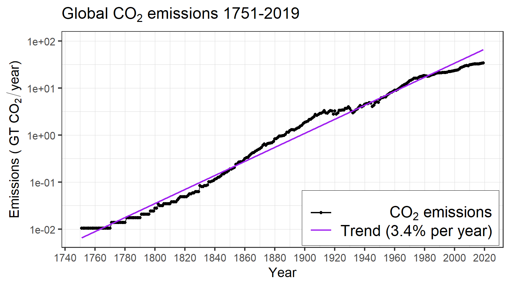

# Climate and Economy  {#climate-econ-sec .center}

## Climate and Economy  {#climate-econ-1 .ninety}

::: {.textcenter .mbot-2}
**How well do markets manage global warming?**
:::

* {+} How well do markets manage supply and price of bread?
* {+} What is different about global warming?
* {+} Externalities:
  * {+} What is an externality?
  * {+} Are externalities good or bad?
  * {+} What challenges to they pose for markets?
  * {+} How can market-based economies manage externalities better?

::: {.textcenter .fragment .mtop-3}
**Discuss for 5 minutes in breakout rooms**
:::

## Energy, Economy, Emissions  {#ege-1 data-transition="fade"}

## Energy, Economy, Emissions  {#ege-2 data-transition="fade"}

# Kaya Identity  {#kaya-sec .center}

## Kaya Identity  {#kaya .ninety}

$$
\color{darkgreen}{P} \times 
  \frac{\color{blue}{G}}{\color{darkgreen}{P}} \times 
  \frac{\color{purple}{E}}{\color{blue}{G}} \times 
  \frac{\color{red}{F}}{\color{purple}{E}} = \color{red}{F},
$$
 

**where**

 
$$
\begin{aligned}
  \color{red}{F} &= \COO~\text{emissions}\\
  \color{purple}{E} &= \text{energy use}\\
  \color{blue}{G} &= \text{gross domestic product}\\
  \color{darkgreen}{P} &= \text{population}
\end{aligned}
$$

## Kaya Identity  {#kaya-2 .ninety data-transition="fade"}

$$\begin{aligned}
  \color{red}{F} &= \color{darkgreen}{P} \times 
  \frac{\color{blue}{G}}{\color{darkgreen}{P}} \times 
  \frac{\color{purple}{E}}{\color{blue}{G}} \times 
  \frac{\color{red}{F}}{\color{purple}{E}}\\
  &= \color{darkgreen}{P} \times \color{blue}{g}\times 
  \color{purple}{e} \times \color{red}{f}\\
\end{aligned}$$
 
**where**
 
$$\begin{aligned}
  \color{darkgreen}{P} &= \text{population}\\
  \color{blue}{g} &= \color{blue}{G} / \color{darkgreen}{P} = \text{per-capita GDP}\\
  \color{purple}{e} &= \color{purple}{E} / \color{blue}{G} = \text{energy intensity of economy}\\
  \color{red}{f} &= \color{red}{F} / \color{purple}{E} = \COO~\text{intensity of energy supply}
\end{aligned}$$

## Kaya Identity in Practice  {#kaya-3 .ninety data-transition="fade"}

# Computer Models of Climate {#climate-models-sec data-transition="fade" data-state="skip_slide"}

## Computer Models of Climate {#climate-models data-transition="fade-out"}

{style="height:900px;"}

## Computer Models  {#models-2 data-transition="fade"}

{style="height:900px;"}

## Computer Models  {#models-3 data-transition="fade"}

:::::: {.columns style="display:flex;align-items:center;justify-content:center;"}
::: {.column style="width:50%;"}

{style="height:900px;"}

:::
::: {.column style="width:50%;"}

{style="height:900px;"}

:::
::::::

## Principles of Computer Modeling  {#models-4 .ninety}

* Make models as simple as possible:
  * Start simple
  * Add complexity only as needed
    * Different models for different purposes
  * Check model against real world

{.fragment .fade-in style="height:630px;"}

# Transient vs. Equilibrium Response  {#transient-response-sec .center data-transition="fade-out"}

## Transient vs. Equilibrium Response  {#transient-response .ninety data-transition="fade-in"}

::::::{.columns}
:::{.column .ptop-3}
* {+} Gradually raise \(\COO\) and then stop.
* {+} Planet takes time to heat up
  * {+} Oceans absorb heat
  * {+} Like pot of water on stove
* {+} Transient response: \(\Delta T\) when \(\COO\) stops changing
* {+} Equilibrium response: Stable temperature (much later)
  * [Green: Atmosphere & surface ocean]{style="color:darkgreen;"}
  * [Red: Atmosphere, surface ocean, & deep ocean.]{style="color:red;"}
* {+} Equilibrium takes many decades.
:::
::: {.column .bare style="width:780px;"}
{style="width:780px;height:900px;max-height:100%;max-width:100%;"}
:::
::::::

# Modeling for Science vs. Policy  {#iams-sec .center data-transition="fade-out"}

## Modeling for Science vs. Policy  {#iams .ninety data-transition="fade-out"}

### Integrated Assessment Models (IAMS)

* {+} Combine climate system and world economy 
  * {+} Emissions as a consequence of economic activity
    * {+} Energy use for production (factories, etc.)
    * {+} Energy use for consumption (households, etc.)
    * {+} Farming: fertilizers, livestock, paddy fields, etc.
  * {+} Climatic impacts on economy
    * {+} Cost of severe weather
    * {+} Sea level rise
    * {+} Droughts & heat waves
    * {+} ...
* {+} **Optimize for greatest net economic output**
    
## Climate Projections  {#model-scenarios .eightyfive .center}

* {+} Biggest uncertainty in predicting future climates is GHG emissions
  *  {+} We can predict consequences of emissions
  *  {+} We can't predict what emissions will be
* {+} Scenarios and Pathways:
  * {+} **Scenario**: possible future, 
    *  Story of economic & political development $\rightarrow$ resulting emissions
  * {+} **Pathway**: possible future, 
    *  Trajectory of emissions $\rightarrow$ economic activity that might cause them
* {+} Projections:
  * {+} Conditional predictions: 
    * "**If** emissions do this, **then** climate will do that."

<!--- ---> {#us-projections .center data-transition="fade" }
------

### Projections for future emissions in US:

|                       |  2010    |  2050    | Growth rate |
|-----------------------|---------:|---------:|-------------------------:|
| _g_ (\$/person)       |  42,300   |  83,495  |  1.7%  |
| _ef_ (tons/$million)  |  432  |  228 |  -1.6%  |
| _P_ (millions)        |  309   |  393  |  0.6%  |
| **Total Emissions** $F$ (million tons CO~2~)   |  **5,647** | **7,471** | 1.7 - 1.6 + 0.6 = **0.7%** |

<!--- ---> {#world-projections .center data-transition="fade" }
------

### Projections for future world emissions:

|                       |  2010    |  2050    | Growth rate |
|-----------------------|---------:|---------:|-------------------------:|
| _g_ (\$/person)       |  9,780   |  22,654  |  2.1%  |
| _ef_ (tons/$million)  |  522  |  275 |  -1.6%  |
| _P_ (millions)        |  6,410   |  9,188  |  0.9%  |
| **Total Emissions** $F$ (million tons CO~2~)   |  **32,724** | **57,289** | 2.1 - 1.6 + 0.9 = **1.4%** |

## Uncertainties in Projections  {#model-uncertainties-2 data-transition="fade"}

### Projections for future world emissions: {.mtop-3}

|                       |  2010    |  2050    | 2100  |    Growth rate     |
|-----------------------|---------:|---------:|------:|-------------------:|
| _g_ (\$/person)       |  9,780   |  22,654  |  64,737  |  2.1%  |
| _ef_ (tons/$million)  |  522   |  275  |  124  |  -1.6%  |
| _P_ (millions)        |  6,410   |  9,188  |  14,409  |  0.9%  |
| **Total Emissions** $F$ (million tons CO~2~)   |  **32,724** | **57,289** | **115,366** | **1.4%** |

## Uncertainties in Projections {#higher-growth data-transition="fade"}

### Projections for future world emissions with slightly different growth rates: {.mtop-3}

|                       |  2010    |  2050    | 2100  |    Growth rate     | &Delta; rate |
|-----------------------|---------:|---------:|------:|-------------------:|--------------------:|
| _g_ (\$/person)       | 9,780  | 24,541  | 77,505  | 2.3%  | 0.2% |
| _ef_ (tons/$million)  | 522 | 298 | 148 | -1.4% | 0.2% |
| _P_ (millions)        | 6,410  | 9,563  | 15,766  | 1.0%  | 0.1% |
| **Total Emissions** $F$ (million tons CO~2~)   |  **32,724** | **69,973** | **180,930** | **1.9%** | 0.5% |
| **Difference**        |                                  | **12,684**    | **65,564**    | **0.5%** |
| **Difference (%)**    |                                  | **22%**   | **57%**   |             |
