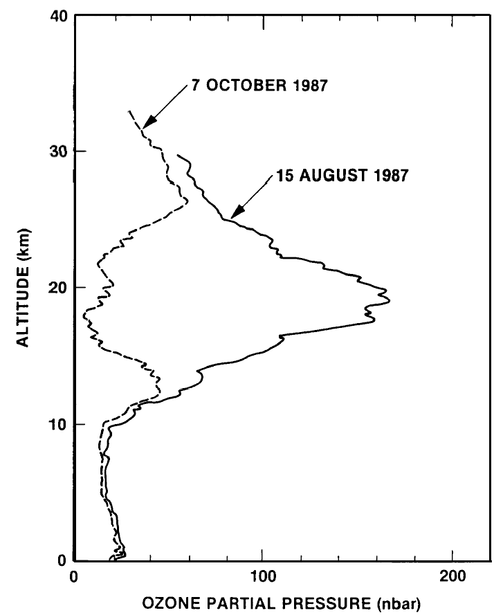
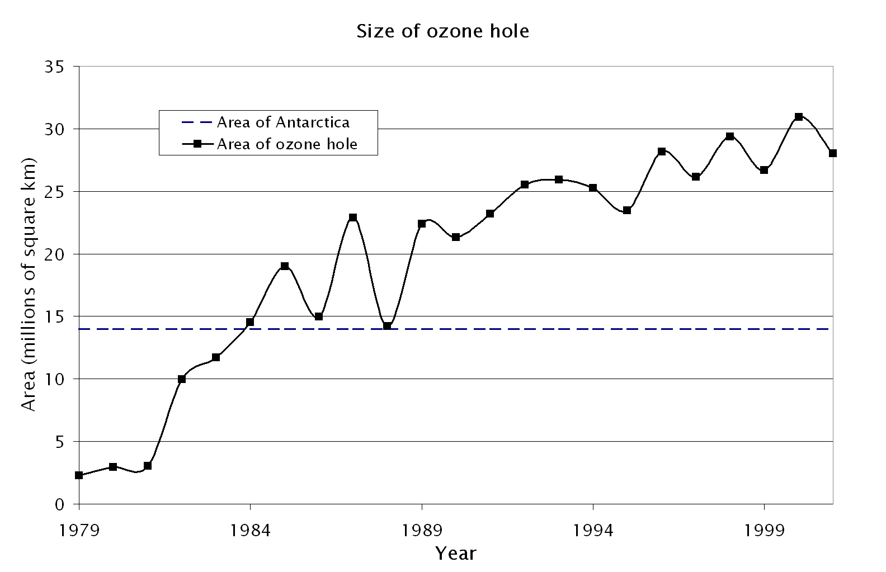

# Pielke and Nordhaus {#pielke-nordhaus-sec .center}

## Pielke and Nordhaus {#pielke-nordhaus-policy .eightyfive}

### **Pielke:**

> Although some scientists believe that there may be "tipping points" ...
> no one knows if or when there might be a threshold effect.

### **Nordhaus:**

> Humans are in effect spinning the roulette wheel when we inject
> CO~2~ and other gases into the atmosphere. The balls may land in the 
> favorable black pockets or in the unfavorable red pockets, or possibly
> in the dangerous zero or double-zero pockets.

## Principles of Tipping Points {#tipping-principles .eighty}

* {+} Ordinary positive feedbacks amplify changes
   (hot &rarr; hotter, cold &rarr; colder).
  * Small positive feedbacks amplify but the _system remains stable_.
* {+} If positive feedbacks are too strong they become _self-perpetuating_.
  * Secondary forcing from feedback creates _unstoppable change_.
* {+} If feedback _strengthens with warming_:
  * Tipping point: feedback becomes strong enough to 
    continue warming independent of external forcing.
* {+} **Not all positive feedbacks have tipping points.**
* {+} **Hard to predict** when a positive feedback might go from
  _amplifying_ to _runaway_ (tipping point).

## Stratospheric Ozone {#ozone .center .eighty}

* Ozone is a naturally occurring molecule in the stratosphere
  * From 15--35 km altitude
* {+} Blocks harmful ultraviolet (extreme shortwave) radiation
  * Disrupts DNA and proteins in the lens of the eye
  * Causes skin cancer
  * Causes blindness from cataracts
* {+} Scientists have measured ozone from the ground since the 1920s
  * Useful for understanding winds and weather

## Stratospheric Ozone Depletion {#ozone-depletion .center .eighty}

* {+} 1974: Scientific prediction: 
  * Chlorofluorocarbon chemicals will destroy ozone
  * {+} Scientists believed ozone destruction would be gradual
* {+} September 1980: Scientists in Antarctica see ozone go to zero
  in a matter of days
* {+} 1985: Announcement: Discovery of a giant hole in the ozone layer
  over Antarctica every spring
* {+} Tipping point:
  * Stratospheric chlorine < 2 parts per billion: No ozone hole
  * Stratospheric chlorine > 2 parts per billion: Ozone hole appears

  ::: {.textcenter .bare .mtop-1}
  {style="height:535px;"}
  :::

## Discovery of the Ozone Hole {.seventy}

::::::::: {.columns}
:::::: {.column}
* Halley Bay Antarctica
  * British meteorological station
  * Measured ozone every month from 1958
* {+1} Antarctic Winter
  * June--September
  * No sun for months
* {+2} September 1980
  * Shortly after the sun rose, ozone disappeared
  * Ozone returned a few months later
  * {+3} Station head Joe Farman thought his instrument must be broken
    * {+4} Ordered a new instrument from England
    * {+5} The next September both instruments saw ozone disappear
  * {+6} 1984: Farman reports ozone hole
    * {+7} NASA had launched Total Ozone Mapping Spectrometer in 1979
      * Why hadn't it seen an ozone hole
    * {+8} NASA had programmed the computers to ignore crazy low ozone values
::::::
:::::: {.column}

{.fragment data-fragment-index="2" style="height:900px;"}

::::::
:::::::::

## Growth of Ozone Hole

{style="height:900px;"}

## Ozone Policy

::: {.textcenter .bare .mtop-3}
{style="height:535px;"}
:::

* {+} 1970s: Significant scientific uncertainty
* {+} Decision to take action without waiting for certainty
* {+} Discovery of hole: tipping point
* {+} Flexible policy (renegotiate details every two years)

## History of Ozone over Halley Bay

{style="width:1900px;"}

## Success: Avoided Futures  {#futures-2 data-transition="fade-in"}

{style="height:900px;"}

## Important Note: {.ninety}

* {+} The ozone hole is completely different from global warming
* {+} Caused by chemical reactions with chlorine atoms
* {+} However: 
  * CFC chemicals that destroy ozone are also powerful greenhouse gases
  * {+} Ozone depletion is temperature-sensitive
    * {+} Hole over Antarctica because of very cold stratosphere (much colder than arctic)
    * {+} Global warming cools stratosphere
    * {+} If we had not stopped production of CFC chemicals
      An ozone hole might have started over arctic too.

## Climate Tipping Points? {#climate-tipping-points .eighty}

* {+} *Climate Casino*: No big danger of fast tipping points if warming stays less than 3&deg;C
* {+} Recent research: West Antarctic Ice Sheet may have already crossed irreversible tipping point.
* {+} New research suggests that global tipping points could occur as low as 2&deg;C

  :::::: {.bare .mtop-1}
  {style="height:700px;margin-right:10px;"}
  {style="height:700px;"}
  
  ::: {.credit}
  W. Steffen _et al._, PNAS 115, **8252** (2018). doi: [10.1073/pnas.1810141115](https://doi.org/10.1073/pnas.1810141115)
  :::
  ::::::
  

<!--
## Recent Scientific Paper

:::::: {.bare .mtop-2}

{style="height:930px;"}

::: {.credit}
T. Lenton _et al._, Nature **575**, 592 (2019).
:::
::::::
-->

## Early Warnings of Tipping Points? {.eightyfive}

{style="width:1900px;"}

* 2020: Early warning signs of tipping points in temperature can show up as
  a slowdown of the recovery from extreme heat events.
* The paper claims to see such a slowdown in recent heatwaves around the world.
* {+} This is one paper, and the results will need to be confirmed by other
  scientists before we can be confident they are right
  * Don't fall into cherry picking!
  
## Ice-Melting and Ocean Tipping Points

{style="width:100%;"}

* Melting ice in the arctic may be close to creating a tipping point for the
  Atlantic conveyor belt current

## Ocean Tipping Points

::::::::: {.columns}
:::::: {.column}
* Climate change + acidification + nutrient pollution + ecosystem changes 
  (overfishing, invasive species, etc.) 
  * {+1} Combination can produce abrupt tipping points:
    * {+2} Quiet before we cross them
    * {+2} Rapid, irreversible change after we cross them
      irreversible change 

::::::
:::::: {.column}
{style="width:100%;"}
{style="height:400px;}

Candidates for abrupt tipping points

::::::
:::::::::

# Goals for Climate Policy {#goals-sec .center}

## Goals for Climate Policy {#policy-goals .eighty}

* Limit temperature rise?
* Limit greenhouse gas concentrations?
* Focus only on CO~2~?
* Focus broadly on all kinds of climate change (natural and human)?
* {+1} What do Pielke and Nordhaus say about these questions?
* {+1} What do you think?
* {+2} Pielke:

    > "A narrow focus on carbon dioxide is double-edged:
    > it gives priority to a very important aspect ...,
    > but it can obscure the fact that ... climate change
    > involves so much more."

## Scientific Uncertainty {#uncertainty .eighty}

* {+} How does scientific uncertainty affect policy?
* {+} Should we wait for more certainty before acting?
* {+} What do Pielke and Nordhaus say?
* {+} What do you think?

. . .

* Nordhaus:

    _"A sensible policy would pay an insurance premium to avoid playing the
    roulette wheel."_

    _"The cost of delaying action for 50 years ... is [estimated] as
    $6.5 trillion."_

* Pielke:

    _"Policy makers routinely make decisions ... with a similar (or even less
    well-developed) state of understanding."_

# Bathtub model {#bathtub-sec .center}

## Bathtub model {#bathtub-model .center}

{style="height:900px;"}

## Bathtub model {#bathtub-model-2 .center data-transition="fade-out"}

:::::: {.bare .mtop-3}
{style="height:900px;"}

::: {.credit}
J.D. Sterman, Science <b>322</b>, 532 (2008).
:::
::::::

## Bathtub model {#bathtub-model-3 .center data-transition="fade-in"}

:::::: {.bare}
{.bare style="height:750px;"}

::: {.credit}
J.D. Sterman, Science <b>322</b>, 532 (2008).
:::
::: {.eighty}
* 212 MIT MBA and graduate students.
* 60% majored in science or engineering
:::
::::::
