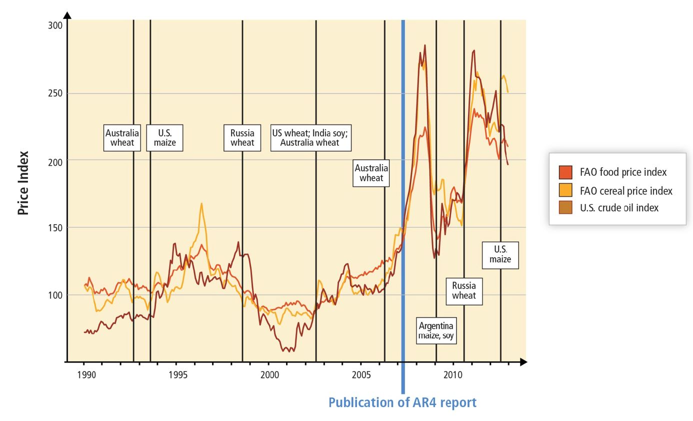
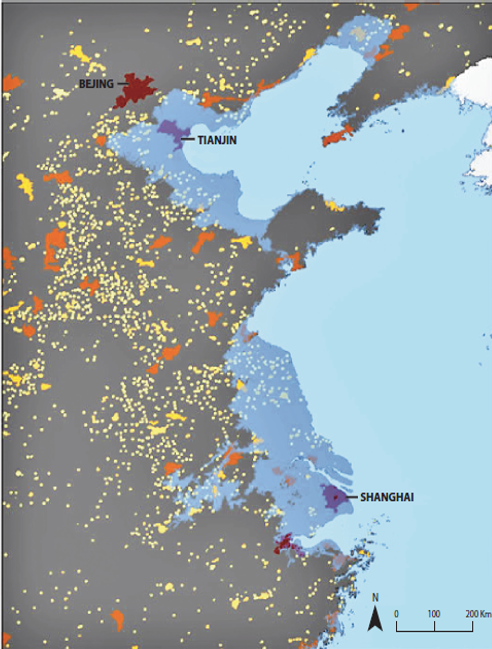

```{r setup, cache = F, echo = F, eval = T, message=F, warning=F}
knitr::opts_chunk$set(cache=TRUE, 
                      echo=FALSE, message=FALSE, warning=FALSE,
                      fig.height=9, fig.width=14, dpi=100,
                      dev='png',fig.path='assets/fig/',cache.path='./cache/')

library(rprojroot)

semester_dir <- find_rstudio_root_file()
data_dir <- file.path(semester_dir, "data")
script_dir <- file.path(semester_dir, "lecture_scripts")

source_semester_script <- function(script) {
  script_file <- file.path(script_dir, script)
  message("Running script", script_file)
  source(script_file, chdir = T)
}

eval_in_sem_script_dir <- function(expr, loc = script_dir) {
  this_dir <- getwd()
  setwd(loc)
  retval <- eval(expr)
  setwd(this_dir)
  invisible(retval)
}

library(magrittr)
library(tidyverse)

source_semester_script('lecture_utils.R')
source_semester_script('load_farm_prices.R')
source_semester_script('plot_farm_prices.R')
source_semester_script('read_dice.R')
source_semester_script('plot_dice.R')
```
# Bathtub model {#bathtub-sec .center}

## Bathtub model {#bathtub-model .center}

{style="height:900px;"}

## Bathtub model {#bathtub-model-2 .center data-transition="fade-out"}

:::::: {.bare .mtop-3}
{style="height:900px;"}

::: {.credit}
J.D. Sterman, Science <b>322</b>, 532 (2008).
:::
::::::

## Bathtub model {#bathtub-model-3 .center data-transition="fade-in"}

:::::: {.bare}
{.bare style="height:750px;"}

::: {.credit}
J.D. Sterman, Science <b>322</b>, 532 (2008).
:::
::: {.eighty}
* 212 MIT MBA and graduate students.
* 60% majored in science or engineering
:::
::::::

# Framework for Thinking about Climate Change {#framework-sec .center}

## Sources of Vulnerability  {#vulnerability .leftslide}

### Types of systems:

* Managed Systems
* Unmanaged Systems
* Unmanageable
* {+} [Examples?]{style="display:inline-block;margin-top:2em;"}

## Systems  {#example_systems data-transition="fade"}

<center>
<table>
<tr>
<th style="border:2px solid;text-align:center;"> **Extensively Managed** </th>
<th style="border:2px solid;text-align:center;"> **Partially Managed** </th>
<th style="border:2px solid;text-align:center;"> **Unmanageable** </th>
</tr>
<tr>
<td style="vertical-align:top;border:2px solid;"> 

* Most economic sectors:
  * *Manufacturing*
  * *Health care*
* Most human activities:
  * *Sleeping*
  * *Surfing the Internet*

</td>
<td style="vertical-align:top;border:2px solid;"> 

* Vulnerable economic sectors:
  * *Agriculture*
  * *Forestry*
* Nonmarket systems:
  * *Beaches and coastal ecosystems*
  * *Wildfires*

</td>
<td style="vertical-align:top;border:2px solid;"> 

* *Hurricanes*
* *Sea-level rise*
* *Ocean acidification*

</td>
</tr>
</table>
</center>

## Managed, Unmanaged,<br/>& Unmanageable Systems

* {+} Relevance?
  * {+} Climate impacts?
* {+} Transformations:
  * {+} Unmanaged &rarr; managed
  * {+} Unmanageable &rarr; manageable
* {+} "Focal Policy"
  * {+} What is it?
  * {+} Examples?
  * {+} Advantages and disadvantages?

## Scientific Uncertainty {#uncertainty .eighty}

* Nordhaus:

    _"A sensible policy would pay an insurance premium to avoid playing the
    roulette wheel."_

    _"The cost of delaying action for 50 years ... is [estimated] as
    $6.5 trillion."_

* Pielke:

    _"Policy makers routinely make decisions ... with a similar (or even less
    well-developed) state of understanding."_

# Economic Growth  {#perspective-sec .center data-state="skip_slide" data-transition="fade-out"}

## Economic Growth  {#perspective .center data-transition="fade-in"}

```{r growth, echo=FALSE, fig.width=9, fig.height=9, cache=TRUE}
dice.data <- load_dice_data()
t <- dice.data$temp
cons <- dice.data$cons
plot_t_dice(t) + theme(axis.line.x = element_line(), axis.line.y = element_line())
cat(' ')
plot_cons_dice(cons) + theme(axis.line.x = element_line(), axis.line.y = element_line())
```

# Mitigating Factors  {#mitigating_factors_sec .center}

## Mitigating Factors  {#mitigating_factors .ninety}

* {+} What are mitigating factors?
* {+} Note: 
  * {+} Most policy analysis defines mitigation = reducing the 
    __amount__ of  climate change<br/> 
    (e.g. by cutting GHG emissions).
  * {+} Nordhaus also uses the term to mean<br/>
    reducing the __impacts__ of climate change
* {+} Examples?
  * {+} Carbon fertilization
  * {+} Longer growing seasons at high latitudes
  * {+} Higher temperature \\(\rightarrow\\) more snow falling on Antarctica
* {+} Artificial Mitigation
  * {+} Geoengineering

## Adaptation  {#adaptation}

<br/>

### What kinds of things can people do<br/>to adapt to climate change?

## Crop Yields  {#crop-yields .ninety}

:::::: {.bare .mtop-3}
{style="height:900px;"}

::: {.credit}
Image credit: IPCC Fifth Assessment Report, Working Group 2, Chapter 7
:::
::::::

## Prices of Farm Products

::::::{.bare .mtop-3}
```{r farm_prices, echo=F, eval=T, message=F, warning=F, fig.width=10}
farm.prices <- get_farm_prices(1948)
plot_farm_prices(farm.prices)
```

:::{.credit}
Data source: U.S. Bureau of Economic Analysis
:::
::::::

## Impact of Declining Food Prices {.center}

| Category | % of income  | Expense | 25% price rise | as % of income |
|----------|-------------:|--------:|---------------:|:----------------:|
| Income   |      100%    | $60,000 |                |                |
| Housing  |       20%    | $12,000 |     $3,000     |        5%      |
| Food     |        5%    |  $3,000 |        $750    |         1%     |

## Agricultural Price Shocks  {#price_shocks}
 
::::::{.bare .mtop-3}
{height=900}

::: {.credit}
Image credit: IPCC Fifth Assessment Report, Working Group 2, Chapter 7
:::
::::::

## Winter Temperatures

:::::: {.columns}
::: {.column .ptop-2}
* Cold winters are important
  * {+} Freezing temperatures kill pests
  * {+} Many trees need cold winters to tell them to reset for growing in the spring
    * {+} Peach trees need more than 800 hours below 40&deg; F to make good fruit
    * {+} The winter of 2016--2017 had less than 500 "cold-soaking" hours in Georgia
    * {+} 85% of the Georgia peach crop was lost.
:::
::: {.column}
{style="width:900px;"}
:::
::::::

# Health Impacts  {#health-sec .center}

## Deaths due to Climate Change  {#health_1}

<br/>

### Years of life lost per 1,000 persons

<table><thead>
<tr>
<th style="text-align:center; font-weight:bold;"> Region </th>
<th style="text-align:center; font-weight:bold;"> Total </th>
<th style="text-align:center; font-weight:bold;"> Diarrheal disease </th>
<th style="text-align:center; font-weight:bold;"> Malaria </th>
<th style="text-align:center; font-weight:bold;"> Malnutrition </th>
</tr></thead>
<tbody>
<tr>
<td style="text-align:center">Africa</td>
<td style="text-align:right">14.91</td>
<td style="text-align:center">6.99</td>
<td style="text-align:center">7.13</td>
<td style="text-align:center">0.80</td>
</tr>
<tr>
<td style="text-align:center">Wealthy countries</td>
<td style="text-align:right">0.02</td>
<td style="text-align:center">0.02</td>
<td style="text-align:center">0.00</td>
<td style="text-align:center">0.00</td>
</tr>
</tbody>
</table>

<div class="fragment" style="padding-top:30px;color:darkblue">

<h3>As % of all deaths</h3>

<table><thead>
<tr>
<th style="text-align:center; font-weight:bold;"> Region </th>
<th style="text-align:center; font-weight:bold;"> Total </th>
<th style="text-align:center; font-weight:bold;"> Diarrheal disease </th>
<th style="text-align:center; font-weight:bold;"> Malaria </th>
<th style="text-align:center; font-weight:bold;"> Malnutrition </th>
</tr></thead>
<tbody>
<tr>
<td style="text-align:center">Africa</td>
<td style="text-align:center">2.92</td>
<td style="text-align:center">1.37</td>
<td style="text-align:center">1.40</td>
<td style="text-align:center">0.16</td>
</tr>
<tr>
<td style="text-align:center">Wealthy countries</td>
<td style="text-align:center">0.01</td>
<td style="text-align:center">0.01</td>
<td style="text-align:center">0.00</td>
<td style="text-align:center">0.00</td>
</tr>
</tbody>
</table>

</div>

## Heat Waves {#heat-waves data-transition="fade-in"}

> * Extreme summer heat that was **practically non-existent** before 1989 now affects
>   about **10% of the earth's land surface** in a typical summer.
> * Two of the ten deadliest heat waves in history happened in 2015.
> * Six of the ten deadliest heat waves happened since 2000
>   * Western Europe 2003: 70,000 deaths
>   * Russia 2010: 56,000 deaths
>   * [These could be typical summer heat by 2100.]{style="color:darkred;font-weight:bold;"}

## Heat versus Cold

{style="height:900px;margin-bottom:0;padding:0"}

::: {.credit}
Source: <https://www.weather.gov/hazstat/>
:::

## Heat versus Cold

* More people die during cold months than hot months each year
  * Confounding factor: Seasonality of diseases (flu, etc.)
  * Deaths from cold are relative: it's about acclimation
  * Deaths from heat are absolute: threshold temperatures
* Adding extremely hot days raises mortality much more than adding extremely cold days

## Urban Heat Islands

{style="width:45%;margin-bottom:0;padding:0;"}
{style="width:45%;margin-bottom:0;padding:0;"}

::: {.credit}
Source: Environmental Protection Agency
:::

## Urban Heat Islands in the United States

{style="height:900px;margin-bottom:0;padding:0"}

::: {.credit}
Source: <https://landsat.gsfc.nasa.gov/vegetation-essential-for-limiting-city-warming-effects/>
:::

## Urban Heat Mortality

### Chicago, 1995 {style="margin:50px;"}

{style="height:700px;margin-bottom:0;padding:0;"}

::: {.credit}
Source: USGCRP, _The Impacts of Climate Change on Human Health in the United States: A Scientific Assessment_ (2016).
:::

## Socioeconomic Status and Vulnerability to Heat

::::::::: {.columns}
:::::: {.column style="vertical-align:top;width:40%;padding-top:50px;"}

* LST = Urban heat island effect
* EHVI = extreme heat vulnerability index
* EHVI correlates very strongly with socioeconomic variables

::::::
:::::: {.column style="vertical-align:top;width:59%;"}

{style="height:850px;margin-bottom:0;padding:0;"}

::: {.credit}
Source: D.P. Johnson _et al_., Appl. Geography **35**, 23 (2012).
:::

::::::
:::::::::

## Climate Change and Deadly Heat

::::::{.bare .mtop-3}
{style="height:900px;"}

::: {.credit}
Source: C. Mora _et al_., Nature Climate Change **7**, 501 (2017)
:::
::::::

## More than Deaths

:::::: {.columns}
::: {.column .eightyfive .ptop-3}
* {+} In the South, many people work outside
  * {+} Construction, farming, logging, etc.
  * {+} Summer heat waves could make it dangerous to be physically active outdoors
  * {+} Loss of working hours, lower economic productivity, less money
:::
::: {.column}
{style="width:900px;"}
:::
::::::

## Severe Heat Waves {#future-heat-waves}

* Severe heat waves even with serious emission reductions.

:::::: {.flush style="margin-top:3rem;"}
{style="height:800px;"}

::: {.credit}
K. Dahl _et al._, Environ. Res. Commun. **1**, 075002 (2019), [doi:10.1088/2515-7620/ab27cf](https://doi.org/10.1088/2515-7620/ab27cf)
:::
::::::

::: notes

NCHAA football practice rules:

Heat index of 104 or more is considered **dangerous**

* All athletes must be under constant observation and supervision.
* No pads or equipment
* Frequent mandatory rest and water breaks (5 minutes break every 15 minutes)

:::

## Football Practice in Heat

::::::::: {.columns .ptop-3}
:::::: {.column}
Football practice health/safety rules:

* Heat index of 104 or more is considered **dangerous**
  * {+1} Constant observation and supervision for overheating
  * {+1} No pads or equipment
  * {+1} 5 minutes mandatory rest and water break every 15 minutes
* {+2} After 2070: 
  * Average of 3 weeks per year in Southeast & Midwest
  * 2 months per year in Texas, Louisiana, Southern Florida
::::::
:::::: {.column .bare .mtop-3}
{style="width:880px;"}

::: {.credit}
Photo credit: Nathaniel Rutherford/RTI
:::
::::::
:::::::::

::: notes

NCHAA football practice rules:

Heat index of 104 or more is considered **dangerous**

* All athletes must be under constant observation and supervision.
* No pads or equipment
* Frequent mandatory rest and water breaks (5 minutes break every 15 minutes)

:::

# Sea-Level Rise  {#sea-level .center}

## Sea-Level Rise

:::::: {.columns}
::: {.column .ptop-3}
* Sea level rise is causing increasing flooding in coastal cities
  * {+} "King tides" in Miami are flooding the city even in good weather.
  * {+} When hurricanes come, storm surges are higher and more destructive
:::
::: {.column}
{style="height:900px;"}
:::
::::::

## Low-Elevation Coastal Zone  {#sea-level_2 .center}

<center>
<table style="border:none;">
<tr style="border:none;">
<td  style="border:none;">
{style="height:800px;max-height:800px;"}
</td>
<td style="vertical-align:bottom;border:none;">

* Within 10 meters of sea level
* 2/3 of cities with >5 million people
* 10% of world population

{style="width:600px;max-width:600px;"}

</td>
</tr>
</table></center>

## Greenland {#greenland}

::::::{.columns .mtop-3}
:::{.column}
* Melt descending into Moulin 
  * {+} Meltwater lubricates base of glacier
  * {+} Accelerates ice-flow
  * {+} Speeds up melting
:::
:::{.column .bare}
{style="height:900px;"}
:::
::::::

## Peterman Glacier 2009  {#peterman_1 data-transition="fade"}

{style="height:900px;"}

## Peterman Glacier 2011  {#peterman_2 data-transition="fade"}

{style="height:900px;"}

## Ice Loss from Greenland  {#greenland_ice_loss}

::::::{.bare .mtop-3}
{style="height:900px;"}

:::{.credit}
Image credit: [M. Tedescoo _et al_.](https://arctic.noaa.gov/Report-Card/Report-Card-2019/ArtMID/7916/ArticleID/842/Greenland-Ice-Sheet), NOAA Arctic Program
:::
::::::

# Antarctica  {#antarctica .center}

## Antarctica  {#antarctica}

{style="height:900px;"}

## GRACE Satellite  {#grace}

::::::{.bare .mtop-3}
{style="height:900px;"}

:::{.credit}
Image credit: NASA
:::
::::::

## Observations  {#grace_antarctic}

::::::{.bare .mtop-3}
{style="height:900px;"}

:::{.credit}
Image credit: Arnoud Jochemsen, Technical University of Dresden
:::
::::::

## Ice loss  {#grace_ice_loss}

:::::: {.bare .mtop-3}

{style="height:900px;"}

::: {.credit}
Image credit: IMBIE Team, Nature **558**, 219 (2018) 
doi: [10.1038/s41586-018-0179-y](https://doi.org/10.1038/s41586-018-0179-y)
:::
::::::

## GRACE Results  {#GRACE_results data-transition="fade"}

* Greenland melting faster than previously thought
  * Almost 150 cubic miles per year
  * Loss is accelerating
    * Melting more than 7 times faster than in 1990s.
* Antarctica is losing ice instead of gaining
  * 150 cubic miles per year
    

## Bottom Line:  {#sea_level_bottom_line .center}

* Sea level is rising
* Hard to estimate future rise: 
  * Glacier dynamics is very uncertain
* Rate matters!
  * Rapid sea-level rise makes it hard to adapt

## Impacts  {#sea_level_impacts .center}

:::::::::{.columns .mtop-3 .vcenter}
::::::{.column}
* Population displacement, migration
* Amplified impacts of coastal storms 
* Coastal ecosystems
* World Heritage Sites
::::::
::::::{.column .bare .mtop-3}


:::{.credit}
Photo credit: Soumyajit Nandy
:::
::::::
:::::::::

## Adaptation  {#sea_level_adaptation .center}

:::::::::{.columns .vcenter .mtop-3}
::::::{.column}
* Abandon vulnerable land
* Protect valuable land
* Raise buildings
* Move inland
::::::
::::::{.column .bare}


:::{.credit}
Photo credit: Wikipedia
:::
::::::
:::::::::

# Summing Up  {#summing_up_sec .center}

## Perspective  {#final_perspective}

* Cost of cutting emissions vs. cost of adapting or living with climate change
* Extreme positions versus balanced mixture
* What about uncertainties, tipping points, and irreversibility?

# End {#end .center}
