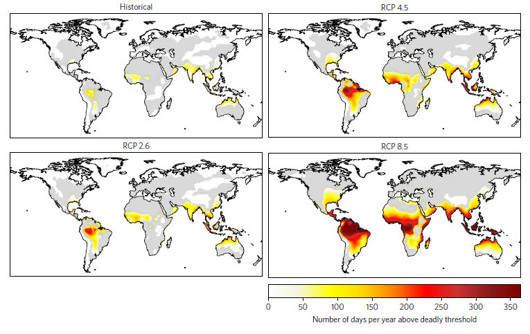

```{r setup, cache = F, echo = F, eval = T, message=F, warning=F}
knitr::opts_chunk$set(cache=TRUE, 
                      echo=FALSE, message=FALSE, warning=FALSE,
                      fig.height=9, fig.width=14, dpi=100,
                      dev='png',fig.path='assets/fig/',cache.path='./cache/')

library(rprojroot)

semester_dir <- find_rstudio_root_file()
data_dir <- file.path(semester_dir, "data")
script_dir <- file.path(semester_dir, "lecture_scripts")

source_semester_script <- function(script) {
  script_file <- file.path(script_dir, script)
  message("Running script", script_file)
  source(script_file, chdir = T)
}

eval_in_sem_script_dir <- function(expr, loc = script_dir) {
  this_dir <- getwd()
  setwd(loc)
  retval <- eval(expr)
  setwd(this_dir)
  invisible(retval)
}

library(magrittr)
library(tidyverse)
library(lubridate)
library(janitor)
library(ggthemes)
library(jsonlite)

source_semester_script('lecture_utils.R')
theme_set(theme_bw(base_size = 20))
```
# Health Impacts {.center}

## Urban Heat Islands

{style="width:45%;margin-bottom:0;padding:0;"}
{style="width:45%;margin-bottom:0;padding:0;"}

::: {.credit}
Source: Environmental Protection Agency
:::

## Urban Heat Islands in the United States

{style="height:900px;margin-bottom:0;padding:0"}

::: {.credit}
Source: <https://landsat.gsfc.nasa.gov/vegetation-essential-for-limiting-city-warming-effects/>
:::

## Urban Heat Mortality

### Chicago, 1995 {style="margin:50px;"}

{style="height:700px;margin-bottom:0;padding:0;"}

::: {.credit}
Source: USGCRP, _The Impacts of Climate Change on Human Health in the United States: A Scientific Assessment_ (2016).
:::

## Socioeconomic Status and Vulnerability to Heat

::::::::: {.columns}
:::::: {.column style="vertical-align:top;width:40%;padding-top:50px;"}

* LST = Urban heat island effect
* EHVI = extreme heat vulnerability index
* EHVI correlates very strongly with socioeconomic variables

::::::
:::::: {.column style="vertical-align:top;width:59%;"}

{style="height:850px;margin-bottom:0;padding:0;"}

::: {.credit}
Source: D.P. Johnson _et al_., Appl. Geography **35**, 23 (2012).
:::

::::::
:::::::::

## Climate Change and Deadly Heat

::::::{.bare .mtop-3}
{style="height:900px;"}

::: {.credit}
Source: C. Mora _et al_., Nature Climate Change **7**, 501 (2017)
:::
::::::

## More than Deaths

:::::: {.columns}
::: {.column .eightyfive .ptop-3}
* {+} In the South, many people work outside
  * {+} Construction, farming, logging, etc.
  * {+} Summer heat waves could make it dangerous to be physically active outdoors
  * {+} Loss of working hours, lower economic productivity, less money
:::
::: {.column}
{style="width:900px;"}
:::
::::::

## Severe Heat Waves {#future-heat-waves}

* Severe heat waves even with serious emission reductions.

:::::: {.flush style="margin-top:3rem;"}
{style="height:800px;"}

::: {.credit}
K. Dahl _et al._, Environ. Res. Commun. **1**, 075002 (2019), [doi:10.1088/2515-7620/ab27cf](https://doi.org/10.1088/2515-7620/ab27cf)
:::
::::::

::: notes

NCHAA football practice rules:

Heat index of 104 or more is considered **dangerous**

* All athletes must be under constant observation and supervision.
* No pads or equipment
* Frequent mandatory rest and water breaks (5 minutes break every 15 minutes)

:::

## Football Practice in Heat

::::::::: {.columns .ptop-3}
:::::: {.column}
Football practice health/safety rules:

* Heat index of 104 or more is considered **dangerous**
  * {+1} Constant observation and supervision for overheating
  * {+1} No pads or equipment
  * {+1} 5 minutes mandatory rest and water break every 15 minutes
* {+2} After 2070: 
  * Average of 3 weeks per year in Southeast & Midwest
  * 2 months per year in Texas, Louisiana, Southern Florida
::::::
:::::: {.column .bare .mtop-3}
{style="width:880px;"}

::: {.credit}
Photo credit: Nathaniel Rutherford/RTI
:::
::::::
:::::::::

::: notes

NCHAA football practice rules:

Heat index of 104 or more is considered **dangerous**

* All athletes must be under constant observation and supervision.
* No pads or equipment
* Frequent mandatory rest and water breaks (5 minutes break every 15 minutes)

:::

# Sea-Level Rise  {#sea-level .center}

## Sea-Level Rise

:::::: {.columns}
::: {.column .ptop-3}
* Sea level rise is causing increasing flooding in coastal cities
  * {+} "King tides" in Miami are flooding the city even in good weather.
  * {+} When hurricanes come, storm surges are higher and more destructive
:::
::: {.column}
{style="height:900px;"}
:::
::::::

## Low-Elevation Coastal Zone  {#sea-level_2 .center}

<center>
<table style="border:none;">
<tr style="border:none;">
<td  style="border:none;">
{style="height:800px;max-height:800px;"}
</td>
<td style="vertical-align:bottom;border:none;">

* Within 10 meters of sea level
* 2/3 of cities with >5 million people
* 10% of world population

{style="width:600px;max-width:600px;"}

</td>
</tr>
</table></center>

## Greenland {#greenland}

::::::{.columns .mtop-3}
:::{.column}
* Melt descending into Moulin 
  * {+} Meltwater lubricates base of glacier
  * {+} Accelerates ice-flow
  * {+} Speeds up melting
:::
:::{.column .bare}
{style="height:900px;"}
:::
::::::

## Peterman Glacier 2009  {#peterman_1 data-transition="fade"}

{style="height:900px;"}

## Peterman Glacier 2011  {#peterman_2 data-transition="fade"}

{style="height:900px;"}

## Ice Loss from Greenland  {#greenland_ice_loss}

::::::{.bare .mtop-3}
{style="height:900px;"}

:::{.credit}
Image credit: [M. Tedescoo _et al_.](https://arctic.noaa.gov/Report-Card/Report-Card-2019/ArtMID/7916/ArticleID/842/Greenland-Ice-Sheet), NOAA Arctic Program
:::
::::::

# Antarctica  {#antarctica .center}

## Antarctica  {#antarctica}

{style="height:900px;"}

## GRACE Satellite  {#grace}

::::::{.bare .mtop-3}
{style="height:900px;"}

:::{.credit}
Image credit: NASA
:::
::::::

## Observations  {#grace_antarctic}

::::::{.bare .mtop-3}
{style="height:900px;"}

:::{.credit}
Image credit: Arnoud Jochemsen, Technical University of Dresden
:::
::::::

## Ice loss  {#grace_ice_loss}

:::::: {.bare .mtop-3}

{style="height:900px;"}

::: {.credit}
Image credit: IMBIE Team, Nature **558**, 219 (2018) 
doi: [10.1038/s41586-018-0179-y](https://doi.org/10.1038/s41586-018-0179-y)
:::
::::::

## GRACE Results  {#GRACE_results data-transition="fade"}

* Greenland melting faster than previously thought
  * Almost 150 cubic miles per year
  * Loss is accelerating
    * Melting more than 7 times faster than in 1990s.
* Antarctica is losing ice instead of gaining
  * 150 cubic miles per year
    

## Bottom Line:  {#sea_level_bottom_line .center}

* Sea level is rising
* Hard to estimate future rise: 
  * Glacier dynamics is very uncertain
* Rate matters!
  * Rapid sea-level rise makes it hard to adapt

## Impacts  {#sea_level_impacts .center}

:::::::::{.columns .mtop-3 .vcenter}
::::::{.column}
* Population displacement, migration
* Amplified impacts of coastal storms 
* Coastal ecosystems
* World Heritage Sites
::::::
::::::{.column .bare .mtop-3}


:::{.credit}
Photo credit: Soumyajit Nandy
:::
::::::
:::::::::

## Adaptation  {#sea_level_adaptation .center}

:::::::::{.columns .vcenter .mtop-3}
::::::{.column}
* Abandon vulnerable land
* Protect valuable land
* Raise buildings
* Move inland
::::::
::::::{.column .bare}


:::{.credit}
Photo credit: Wikipedia
:::
::::::
:::::::::

# Adding Up Damages  {#damages-sec .center}

## Risk Premiums

* {+} Why do people buy insurance?
* {+} Costs and benefits of insurance
  * {+} How does insurance company set premiums relative to expected payouts?
  * {+} On average do customers get more, less, or the same back as they paid in?
  * {+} So why does anyone buy insurance?
* {+} Is there a lesson here for climate policy?

## Overview of Damage Assessment  {#damage-overview .center .eightyfive}

* {+} Climate change is an externality:<br/>Unintended consequence of economic activity
* {+} Zero growth would dramatically slow warming
* {+} Climate change can slow future growth
  * {+} If climate change causes negative growth,<br/>
    economic calculations stop making sense
* {+} Converting unmanaged $\rightarrow$ managed systems reduces damage, vulnerability
* {+} Forecasting damage from climate change requires forecasting economies:
  * {+} How much of economy will be managed?
  * {+} What technology will be available to adapt & mitigate damage?
* {+} Value of non-economic goods<br/>(wilderness, ecosystems, biodiversity, ...)

## How much damage?  {#how.big  data-transition="convex-out"}

:::::: {.bare}
{style="height:850px;"}

:::{.credit}
Source: R.S.J. Tol, J. Econ. Perspect. **23**, 29 (2009). 
[doi:10.1257/jep.23.2.29](https://doi.org/10.1257/jep.23.2.29)
:::
::::::

* {+} Note benefits at 1.0 and 2.5 degrees...

## Oops! Gremlins!  {#tol_error_1 .center data-transition="convex"}

:::::::::{.columns .vcenter}
:::::: {.column style="font-size:120%;"}
_"Gremlins intervened in the preparation of my paper ...
minus signs were dropped from the two impact estimates ..."_

:::{.credit}
R.S.J. Tol, J. Econ. Perspect. **28**, 221 (2014)
[doi: 10.1257/jep.28.2.221](https:/doi.org/10.1257/jep.28.2.221)
:::
::::::
:::::: {.column}
::: {.bare .mtop-3}
{style="width:100%;"}
:::
::::::
:::::::::

:::{.eighty}
* {+} Global warming was worse than Tol thought:
  * Two studies that found net harm from global warming were reported as net benefits.
  * Four studies that found net harm were simply omitted.
* {+} Then, in 2015, more Gremlins: 
  * numbers were not even calibrated correctly.
:::

## Damages from Warming {#tol_error_2 data-transition="fade"}

::::::{.columns .vcenter}
::: {.column }
```{r tol_figures, echo=F, eval=T, warning=F, message=F, fig.width=9, fig.height=9}
source_semester_script('tol_figure.R')

tol_data <- read_tol_data()

plot_original_tol_data(tol_data) + ggtitle("Original Figure")
```

:::
::: {.column .fragment}
```{r tol_figures_2b, echo=F, eval=T, warning=F, message=F, fig.width=9, fig.height=9}
plot_tol_data(tol_data)
```
:::
::::::

## More Recent Work {#nonlinear-productivity}

:::::: {.bare .mtop-3}
{style="height:850px;margin:2px;vertical-align:middle"}
{style="height:750px;margin:2px;vertical-align:middle"}

:::{.credit}
M. Burke _et al._, Nature **527**, 235 (2015). [doi:10.1038/nature15725](https://doi.org/10.1038/nature15725)
:::
::::::

:::{.bare}
Under a worst-case scenario
:::

## Global Warming is Already Affecting Economic Inequality

:::::: {.flush style="margin-top:3rem;"}
{style="height:900px;"}

::: {.credit}
N.S. Diffenbaugh & M. Burke, Proc. Nat'l Acad. Sci. **116**, 9808 (2019) [10.1073/pnas.1816020116](https://doi.org/10.1073/pnas.1816020116)
:::
::::::

## Benefits of Reaching International Climate Goals

:::::: {.flush style="margin-top:3rem;"}
{style="height:900px;"}

::: {.credit}
M. Burke _et al._, Nature **557**, 549 (2018)  [10.1038/s41586-018-0071-9](https://doi.org/10.1038/s41586-018-0071-9)
:::
::::::

<!--
# Global Natural Disasters {#global-disaster-sec .center}
```{r prepare_natural_disaster, include=FALSE, message=FALSE, warning=FALSE}
#
# Get data from https://natcatservice.munichre.com/
# Scrape JSON data from response using Firefox Developer Tools network tab.
#
# Script to get data is in lecture_scripts/query_munich_re.R
#
base_year_2 = 1990
# disasters = fromJSON('weather_disasters.json')
disasters <- read_rds(file.path(data_dir, "disasters", "weather_disasters.Rds"))
disasters_by_year = disasters$aggregations$year %>% map_df(~.x)
disaster_start_year = min(disasters_by_year$year)
disaster_stop_year = max(disasters_by_year$year)
disaster_period = str_c(disaster_start_year, disaster_stop_year, sep = "--")
disaster_period_2 = str_c(base_year_2, disaster_stop_year, sep = "--")
caption_string = with(disasters,
                      str_c(perilString, areaString, disaster_period,
                            sep = " "))
caption_string_2 = with(disasters, 
                        str_c(perilString, areaString, disaster_period_2, 
                              sep = " "))
```

## Cost of Natural Disasters: `r disaster_period` {#weather-losses-nominal data-transition="fade-out"}

:::::: {.bare .mtop-3}
```{r disaster_plot_nominal, message=FALSE, warning=FALSE}
ggplot(disasters_by_year, aes(x = year, y = econLossesNominal)) +
  geom_bar(stat = "identity", fill = "cornflowerblue") +
  geom_smooth(method = "lm", fill = NA, color = "dark blue") +
  labs(x = "Year", y = "Damages ($Billion)", 
       title = str_c(caption_string, " (Nominal)"))
```

::: {.credit}
Data: [Munich Re: NatCat service](https://natcatservice.munichre.com/)
:::
::::::

## Cost of Natural Disasters: `r disaster_period` {#weather-losses-constant data-transition="fade"}

:::::: {.bare .mtop-3}
```{r disaster_plot_constant_dollar, message=FALSE, warning=FALSE}
ggplot(disasters_by_year, aes(x = year, y = econLossesInflationAdj)) +
  geom_bar(stat = "identity", fill = "cornflowerblue") +
  geom_smooth(method = "lm", fill = NA, color = "dark blue") +
  labs(x = "Year", y = "Damages ($Billion)", 
       title = str_c(caption_string, " (Inflation-adjusted)"))
```

::: {.credit}
Data: [Munich Re: NatCat service](https://natcatservice.munichre.com/)
:::
::::::

## Cost of Natural Disasters: `r disaster_period` {#weather-losses-normalized data-transition="fade-in"}

:::::: {.bare .mtop-3}
```{r disaster_plot_normalized, message=FALSE, warning=FALSE}
ggplot(disasters_by_year, aes(x = year, y = econLossesNormalized)) +
  geom_bar(stat = "identity", fill = "cornflowerblue") +
  geom_smooth(method = "lm", fill = NA, color = "dark blue") +
  labs(x = "Year", y = "Damages ($Billion)", 
       title = str_c(caption_string, " (Normalized by GDP)"))
```

::: {.credit}
Data: [Munich Re: NatCat service](https://natcatservice.munichre.com/)
:::
::::::

## Cost of Natural Disasters: `r disaster_period_2` {#weather-losses-normalized_2 data-transition="fade-in"}

:::::: {.bare .mtop-3}
```{r disaster_plot_normalized_2, message=FALSE, warning=FALSE}
disasters_by_year %>% filter(year >= base_year_2) %>%
ggplot(aes(x = year, y = econLossesNormalized)) +
  geom_bar(stat = "identity", fill = "cornflowerblue") +
  geom_smooth(method = "lm", fill = NA, color = "dark blue") +
  labs(x = "Year", y = "Damages ($Billion)", 
       title = str_c(caption_string_2, " (Normalized by GDP)"))
```

::: {.credit}
Data: [Munich Re: NatCat service](https://natcatservice.munichre.com/)
:::
::::::

-->

# Hurricanes { .center}

## Hurricanes and Global Warming {.center .ninety}

* Hurricanes require ocean surface  &ge;80&deg;F
* Hurricanes can only form with certain wind conditions
* Warming climates are expected to:
    * Increase sea-surface temperature:
        * More hurricanes
        * Stronger hurricanes
        * Hurricanes farther from tropics
    * Increase unfavorable wind conditions:
        * Fewer hurricanes
    * Expected impact:
        * Number: same or fewer
        * Intensity: greater
* Significant expert disagreement

<!--
## Hurricane Damages (nominal dollars)  {#hurr_trend_non_norm data-transition="fade-out"}

```{r pielke_base_damage}
source_semester_script("hurricane_damages.R")
pielke <- load_pielke(data_dir)
grinsted <- load_grinsted(data_dir)

ggplot(pielke, aes(x = year, y = base_damage * 1E-9)) + geom_col() +
  scale_x_continuous(limits=c(1900, 2020), expand = c(0,0),
                     breaks = seq(1900,2100,20)) +
  labs(x = "Year", y = "HUrricane Damages (billion 2018 dollars)") +
  theme(plot.margin = margin(5.5, 25.0, 5.5, 5.5, "pt"))

```

## Hurricane Damages in Constant Dollars  {data-transition="fade"}

```{r pielke_const_dollar}
ggplot(pielke, aes(x = year, y = const_dollar_damage * 1E-9)) + geom_col() +
  scale_x_continuous(limits=c(1900, 2020), expand = c(0,0),
                     breaks = seq(1900,2100,20)) +
  labs(x = "Year", y = "HUrricane Damages (billion 2018 dollars)") +
  theme(plot.margin = margin(5.5, 25.0, 5.5, 5.5, "pt"))

```

* Adjusted for inflation

## Normalized Damages {data-transition="fade"}

```{r pielke_norm_damages}
ggplot(pielke, aes(x = year, y = norm_damage * 1E-9)) + geom_col() +
  geom_smooth(method = "lm") +
  scale_x_continuous(limits=c(1900, 2020), expand = c(0,0),
                     breaks = seq(1900,2100,20)) +
  labs(x = "Year", y = "HUrricane Damages (billion 2018 dollars)") +
  theme(plot.margin = margin(5.5, 25.0, 5.5, 5.5, "pt"))

```

* Accounting for higher density of valuable property.

## Area of Total Destruction  {data-transition="fade"}

```{r hurricane_atd}
grinsted %>% filter(source == "Weinkle") %>%
  ggplot(aes(x = year, y = atd)) + geom_col() +
  geom_smooth(method = "lm") +
  scale_x_continuous(limits=c(1900, 2020), expand = c(0,0),
                     breaks = seq(1900,2100,20)) +
  labs(x = "Year", y = expression(paste("Area of Ttal Destruction ", (km^2)))) +
  theme(plot.margin = margin(5.5, 25.0, 5.5, 5.5, "pt"))

```

::: {.eighty}
* Normalized damages may under-estimate recent hurricanes by including lots of properties in places that weren't affected by the storm.
* Focus on the size of the area destroyed. 
:::

## Area of Total Destruction with Insurance Industry Data  {data-transition="fade"}

```{r hurricane_atd_icat}
grinsted %>% filter(source == "ICAT") %>%
  ggplot(aes(x = year, y = atd)) + geom_col() +
  geom_smooth(method = "lm") +
  scale_x_continuous(limits=c(1900, 2020), expand = c(0,0),
                     breaks = seq(1900,2100,20)) +
  labs(x = "Year", y = expression(paste("Area of Ttal Destruction ", (km^2)))) +
  theme(plot.margin = margin(5.5, 25.0, 5.5, 5.5, "pt"))

```

* Use damage & destruction data from International Catastrophe Insurance Managers LLC (ICAT)

## Bottom line  {#hurr_bottom}
-->

## Hurricane Controversy

*  Hurricane damage is rising
*  Much of this is because more people are building more valuable property near
   the coast
*  Dispute over how much is due to climate change

## Hurricane Expert Kerry Emanuel  {#emanuel}

:::::: {.columns}
::: {.column style="width:300px;"}
{style="width:100%;max-width:100%;max-height:100%;"}
:::
::: {.column .ptop-3 style="width:900px;margin-left:1em"}
* Many hurricanes in Atlantic Ocean
* Only a small fraction hit the US coast
* Clear trend toward more hurricane activity in North Atlantic
* Suppose bear population in woods was rising sharply...
  * Should hikers wait for clear increase in bear attacks before taking 
    precautions?
:::
::::::

<!---
## Sea-Level Rise {data-state="skip_slide"}

* Island Nations
    * Bahamas
    * Maldives
    * Marshall Islands
* Low-Lying Coastal Countries
    * Netherlands
    * Bangladesh
    * Gambia
* Populous Countries
    * US, India, China, ...
    * Big port cities
    * 5--10% of population at risk
    * 5--15% of GDP at risk

## Hurricanes {.center data-state="skip_slide"}

* Hurricane intensity without sea-level rise:
    * Central America most at risk
    * Small fraction of GDP for all countries

* Hurricanes **and** Sea-Level Rise
    * Sea-level rise multiplies hurricane risk
-->    

## Adaptation: Sea Level and Hurricanes  {#sea_level_adaptation_2 .center}

* Abandon vulnerable land
* Protect valuable land
* Raise buildings
* Build hurricane-resistant housing
* Move inland
    * Average structure lasts 50 years
    * Abandoning risky coastal real-estate over 50 years would cost around 
      0.01% of GDP each year 

