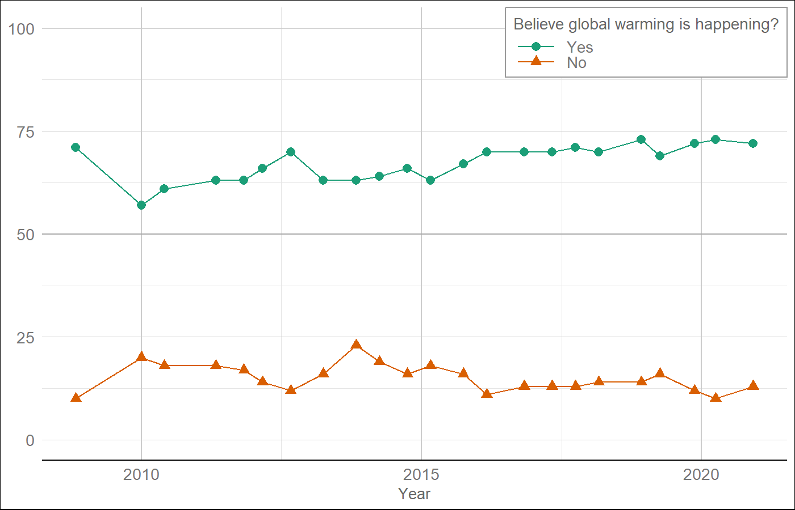
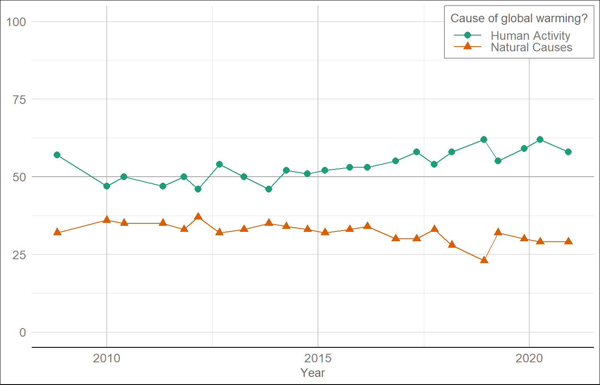
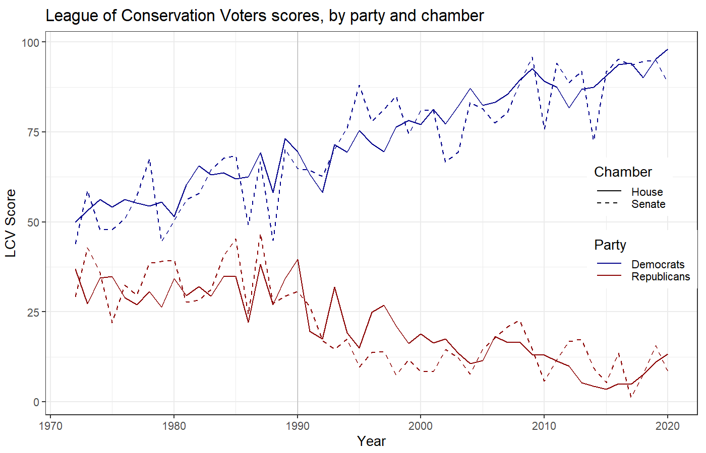

# Adding Up Damages  {#damages-sec .center}

## Risk Premiums

* {+} Why do people buy insurance?
* {+} Costs and benefits of insurance
  * {+} How does insurance company set premiums relative to expected payouts?
  * {+} On average do customers get more, less, or the same back as they paid in?
  * {+} So why does anyone buy insurance?
* {+} Is there a lesson here for climate policy?

## Overview of Damage Assessment  {#damage-overview .center .eightyfive}

* {+} Climate change is an externality: Unintended consequence of economic activity
* {+} Zero growth would dramatically slow warming
* {+} Climate change can slow future growth
  * {+} If climate change causes negative growth, 
    economic calculations stop making sense
* {+} Converting unmanaged $\rightarrow$ managed systems reduces damage, vulnerability
* {+} Forecasting damage from climate change requires forecasting economies:
  * {+} How much of economy will be managed?
  * {+} What technology will be available to adapt & mitigate damage?
* {+} Value of non-economic goods (wilderness, ecosystems, biodiversity, ...)

## How much damage?  {#how.big  data-transition="convex-out"}

:::::: {.bare}
{style="height:850px;"}

::: {.credit}
Source: R.S.J. Tol, J. Econ. Perspect. **23**, 29 (2009). 
[doi:10.1257/jep.23.2.29](https://doi.org/10.1257/jep.23.2.29)
:::
::::::

* {+} Note benefits at 1.0 and 2.5 degrees...

## Oops! Gremlins!  {#tol_error_1 .center data-transition="convex"}

::::::::: {.columns .vcenter}
:::::: {.column style="font-size:120%;"}
_"Gremlins intervened in the preparation of my paper ...
minus signs were dropped from the two impact estimates ..."_

::: {.credit}
R.S.J. Tol, J. Econ. Perspect. **28**, 221 (2014)
[doi: 10.1257/jep.28.2.221](https:/doi.org/10.1257/jep.28.2.221)
:::
::::::
:::::: {.column}
::: {.bare .mtop-3}
{style="width:100%;"}
:::
::::::
:::::::::

::: {.eighty}
* {+} Global warming was worse than Tol thought:
  * Two studies that found net harm from global warming were reported as net benefits.
  * Four studies that found net harm were simply omitted.
* {+} Then, in 2015, more Gremlins: 
  * numbers were not even calibrated correctly.
:::

## Damages from Warming {#tol_error_2 data-transition="fade"}

:::::: {.columns .vcenter}
::: {.column }

:::
::: {.column .fragment}

:::
::::::

## More Recent Work {#nonlinear-productivity}

:::::: {.bare .mtop-3}
{style="height:850px;margin:2px;vertical-align:middle"}
{style="height:750px;margin:2px;vertical-align:middle"}

::: {.credit}
M. Burke _et al._, Nature **527**, 235 (2015). [doi:10.1038/nature15725](https://doi.org/10.1038/nature15725)
:::
::::::

::: {.bare}
Under a worst-case scenario
:::

## Global Warming is Already Affecting Economic Inequality

:::::: {.flush style="margin-top:3rem;"}
{style="height:900px;"}

::: {.credit}
N.S. Diffenbaugh & M. Burke, Proc. Nat'l Acad. Sci. **116**, 9808 (2019) [10.1073/pnas.1816020116](https://doi.org/10.1073/pnas.1816020116)
:::
::::::

## Benefits of Reaching International Climate Goals

:::::: {.flush style="margin-top:3rem;"}
{style="height:900px;"}

::: {.credit}
M. Burke _et al._, Nature **557**, 549 (2018)  [10.1038/s41586-018-0071-9](https://doi.org/10.1038/s41586-018-0071-9)
:::
::::::

# Pielke's Lessons from the Ozone Hole {#ozone-hole-sec .center}

## Pielke's Lessons from the Ozone Hole {#ozone-hole .center .eighty}
{style="height:600px;"}

* {+} 1970s: Significant scientific uncertainty
* {+} Decision to take action without waiting for certainty
* {+} Discovery of hole: tipping point
* {+} "No regrets"" policy
* {+} Flexible policy (renegotiate details every two years)

# Policy Myths  {#myths-sec .center}

## Policy Myths  {#myths .center}

1. We lack political will
2. We must trade off the economy for the environment
3. We have all the technology we need

# Myth 1: We Lack Political Will {#myth-1 .center}

## Public Opinion: Is the Earth Warming  {#yale-warming .ninety data-transition="fade-out"}

::: {.credit}
Yale Program on Climate Communication: [Climate Change in the American Mind: December 2020](http://climatecommunication.yale.edu/publications/climate-change-american-mind-december-2020/)
:::
::::::

## Public Opinion: Cause of Warming? {#gallup-warming-cause .ninety data-transition="fade-in"}

::: {.bare .mtop-3}

::: {.credit}
Yale Program on Climate Communication: [Climate Change in the American Mind: November 2019](http://climatecommunication.yale.edu/publications/climate-change-american-mind-november-2019/)
:::
::::::

## Variation across polls {#poll-variation}

# Partisan Split {#partisan-split-sec .center}

## Partisan Split:

::::::::: {.columns .mtop-3}
:::::: {.column}
* {+} Climate policy is the most divisive issue
* {+} Greater partisan polarization than abortion
::::::
:::::: {.column .bare}

{style="height:900px;"}

::: {.credit}
[Pew: As Economic Concerns Recede, Environmental Protection Rises on the Public’s Policy Agenda](https://www.people-press.org/2020/02/13/as-economic-concerns-recede-environmental-protection-rises-on-the-publics-policy-agenda/)
:::
::::::
:::::::::

## Partisan split {#partisan-split-2}

:::::: {.bare .mtop-3}

::: {.credit}
Gallup: 
[Americans' Views on Global Warming, 2019](https://news.gallup.com/poll/248030/americans-views-global-warming-2019-trends.aspx),
[U.S. Concern About Global Warming at Eight-Year High (2016)](http://news.gallup.com/poll/190010/concern-global-warming-eight-year-high.aspx)
[Republican Skepticism Toward Global Warming Eases (2013)](http://news.gallup.com/poll/161714/republican-skepticism-global-warming-eases.aspx),
:::
::::::

## Polarization in Congress 1972--2020 {#congress-polarization}

:::::: {.bare .mtop-3}

::: {.credit}
Data: [League of Conservation Voters](http://scorecard.lcv.org/)
:::
::::::

# Myth 2: We must trade off the economy for the environment {#myth-2 .center data-transition="fade-out"}

## Willingness to pay (2009) {#wtp-economist}

:::::: {.bare .mtop-3}

::: {.credit}
[The Economist, Jul 1, 2009.](http://media.economist.com/media/pdf/Tabs20090701.pdf)
:::
::::::

## Iron Law of Climate Policy {#iron-law .center}

* {+} People want action on global warming
* {+} But if climate policies conflict with economic growth, growth will win every time.

## Frank Luntz (2010) {#luntz .center}

> What has changed is that the American economy went to hell. 
> And when you ask voters are they more concerned about 
> destroying their environment over the next 100 years or 
> rehabilitating their economy over the next 100 weeks, they'll
> choose the economy over the environment any day.

[“Candidates Take Aim At Climate Bill To Win Votes”
*All Things Considered*, NPR, 28 Oct. 2010 
<https://www.npr.org/templates/story/story.php?storyId=130888515>]{style="font-size:50%;"}

## James Inhofe (2016) {#inhofe .center}

> I assumed like everybody else, way back when everyone was talking about 
> global warming and all that, I assumed that that was probably right, 
> until I found out what it was going to cost

[Heritage Foundation Energy & Climate Policy Summit, Dec. 8, 2016 
<https://www.youtube.com/watch?v=surP84BQwhc>]{style="font-size:50%;"}

## New Data {#new-data}

:::::: {.bare .mtop-3 .eighty}
> Nearly two-thirds of Americans ranked protecting the environment as a 
> leading policy priority. 
> --- [Pew survey (2020)](https://www.people-press.org/2020/02/13/as-economic-concerns-recede-environmental-protection-rises-on-the-publics-policy-agenda/)

> By the widest margin since 2000, more Americans believe environmental 
> protection should take precedence over economic growth.
>  --- [Gallup Survey (2019)](https://news.gallup.com/poll/248243/preference-environment-economy-largest-2000.aspx)
::::::
:::::: {.bare .mtop-3}

::: {.credit}
Source: [Gallup: Preference for Environment Over Economy Largest Since 2000 (2019)](https://news.gallup.com/poll/248243/preference-environment-economy-largest-2000.aspx)

:::
::::::

## Public Opinion on Priorities (2015) {#priorities .ninety}

## Public Support for Policies (2017) {#policy-support .eighty}

# Political Will {#political-will-sec .center data-transition="fade-out"}

## Political Will {#political-will .center .eighty data-transition="fade-in"}

* Walter Lippmann  (Pielke's paraphrase):

  > The goal of politics is not to get everyone to think alike, but to get 
  > people who think differently to act alike

* {+} Cass Sunstein

  > people can often agree on constitutional practices, and even on 
  > constitutional rights, when they cannot agree on constitutional theories
  >  
  > ... 
  >  
  > a major goal of a heterogeneous society [is] to make it possible to 
  > obtain agreement where agreement is necessary, and to make it unnecessary 
  > to obtain agreement where agreement is impossible.

# Myth 3: We have all the technology we need. {#myth-3 .center}

## Do we have the technology? {#wedges data-transition="fade"}

:::::: {.bare .mtop-3}
{style="height:900px;"}

::: {.credit}
Image credit: S. Pacala & R. Socolow, _Science_ **305**, 968 (2004). 
[doi: 10.1126/science.1100103](https://doi.org/10.1126/science.1100103)
:::
::::::

## Do we have the technology? {#dangerous-assumptions .ninety data-transition="fade-in"}

:::::: {.bare .mtop-3}
{style="height:775px;"}

::: {.credit}
R.A. Pielke, Jr. <i>et al.</i>, Nature <b>452</b>, 531 (2008).
[doi: 10.1038/452531a](https://doi.org/10.1038/452531a)
:::
::::::
::: {.eighty}
* Blue = Assumed spontaneous emissions reduction
* Brown = Regulations
* Yellow = Allowed emissions to stabilize CO2 at 550 ppm.
:::

## Optimism on energy efficiency {#pielke-kaya .center .ninety}

:::::: {.bare .mtop-3}
{style="height:900px;"}

::: {.credit}
R.A. Pielke, Jr. <i>et al.</i>, Nature <b>452</b>, 531 (2008).
[doi: 10.1038/452531a](https://doi.org/10.1038/452531a)
:::
::::::

## The View from 2018: {#gilligan-kaya}

* Pielke's numbers focus on 2000--2005
    * The years when China's economy began really rapid growth
* After 2005, things changed:

:::::: {.columns}
::: {.column}

:::
::: {.column}

:::
::::::

## Current Emissions Pathways {#rcps}

:::::: {.columns}
::: {.column}

:::
::: {.column .seventy style="width:45%;vertical-align:top;margin-top:1.0em;padding-left:0.5em;"}
* Comparing actual trends for 2005--2017 to trends for 2005--2020 in 5
  emissions scenarios:
  * {+} Points above & right of the magenta line have higher emission trends 
    than historical
  * {+} Points below & left of the magenta line have lower emission trends than 
    historical
* {+} The historical trend from 2005--2017 is doing better (lower emissions) 
  than several scenarios including baseline (no policies) and RCP 6.0
  (business as usual with current policies).
:::
::::::

## Summary

* Pielke and others were very pessimistic around 2010
* Ten years later:
  * Some reasons for greater optimism
  * But still cause for concern
  
## 2021 UN Report {.seventyfive}

{style="height:400px;"}

::: {.fragment .bare}
> “Current levels of climate ambition are very far from putting us on a pathway 
> that will meet our Paris agreement goals,” said Patricia Espinosa, executive 
> secretary of the U.N. Framework Convention on Climate Change. 

:::
::: {.fragment .bare .mtop-2}
> Even if countries follow through, [they] would put the world on a path to 
> achieve only a 1 percent reduction in global emissions by 2030....
> 
> By contrast, scientists have said that emissions must fall by nearly 
> 50 percent this decade for the world to realistically have a shot at avoiding 
> devastating temperature rise.

:::

## Do we have the technology? {.center}

:::::: {.bare .mtop-3}
{style="height:900px;"}

::: {.credit}
M.I. Hoffert, _Science_ **329**, 1292 (2010)
[doi: 10.1126/science.1195449](https://doi.org/10.1126/science.1195449)
:::
::::::

