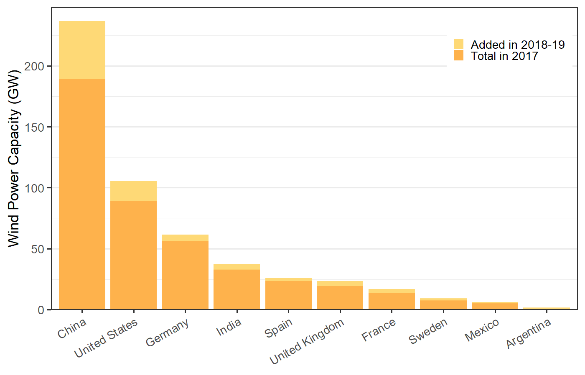
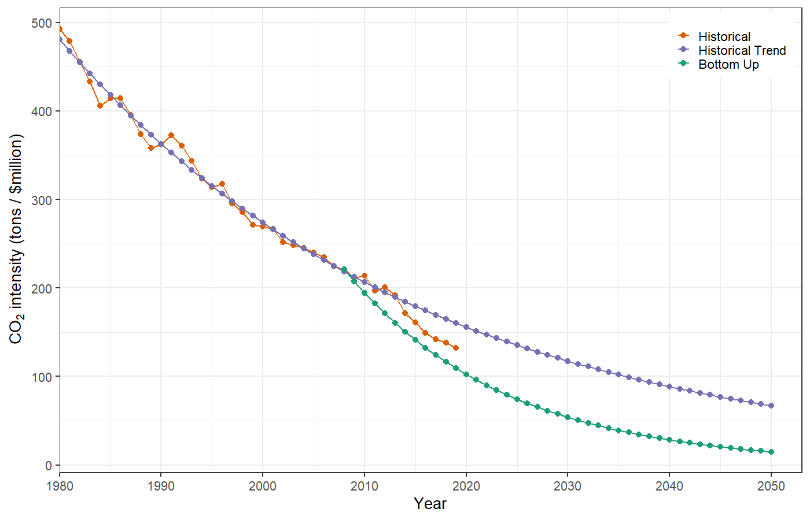
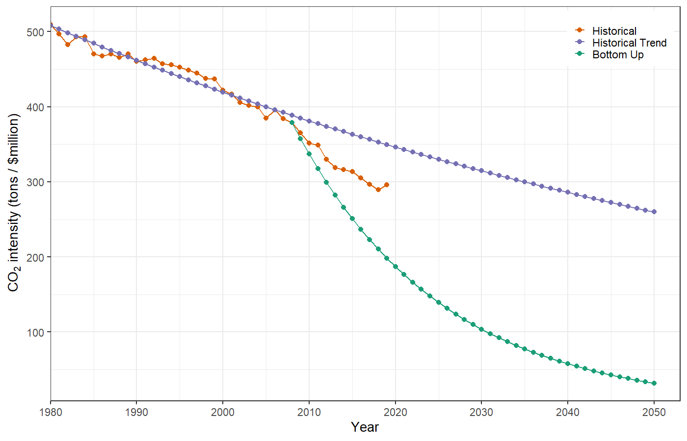

# Challenges of Decarbonizing {#decarb-challenge-sec .center}

## Scale of Problem: 450 ppm target {#scale-of-problem}

{height=725}

## Pielke's Policy Criteria {#pielke-policy-criteria .center}

1. Policies should flow with public opinion
1. Public will not tolerate significant short-term costs, 
   even for big long-term benefits
1. Policy must center on clean energy innovation

# Solar Photovoltaic Power {.blacktitle #solar-sec data-background-image="assets/images/solar_panels.jpg" data-backfround-position="contain"}

## Solar Energy over Time {#solar-time data-background-image="assets/images/solar_panels.jpg" data-backfround-position="contain"}

::::::{.bare .mtop-3}

::: {.credit .yellowtext}
Renewable Energy Parity Network for the 21st Century,
_Global Status Report 2020_,
<http://www.ren21.net/status-of-renewables/global-status-report/>
:::
::::::

## Top-10 Nations for Solar PV {#solar-top-10 data-background-image="assets/images/solar_panels.jpg" data-backfround-position="contain"}

::::::{.bare .mtop-3}

::: {.credit .yellowtext}
Renewable Energy Parity Network for the 21st Century,
_Global Status Report 2020_,
<http://www.ren21.net/status-of-renewables/global-status-report/>
:::
::::::

# Wind Power {#wind-sec .yellowtitle data-background-image="assets/images/1280px-A_close_shot_of_wind_turbines_wind_farm.jpg" data-backfround-position="contain"}

## Wind Energy over Time {#wind-time data-background-image="assets/images/1280px-A_close_shot_of_wind_turbines_wind_farm.jpg" data-backfround-position="contain" data-background-color="white" data-background-opacity=0.3}

::::::{.bare .mtop-3}

::: {.credit .blacktext}
Renewable Energy Parity Network for the 21st Century,
_Global Status Report 2020_,
<http://www.ren21.net/status-of-renewables/global-status-report/>
:::
::::::

## Top-10 Nations for Wind {#wind-top-10 data-background-image="assets/images/1280px-A_close_shot_of_wind_turbines_wind_farm.jpg" data-backfround-position="contain" data-background-color="white" data-background-opacity=0.3}

::::::{.bare .mtop-3}

::: {.credit .blacktext}
Renewable Energy Parity Network for the 21st Century,
_Global Status Report 2020_,
<http://www.ren21.net/status-of-renewables/global-status-report/>
:::
::::::

# Prospects for Future Renewable Energy {#renewable-future .center}

## Solar PV {#pv-prices}

{height=900}

## Cost of Renewable Energy vs. Fossil Fuels

{height=900}

::: notes

The cost of solar electricity dropped 89% in
the last 10 years.

The cost of wind power dropped 70% in
the last 10 years.

:::

## Current World Mix of Energy {#current-mixy}

::::::{.bare .mtop-3}
{height=750}

::: {.credit}
Renewable Energy Parity Network for the 21st Century,
_Global Status Report 2020_,
<http://www.ren21.net/status-of-renewables/global-status-report/>
:::
::::::

## World Electricity Generation {#electricity-mix}

::::::{.bare .mtop-3}
{height=750}

::: {.credit}
Renewable Energy Parity Network for the 21st Century,
_Global Status Report 2020_,
<http://www.ren21.net/status-of-renewables/global-status-report/>
:::
::::::

# Decarbonizing the World {#decarbonizing-sec .center}

## Implied Decarbonization: {#decarbonization-intro .eighty .leftslide}

* Goal:
  * Reduce emissions to some percentage below a reference year,
    by a target year
  * Example: Reduce emissions so _F_(2050) is 80% less than _F_(1990).
* {+} Bottom-up procedure:
  * Treat each Kaya identity factor separately: _P_, _g_, _e_, _f_.
    * e.g., **extrapolate each factor**, based on historical rate of change
  * Combine _P_ and _g_ to get _G_ (GDP in target year)
* {+} Top-down procedure:
  * Begin with integrated model of total GDP growth
    * e.g., **macroeconomic model** that considers interactions between
      _P_, _g_, _e_, and _f_.
    * {+} _F_ = total CO~2~ emissions
    * {+} _G_ = _Pg_ is Gross Domestic Product: Size of the economy
    * {+} _ef_ = carbon intensity of the economy
    * {+} If _ef_ rapidly gets smaller, then we can have economic growth while 
      reducing emissions.

## Implied Decarbonization (Bottom Up) {#implied-bottom-up .ninety}

* {+} We know _F_ and _G_ at the start.
* {+} We know the goal for _F_ at the target date
* {+} We predict what _P_ and _g_ will be at the target date
* {+} Kaya Identity:

  $$ 
  \begin{align*}
    F   &= P \times g \times e \times f \\
        &= G \times ef \\
    F/G &= ef
  \end{align*}
  $$

* {+} Change if $F/G$ implies change in $ef$: decarbonization.
    * $\Delta (F/G) = \Delta (ef)$
* {+} Achieve decarbonization by some mix of energy efficiency (reduce _e_)
  and adoption of clean energy (reduce _f_).

## Implied Decarbonization (Top Down) {#implied-top-down .ninety}

* {+} We know _F_ and _E_ at the start.
* {+} We know the goal for _F_ at the target date
* {+} We predict what energy consumption _E_ will be at the target date
* {+} Kaya Identity:
  $$ 
  \begin{align*}
    F   &= E \times f \\
    F/E &= f
  \end{align*}
  $$
* {+} Change if $F/E$ implies change in $f$: decarbonization.
    * $\Delta (F/E) = \Delta (f)$
* {+} Achieve decarbonization by adopting clean energy (reduce _f_).

# Worked Example: UK {#bottom-up-uk-sec .center}

## UK Climate Change Act (2008) {#uk-climate-act .center}

* Reduce greenhouse gas emissions so *F* in 2050 is 80% lower than in 1990:
  [\[ F(2050) = 0.20\: F(1990) \]]{style="font-size:95%;"}
* How hard will it be to achieve this goal?

## Bottom-Up Analysis

* Begin by figuring historical rates of change for $P$, $g$, $e$, and $f$.
* Estimate historical growth rate for $P \times g$.
* Calculate implied rate of change for $e \times f$.
* Compare implied rate of change for $ef$ to historical rate of change.
* Use on-line web application to calculate rates of change.
  <https://ees3310.jgilligan.org/decarbonization/>
  * R package `kayadata`: `install.packages("kayadata")`

## Bottom-Up Analysis {#bottom-up-uk-app}

<iframe src="https://ees3310.jgilligan.org/decarbonization" height=900, width=1600>
<a href="https://ees3310.jgilligan.org/decarbonization", target="_blank">https://ees3310.jgilligan.org/decarbonization</a>
</iframe>

:::{.bare .eighty}
<https://ees3310.jgilligan.org/decarbonization>
:::

## Bottom-Up Analysis {#bottom-up-uk-1 .eighty}

* {+} GDP(2008) = $2.54 trllion
  * Emissions intensity *ef*(2008) = 221 tons per $1000
* {+} Business as usual:
  * If growth follows historical trends
    * {+} Population _P_ grows at 0.31%,
    * {+} per-capita GDP _g_ grows at 2.41%,
    * {+} GDP grows at 0.31% + 2.41% = 2.72%
    
      [\(\displaystyle
      \begin{aligned}
      GDP(2050) &= GDP(2008) \times \exp(0.0272 \times (2050 - 2008))\\
      &= \$2.54~\text{trillion} \times \exp(0.0272 \times 42)\\
      &= \$7.95~{\text{trillion}}
      \end{aligned}
      \)]{style="font-size:95%;"}

## Bottom-Up Analysis {#bottom-up-uk-2 .eighty}

* {+} F(2008) = 561 million tons CO~2~.
* {+} F(1990) = 595 million tons CO~2~.
* {+} Goal: Emissions in 2050 are 80% less than in 1990:
    * {+} [$F(2050) = 0.20\: F(1990) = 0.20 \times 595~\text{MMT} = 119~\text{MMT}$]{style="font-size:95%;"}
    * {+} Implied growth rate of $F$:

      [\(\displaystyle
      \begin{aligned}
      r_F &= \ln(F(2050) / F(2008)) / 42~\text{years} \\
      &= \ln(119 / 561) / 42 \\
      &= -3.69\%.
      \end{aligned}
      \)]{style="font-size:95%;"}

## Implied decarbonization rates:  {#bottom-up-uk-3 .eighty}

* {+} GDP ([$P \times g$]{style="font-size:95%;"}) grows at 2.72%
* {+} Implied growth rate of _F_: $r_F = -3.69\%$.
* {+} Implied growth rate of _ef_ (carbon intensity of the economy):
  * $F = Pgef$, so 
  * $r_F = r_{Pg} + r_{ef} = r_G + r_{ef}$

    [\(\displaystyle
    \begin{aligned}
    r_{ef} &= r_F - r_G \\
    &= -3.69\% - 2.72\%\\
    &= -6.41\%
    \end{aligned}
    \)]{style="font-size:95%;"}
* {+} The implied $r_{ef} = -6.41\%$
* {+} The historical $r_{ef} = -2.82\%$
* {+} To meet the goal, the UK would have to decarbonize 2.3 
  times faster than it did for the previous several decades.
* {+} However, since 2010, decarbonization has accelerated!

## Implied decarbonization for UK {#bottom-up-uk-4 .eighty}

## Progress since 2008

# Implied Decarbonization for Australia {#bottom-up-australia-sec .center}

## Australia's Emissions Trading Scheme {#bottom-up-australia-1}

* PM Kevin Rudd calls for cutting emissions 60% below 2000 levels by 2050
* [$F(2050) = 0.40\: 
  F(2000) = 0.40 \times 
  358~\text{MMT} = 143~\text{MMT}$]{style="font-size:95%;"}

## Implied Decarbonization for Australia {#bottom-up-australia-2 .eighty}

* Historical decarbonization rate: $r_{ef} = -0.96\%$
* Implied decarbonization rate: $r_{ef} = -5.89\%$

## Progress since 2008

# Other Considerations {#other-considerations-sec .center}

## Kuznets curve {#kuznets-curve}

## Concluding Remarks {#conclusion .center}

* {+} Implied $ef$ depends on prediction of $\text{GDP} = G = P \times g$.
* {+} Predicting population and economic growth are very tricky and imprecise.
* {+} So take any of these calculations with a grain of salt.
* {+} But are they still useful, despite the uncertainties?
