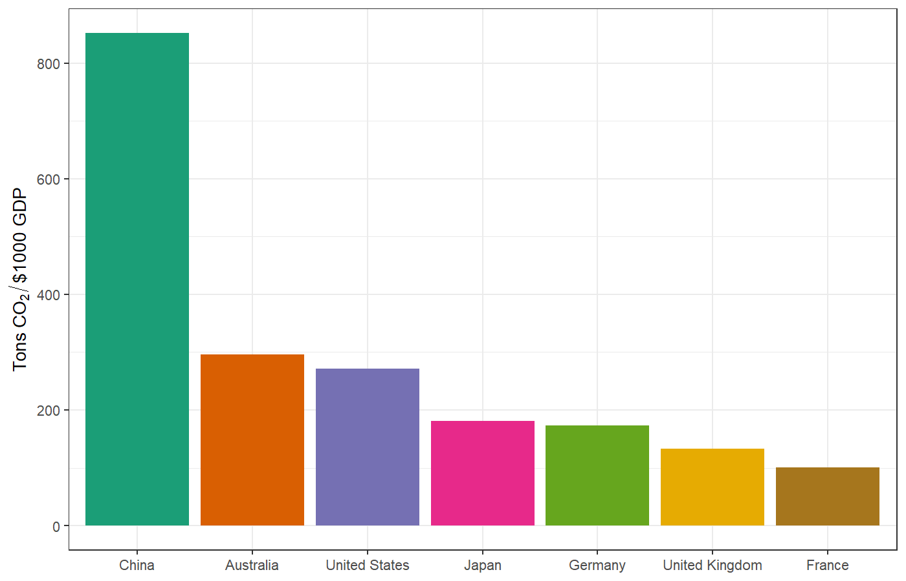
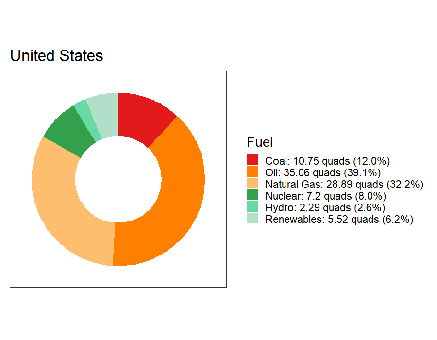

# Considerations on Projections of Future Emissions {#considerations-sec .center}

## Grain of Salt {#grain-of-salt}

* {+} Implied decarbonization rates depend on predictions of _P_, _G_, etc.
* {+} Predicting population and economic growth are very tricky and imprecise.
* {+} So take any of these calculations with a grain of salt.
* {+} But are they still useful, despite the uncertainties?

# Implied Decarbonization for Green New Deal {#bottom-up-gnd-sec .center}

## Kaya Identity

$$\color{firebrick}{F} = \color{darkgreen}{P} \times \color{blue}{g}\times 
  \color{mediumorchid}{e} \times \color{crimson}{f}$$

* $\color{firebrick}{F} =$ emissions (million metric tons (MMT) CO~2~ per year)
* $\color{darkgreen}{P} =$ population (billions)
* $\color{blue}{g} =$ per-capita GDP ($1000 per person)
* $\color{mediumorchid}{e} =$ energy intensity of economy (quads / $ trillion)
  * {+} Reducing [_e_]{style="color:darkorchid;"} means increasing [**energy efficiency**]{style="color:darkorchid;"}
* $\color{crimson}{f} =$ carbon intensity of energy supply (MMT CO~2~ / quad)
  * {+} Reducing [_f_]{style="color:crimson;"} means [**replacing fossil fuels**]{style="color:crimson;"} with cleaner energy

# US Green New Deal {#gnd-sec .center}

## US Green New Deal {#gnd-1}

* The Green New Deal has many definitions:
  * Resolution in Congress does not give specific emissions targets.
  * Bernie Sanders campaigned on a promise to completely eliminate 
    CO~2~ emissions by 2050 and reduce them 71% by 2030
    * [$F(2019) = 4965~\text{MMT}$]{style="font-size:95%;"}
    * [$F(2030) = 1484~\text{MMT}$]{style="font-size:95%;"}
    * Could we do this in 11 years?
      * We would have to cut _ef_ by 13.4% per year.
      * Historically, since 1990, _ef_ has dropped 
        2.5% per year.

# How Can We Decarbonize? {#decarb-options-sec .center}

## Detailed Abatement Options

::::::{.bare .mtop-3}
{height=900}

:::{.credit}
Image credit: McKinsey Global Institute
:::
::::::

## Economic Carbon Intensity in 2019

## CO~2~ Emissions 1965--2019 {#co2-emissions}

## Relative improvement in carbon intensity 1990--2019 {#relative-improvement .seventy}

# Top-Down Analysis for Green New Deal {#top-down-gnd-sec .center}

## Projected Energy Use in 2030 {#us-energy-2050 .eighty}

* Energy Information Administration top-down projection for energy demand
  in United States in 2030: 
  * Total 2030 Primary Energy Use = 88.8 
    Quads 
  * Assume _P_, _g_, and _e_ are fixed. 
  * Manage emissions by reducing _f_
    * Switch from fossil fuels to clean energy

## Energy Mix in 2019 {#us-energy-mix}

:::::: {.columns}
::: {.column width="50%"}

:::
::: {.column width="50%" style="vertical-align:top;padding-top:1em;"}

Fuel           Quads     %
------------  ------  ----
Coal            10.7    12
Oil             35.1    39
Natural Gas     28.9    32
Nuclear          7.2     8
Hydro            2.3     3
Renewables       5.5     6
Total           89.7   100

:::
::::::

## Emissions Factors {#emissions-factors .eighty}

Fuel           MMT CO~2~ per Quad
------------  -------------------
Coal                           94
Oil                            70
Natural Gas                    53
Nuclear                         0
Hydro                           0
Renewables                      0

### Projected Business as Usual Emissions in 2030{style="margin-top:50px;"}

Fuel             %   Quads   MMT/Quad   MMT CO~2~
------------  ----  ------  ---------  ----------
Coal            12    10.6         94        1004
Oil             39    34.7         70        2428
Natural Gas     32    28.6         53        1518
Nuclear          8     7.1          0           0
Hydro            3     2.3          0           0
Renewables       6     5.5          0           0
Total          100    88.8         NA        4951

## Top-down emissions-reduction {#td-gnd-1}

::::::{.columns}
:::{.column}

Fuel             %   Quads   MMT/Quad   MMT CO~2~
------------  ----  ------  ---------  ----------
Coal            12    10.6         94        1004
Oil             39    34.7         70        2428
Natural Gas     32    28.6         53        1518
Nuclear          8     7.1          0           0
Hydro            3     2.3          0           0
Renewables       6     5.5          0           0
Total          100    88.8         NA        4951
:::
::: {.column .eightyfive}
* {+} Projected emissions for 2030 = 4951 MMT
  * If _f_ doesn't change.
* {+} Emissions goal for 2030 = 1484 MMT
* {+} Must cut by (4951 &minus; 1484) = 
  3467 MMT
* {+} Start with coal:
  * Cut 1004 MMT (10.64 quads)
  * 2463 MMT left
* {+} Next, cut gas:
  * Cut 1518 MMT (28.59 quads)
  * 945 MMT left
* {+} Finally, cut oil:
  * Cut 945 MMT (13.49 quads)
* {+} Total energy cuts = 10.64 + 28.59 + 
  13.49 = 52.72 quads.
:::
::::::

## Clean Energy Sources {#clean-energy .eighty}

* {+} 11,000 megawatts (MW) for one year = 1 quad
  * (See Climate Fix, p. 97)
* {+} **Nuclear Power Plant**:
  * 1000 MW &times; 75%
    capacity factor = **750 MW average**
  * 1 quad per year = 11,000  MW / 
    (750 MW per nuclear plant) = 
    **14.7 nuclear plants**
* {+} **Solar Photovoltaic**:
  * 30 MW &times; 30%
    capacity factor = **9 MW average**
  * **1 quad = 1,200  photovoltaic solar farms**
* {+} **Wind Turbine**:
  * 6 MW &times; 42%
    capacity factor = **3 MW average**
  * **1 quad = 4,400  wind turbines**

## Meeting Green New Deal Goal {#meeting-gnd-goal .eighty}

* Cut CO~2~ by 3467 MMT
  * 1004 MMT from coal (10.6 quad)
  * 1518 MMT from gas (28.6 quad)
  * 945 MMT from oil (13.5 quad)
* Total clean energy needed:  quads per year

::: {style="margin-top:1em;"}

* {+} 53 quads &times; 
  15 nuclear plants/quad =  
  **770 nuclear power plants** 
  in 11 years 
  (70 per year)
* {+} 53 quads &times; 
  1,200 photovoltaic solar farms/quad =  
  **63,000 photovoltaic solar farms** in 
  11 years  
  (6,000 per year, 
  or 100 per week)
* {+} 53 quads &times; 
  4,400 wind plants/quad = 
  **232,000 wind turbines** in 
  11 years 
  (21,000 per year, 
  or 60 per day)

:::
## Pielke's Bottom Line

* Unfeasible to build so much clean energy so quickly
* Expense of building so much clean energy would defeat economic goals
* This is why we don't have the technology to decarbonize as quickly as 
  politicians and activists have been promising.

## But ...

* Renewable energy is getting cheaper very quickly
* It may soon be profitable to shut down existing fossil-fuel power plants
  and replace them with renewables.

# Review {#review-sec .center}

## Bottom-Up Analysis {#bottom-up-review .eighty}

* Start with individual Kaya-identity variables:
  * _P_, _g_, _e_, _f_
  * Figure out historical rates of change for each
* {+} Gross Domestic Product: $G = P \times g$
  * Rate of change of $G$: $r_G = r_P + r_g$
  * Rate of change of a product is the sum of the rates of change of the 
    factors.
  * Use rate of change of _G_ to extrapolate _G_ in the future

## Bottom-Up Analysis {#bottom-up-review-2 .eighty}

* Start with individual Kaya-identity variables
* Start with the policy goal: change in $F$.
  * {+} Figure out implied rate of change of emissions $r_F$.
* {+} Compare to the expected rate of change of GDP $r_G$.
* {+} Calculate the implied rate of decarbonizing the economy, $r_{ef}$:

  $$r_{ef} = r_F - r_G$$
* {+} Compare implied $r_{ef}$ to the historical trend in _ef_ to assess the
  difficulty of meeting the policy goals.

## Top-Down Analysis {#top-down-review .eighty}

* {+} Start with macroeconomic estimate of future energy demand _E_
* {+} Use mix of energy sources and emissions factors to calculate
  future emissions (_F_) if the mix of energy sources does not change.
* {+} Your policy has a a goal for  _F_ 
* {+} Calculate difference between projected future _F_ and policy goal for _F_.
* {+} Calculate how many **quads of fossil-fuel energy** you would have to 
  replace with clean energy to meet the policy goal.
  * {+} Start with cutting coal, then cut natural gas, and finally cut oil
  * {+} Why?
* {+} Figure out how many power plants of different kinds you would have to 
  build to supply the necessary clean energy.
