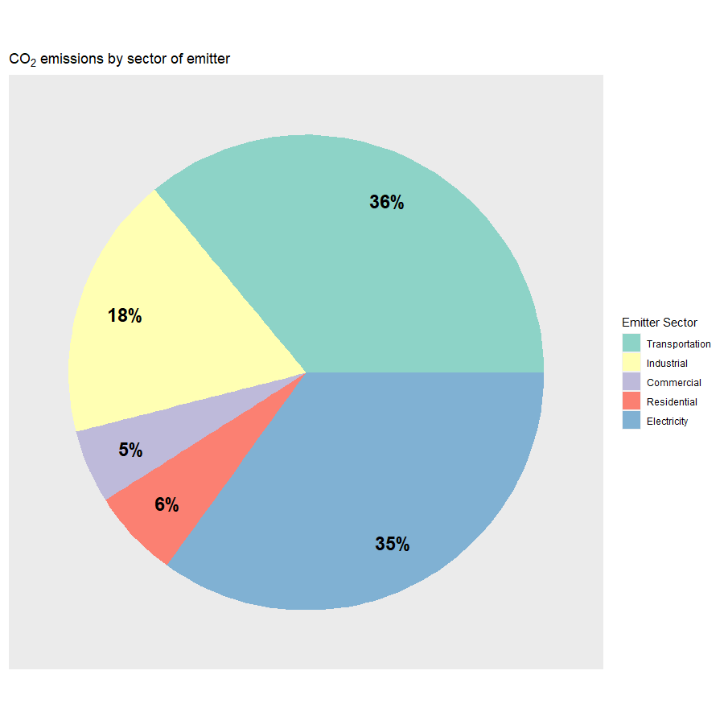

# Big Concepts {#big-concept-sec .center data-transition="fade-out" data-state="skip_slide"}

## Big Concepts {#big-concepts data-transition="fade-out"}

* {+} Cost per ton of reducing emissions
  * {+} Marginal vs. average cost
  * {+} Diminishing marginal returns on investment
     (increasing marginal cost of mitigation)
* {+} A different look at top-down vs. bottom-up
* {+} Implications for policy:
  * {+} The importance of participation
  * {+} The need for new technology
  * {+} Market-driven vs. command-and-control
* {+} Comparison:
  * {+} Pielke vs. Nordhaus

## The cost of reducing emissions {#cost-of-mitigation-1}

{style="height:900px;"}

## Top-down vs. Bottom-up {#top-down-bottom-up}

:::::::::{.columns .mtop-3}
::::::{.column}
#### Climate Fix (Pielke)

:::{.eighty}
* **Top-down** = macroeconomic calculation
* {+1} **Bottom-up** = individual components of Kaya identity:
  * {+2} Technology:
    * _e_ = energy intensity
    * _f_ = carbon intensity
:::
::::::
::::::{.column}
#### Climate Casino (Nordhaus)

:::{.eighty}
* **Top-down** = macroeconomic calculation
* {+1} **Bottom-up** = Engineering:
  * {+2} Individual energy technologies
    * Nuclear
    * Coal
    * Gas
    * ...
:::
::::::
:::::::::

## The cost of reducing emissions {#cost-of-mitigation-2}

{style="height:900px;"}

## Assumptions {#mitigation-assumptions}

::::::{.columns}
:::{.column}
#### Top Down

* No negative-cost options
  * $100 bill on sidewalk
  * Examples:
    * ...
:::
:::{.column}
#### Bottom Up

* All technology is new
  * What about existing infrastructure?
:::
::::::

# Potential for Emissions Reduction {#potential-reductions .center}

## Nortel {#nortel}

* {+} Electronics manufacturing
  * {+} CFC-113 for cleaning circuit boards
    * Cheap, safe
* {+} Concern about ozone layer:
  * {+} 1988: Voluntary pledge to eliminate CFCs
  * {+} Citrus-based cleaner:
    * Even cheaper
    * No chemical disposal costs
    * $1 million initial costs
    * $4 million savings in first 3 years

## Walker's Crisps {#walkers-crisps}

::::::{.columns}
:::{.column}
{style="height:900px;"}
:::
:::{.column .ptop-3 .ninety}
* {+} British snack-food company
  * Makes potato chips
  * {+} Buys potatoes by the pound
* {+} Farmers sell by the pound
  * {+} Make sure potatoes are as wet as possible
  * {+} Humidified warehouses
  * {+} Cost of shipping
* {+} Dry potatoes make better chips
  * {+} Walker's must dry potatoes
    * {+} Cost of heating, dehumidifying
    * {+} Changed the way they bought potatoes
  * {+} Saved money, reduced CO~2~ emissions
:::
::::::

## Home energy efficiency {#home-wedge}

::::::{.columns}
:::{.column}
{style="width:900px;"}
:::
:::{.column .ptop-3 .ninety}
* {+} Insulation, weatherization
  * {+} $1000 on sealing leaks saves $500 per year
    * {+} Improving insulation
      * {+} Costs \$0.25--\$2.75 per square foot
      * {+} Savings \$0.50--\$2.90 per square foot per year
      * {+} Payback time <1 year to 6 years
* {+} So why don't people do things that save money and help environment?
  * {+} Don't know what to do
  * {+} Too much bother/inconvenience
  * {+} Can't afford up-front costs
  * {+} ...
:::
::::::

# The Household Sector {#household-sec .center}

## Who Emits CO~2~? {#emitters}

:::::: {.columns}
::: {.column}

:::
::: {.column .fragment}

:::
::::::

## "The Behavioral Wedge" {#behavioral-wedge}

:::{.ninety}
* {+} Dietz, Gardner, Gilligan, Stern, & Vandenbergh (2009)
* {+} Households can cut emissions ~38%
* {+} With the right incentives, households could be persuaded to 
  cut emissions 20%
  * {+} 450 million metric tons of CO~2~ per year
  * {+} 7.35% of total US emissions
  * {+} More than the whole nation of France
:::

# Policy Implications {#policy-implications .center}

## Climate Casino on Policy {#casino-policy}

* {+} Different actions have different costs/ton
  * {+} Same action may have different costs at different firms
* {+} Government doesn't know enough to micromanage actions efficiently
  * {+} Put a cost on carbon and let market allocate actions
    * {+} Those who can cut emissions cheaply do a lot
    * {+} Those for whom cutting emissions is expensive do less
    * {+} What matters to the environment is total cuts, not 
      whether everyone cuts the same amount.

## Participation {#participation}

:::::: {.columns}
::: {.column width="850px" }
{style="height:900px;"}
:::
::: {.column style="width:550px;vertical-align:top;padding-top:1em;font-size:64%;"}
Full participation vs. only countries representing 50% of emissions
:::
::::::

## Nordhaus on Policy {#nordhaus-on-policy}

> The favorite policies of most countries today are energy efficiency 
> regulations....
>
> However, such regulations will not touch the area where reductions are most 
> economical---electricity generation from coal. 
> ... 
>
> [C]areful analyses show that coal 
> is king when it comes to reducing CO2 emissions.

## Nordhaus on Policy {#nordhaus-on-policy-2}

> Economists and policymakers do not have the information
> to micromanage the energy system for 315 million Americans or 7 billion
> earthlings. 
> 
> The economy is too complicated and evolves too rapidly. 
> 
> Rather, ... economists emphasize that policy should be designed to
> provide strong incentives to reduce CO2 emissions and to develop new low-carbon
> technologies.

## Bill Gates on Policy {#gates-on-policy}

* {+} We need an energy revolution
* {+} Put a price on carbon to motivate the market
* {+} But ...
  * {+} Markets are not good at revolutionizing energy
    * Failure rates of venture-capital investments
  * {+} Government does very well at investing in basic research
    * Calls for massive government support for energy R&D

