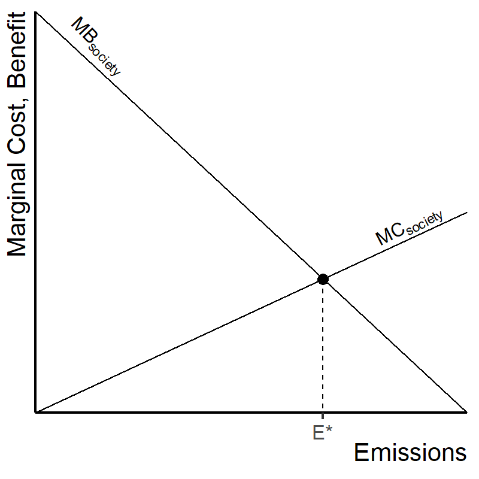
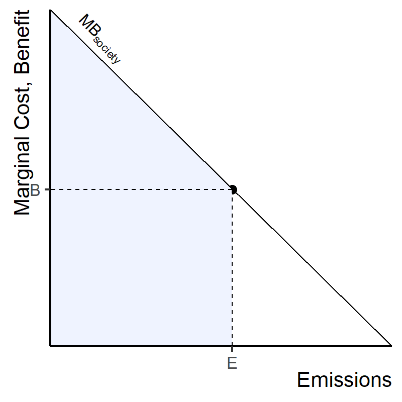
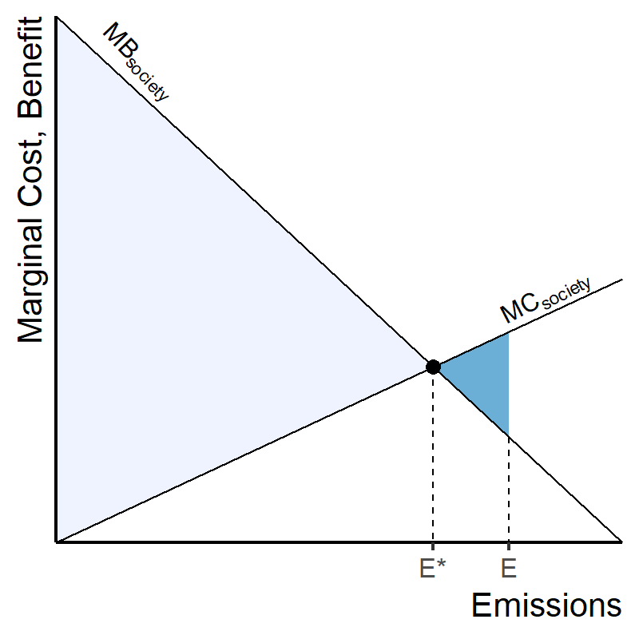
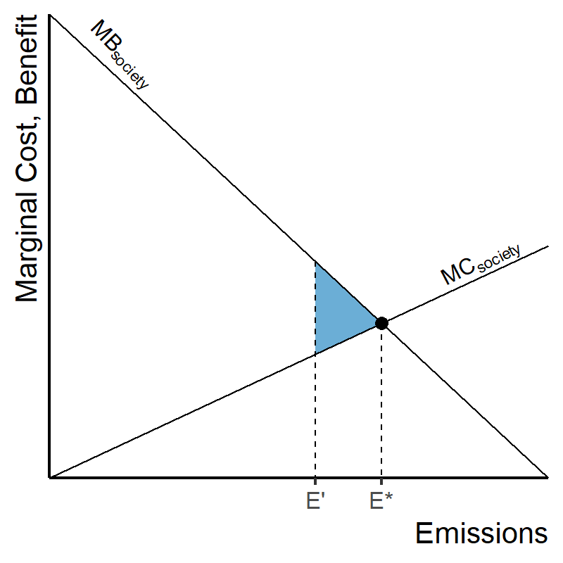

# Climate Casino {#casino-sec .center}

## Considerations in Economic Policy Analysis {#considerations .ninety}

1. Compliance & Participation
   
   If you make a policy, how many people/organizations/nations will follow it?
   
2. {+} Discounting

   If you have to pay the costs now, and don't get the benefits for a long time,
    the effective benefits are smaller.
   
   ::: {.fragment}
   Imagine you're a musician and you're buying a guitar.

   * How much would you pay today for a guitar that you can have right away?
   * How much would you pay today for a guitar that will be delivered 
     in six months?
   ::: 
   ::: {.fragment}
   Much more detail on this next week (Wed. Apr. 7)
   :::

3. {+} Tipping points

## Climate Casino {#casino-1 data-transition="fade-out"}

:::::: {.columns .eighty .mtop-3}
::: {.column}
### Optimal Policy: 100% efficient

{style="width:775px;"}
:::
::: {.column}
### Inefficient: Limited Participation

{style="width:775px;"}
:::
::::::

## Climate Casino {#casino-2 data-transition="fade"}

:::::: {.columns .eighty .mtop-3}
::: {.column}
### Optimal Policy: 100% efficient

{style="width:775px;"}
:::
::: {.column}
### Limited Participation with Discounting

{style="width:775px;"}
:::
::::::

## Climate Casino {#casino-3 data-transition="fade"}

:::::: {.columns .eighty .mtop-3}
::: {.column}
### Limited Participation with Discounting

{style="width:775px;"}
:::
::: {.column}
### Limited Participation with Discounting and Tipping Points

{style="width:775px;"}
:::
::::::

## Summary of Principles:

* Higher damages with higher temperatures
* Higher costs of emissions abatement for lower temperature targets
* Higher costs when participation is limited and abatement is inefficient
* Lower damages when you account for discounting
* Tipping points can change everything

# Microeconomics and Emissions Reduction {#micro-sec .center}

## Technical Microeconomics {#marginal .ninety}

* {+} Marginal costs:
  * The cost of the last unit produced
* {+} Gross costs:
  * The total cost of _all_ units produced
* {+} Marginal costs and scale:
  * {+} iPhones:
    * {+} Billions of dollars to build the first iPhone
    * {+} Less than $500 to build the millionth iPhone
  * {+} Production possibilities:
    * {+} Economies of scale
      * Marginal costs fall as volume increases
    * {+} Learning
      * The more you produce, the more you learn how to cut costs
    * {+} Diminishing returns:
      * Marginal costs rise as volume increases
    * {+} Takeaway: Whether costs go up or down depends on the details

## Using Graphs to Avoid Math {#graphs}

* Costs vs. benefits for increasing CO~2~ abatement
* MC = marginal cost to society of emissions (pollution)
* MB = marginal benefit of emissions (economic output)

:::::: {.columns .mtop-3}
::: {.column .ninety .ptop-3}
* {+} When MC > MB, it's worth cutting emissions.
* {+} When MC < MB, cutting emissions costs more than it's worth.
* {+} When MC = MB: equilibrium, optimal amount of emissions.
:::
::: {.column}

:::
::::::

## Slope of MB {#mb-slope data-transition="fade-out"}

::::::::: {.textleft}
* Costs vs. Benefits of Emissions

:::::: {.columns .mtop-3}
::: {.column .eighty}
* {+} Why does MB slope down?
  * {+} Optimal emissions:
    * {+} When energy is plentiful, diminishing returns on using more
    * {+} Implications for cutting emissions:
      * {+} Marginal benefit of emissions = marginal cost of cutting emissions.
      * {+} Do cheap things first (small marginal cost to reduce emissions)
      * {+} When you run out of cheap things, turn to expensive ones
        (higher marginal cost)
:::
::: {.column}

:::
::::::
:::::::::

## Slope of MC {#mc-slope data-transition="fade-in"}

::::::::: {.textleft}
* Costs vs. Benefits of Emissions

:::::: {.columns .mtop-3}
::: {.column .eighty}
* {+} Why does MC slope up?
  * {+} Greater emissions mean more warming
  * {+} Greater warming = greater damage:
    * {+} Going from 3&deg;C to 4&deg;C is much worse than going from
      2&deg;C to 3&deg;C
    * {+} Benefit of reducing warming from 4&deg;C to 3&deg;C is worth more
      than reducing it from 3&deg;C to 2&deg;C
:::
::: {.column}

:::
::::::
:::::::::

## Marginal vs. Gross Benefit {#gross-benefit data-transition="fade-out"}

:::::: {.columns .ninety .mtop-3}
::: {.column .ptop-3}
* E = emissions (abatement)
* B = marginal benefit 
* Blue area = total gross benefit to society from emissions
:::
::: {.column}

:::
::::::

## Marginal vs. Gross Cost {#gross-cost data-transition="fade"}

:::::: {.columns .ninety .mtop-3}
::: {.column .ptop-3}
* E = emissions (abatement)
* C = marginal cost 
* Blue area = total gross cost to society from emissions
:::
::: {.column}

:::
::::::

## Putting it Together {#marginal-cost-benefit data-transition="fade"}

:::::: {.columns .ninety style="vertical-align:top;margin-top:1em;"}
::: {.column style="width:50%;vertical-align:top;margin-top:1em;"}
* Marginal benefit at E = B
* Marginal cost at E = C
* Marginal net benefit at E = (B - C)
:::
::: {.column}

:::
::::::

## Putting it Together {#gross-cost-benefit data-transition="fade"}

:::::: {.columns .ninety .mtop-3}
::: {.column .ptop-3}
* Gross benefit at E = area under MB (light + dark blue)
* Gross cost at E = area under MC (dark blue)
* Gross net benefit at E = gross benefit - gross cost
    * Light-blue trapezoid
:::
::: {.column}

:::
::::::

## Total Net Benefit {#total-net data-transition="fade-in"}

# Optimizing Emissions {#optimizing-sec .center}

## Optimum Emissions {#optimum-emissions data-transition="fade-out"}

:::::: {.columns .ninety .mtop-3}
::: {.column .ptop-3}
* {+} Optimum emissions = E*
* {+} Actual emissions = E
* {+} Little triangle on right: Costs > Benefits (net loss)
* {+} EPA issues only enough permits to allow emissions of E*
* {+} Free trading in permits cuts emissions to E* at lowest possible cost
* {+} Total net benefits to society are maximized.
:::
::: {.column}

:::
::::::

## Optimum Emissions {#optimum-emissions-2 data-transition="fade-in"}

:::::: {.columns .ninety .mtop-3}
::: {.column .ptop-3}
* Optimum emissions = E*
* EPA issues only enough permits to allow emissions of E*
* Free trading in permits cuts emissions to E* at lowest possible cost
* Total net benefits to society are maximized.
:::
::: {.column}

:::
::::::

## Deadweight Losses {#deadweight data-transition="fade-out"}

:::::: {.columns .ninety .mtop-3}
::: {.column .ptop-3}
* Optimum: E*
* {+} EPA cuts emissions too far, to E'
* {+} Deadweight loss = empty triangle (difference between actual net benefit
  and optimum net benefit).
:::
::: {.column}

:::
::::::

## Deadweight Losses {#deadweight-2 data-transition="fade-in"}

:::::: {.columns .ninety .mtop-3}
::: {.column .ptop-3}
* Optimum: E*
* EPA cuts emissions too far, to E'
* Deadweight loss = blue triangle (difference between actual net benefit
  and optimum net benefit).
:::
::: {.column}

:::
::::::
