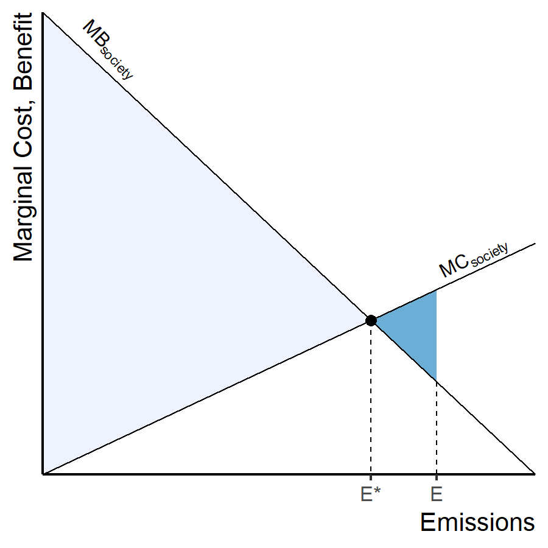
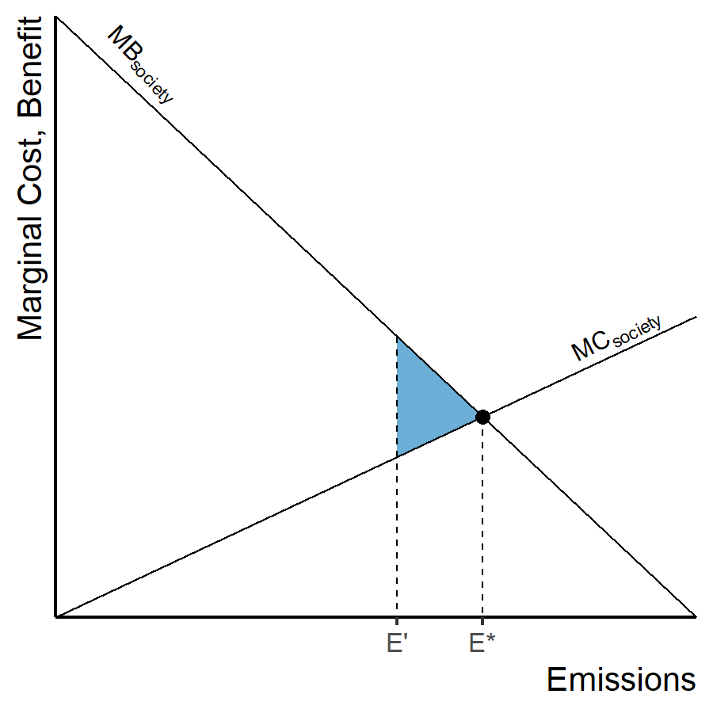

## Review of Costs and Benefits {#cost-benefit-review}

:::::: {.columns}
::: {.column .ptop-3}
* Total gross benefit = area under MB
* Total gross cost = area under MC
* **Total net benefit** = gross benefit &minus; gross cost
  * Light gray trapezoid
:::
::: {.column}

:::
::::::

## Total Net Benefit {#net-benefit}

## Optimum Emissions {#optimum-emissions data-transition="fade-out"}

:::::: {.columns}
::: {.column .ptop-3}
* Optimum emissions = E^\*^
* EPA regulations allow E^\*^ emissions
* Total net benefits are maximized.
:::
::: {.column}

:::
::::::

## Deadweight Losses {#deadweight data-transition="fade"}

:::::: {.columns}
::: {.column .ptop-3}
* Optimum emissions = E^\*^
* EPA regulations allow E' emissions
* Deadweight Loss (dark blue triangle) = difference between 
  **actual net benefit** and **optimum net benefit**
:::
::: {.column}

:::
::::::

## Deadweight Losses {#deadweight-2 data-transition="fade-in"}

:::::: {.columns}
::: {.column .ptop-3}
* Optimum emissions = E^\*^
* EPA regulations allow E' emissions
* Deadweight Loss (dark blue triangle) = difference between 
  **actual net benefit** and **optimum net benefit**
:::
::: {.column}

:::
::::::

# Regulation {.center}

## Regulation {.ninety}

* **Command and Control**
* **Market-Based Regulation**
  * Put a price on externalities
  * {+} Let the market decide best balance between costs and benefits of pollution
  * {+} _Pigovian tax_:
    * Tax equal to social cost
      * {+} Directly compensate people hurt by pollution
      * {+} Or rebate other taxes: indirect compensation
      * {+} Or invest in socially beneficial projects
        * Clean energy
        * Infrastructure to adapt to climate change
        * Compensate out-of-work coal miners

## Nordhaus on Pigovian Taxes

* {+} Taxes on something makes people do less of it
* {+} We want people to work, don't want them to pollute
* {+} But we tax working and don't tax polluting
* {+} Revenue-neutral carbon tax:
  * Raise tax on CO~2~, cut payroll taxes

## Details

* {+} People don't like paying taxes
* {+} _Invisible taxes_
  * {+} Charge tax when fossil fuels are extracted from ground or imported
  * {+} Fossil fuel producer pays tax, passes cost on to consumers
* {+} Taxes &rarr; higher prices &rarr; less consumption
* {+} Higher fuel prices:
  * {+} Incentive to buy energy-efficient products
  * {+} Incentive to invent, produce, market efficient products
  * {+} Clean energy becomes more competitive

## Simplicity of Carbon Prices

* **Command and Control**:
  * Government has to assess emissions & costs for all kinds of technology
* {+} **Green consumers**:
  * To reduce carbon footprint, research and calculate emissions embedded
    in products & services
* {+} **Pricing carbon**:
  * Simple calculation: tax carbon content of fuels
  * Consumers receive simple price signal:
    * Shop for lowest price to reduce carbon footprint

## Difficulties

* Setting the correct tax rate is hard
  * {+} Social cost of carbon is uncertain
  * {+} Social cost depends on total emissions now & in the future
    * Set tax to marginal cost based on total emissions to date
    * Tax rises over time

## Difficulties

* {+} People are not always rational consumers
  * Both as individuals and as organizations
* {+} Often don't notice small changes in price
* {+} Often don't recognize opportunities to save through efficiency & conservation
* {+} Importance of calling people's attention to places they could cut emissions
  and save money

## Difficulties

* _Offshoring_
  * If US sets carbon tax, India does not, companies will shift production
    from US to India
  * Big problem unless carbon tax is applied to all countries

## Difficulties

* Lack of control:
  * Actual emissions depend on both _price_ **and** _consumer demand_
    * If regulators underestimate demand, emissions and warming will be 
      greater than goal
    * But if social cost is correct, this may mean benefits of energy
      consumption exceed damage from warming

# Carbon Taxes {.center}

## Example tax calculations

{style="height:800px;"}

Tax necessary to stabilize at 2.5&deg;C warming

## Impact of $25/ton tax

::: {.mtop-3}
<!-- html table generated in R 4.0.4 by xtable 1.8-4 package -->
<!-- Fri Apr 02 01:53:05 2021 -->
<table border=1>
<tr> <th> Item </th> <th> Price increase </th>  </tr>
  <tr> <td> Coal </td> <td align="right"> 134.0% </td> </tr>
  <tr> <td> Electricity </td> <td align="right"> 31.0% </td> </tr>
  <tr> <td> Natural gas </td> <td align="right"> 30.0% </td> </tr>
  <tr> <td> Gasoline &amp; petroleum products </td> <td align="right"> 11.0% </td> </tr>
   </table>
:::

## Impact of $25/ton tax on Household Spending

::: {.mtop-3}
<!-- html table generated in R 4.0.4 by xtable 1.8-4 package -->
<!-- Fri Apr 02 01:53:05 2021 -->
<table border=1>
<tr> <th> Item </th> <th> Tons CO2 </th> <th> Cost of tax </th> <th> Spending increase </th>  </tr>
  <tr> <td> Annual electricity for one home </td> <td align="right"> 9.34 </td> <td align="right"> $230.00 </td> <td align="right"> 19.00% </td> </tr>
  <tr> <td> Economy-class international flight </td> <td align="right"> 4.68 </td> <td align="right"> $120.00 </td> <td align="right"> 8.00% </td> </tr>
  <tr> <td> Annual phone &amp; internet </td> <td align="right"> 0.01 </td> <td align="right"> $0.36 </td> <td align="right"> 0.04% </td> </tr>
  <tr> <td> Annual total consumption for one household </td> <td align="right"> 30.00 </td> <td align="right"> $740.00 </td> <td align="right"> 0.90% </td> </tr>
   </table>
:::

## Impact of $25/ton tax on National Economy

::: {.mtop-3}
<!-- html table generated in R 4.0.4 by xtable 1.8-4 package -->
<!-- Fri Apr 02 01:53:05 2021 -->
<table border=1>
<tr> <th> Year </th> <th> Tax rate (\$/ton) </th> <th> Emissions (billion ton) </th> <th> Revenue (\$ billion) </th> <th> Revenue (% GDP) </th>  </tr>
  <tr> <td align="right"> 2010 </td> <td align="right"> $0 </td> <td align="right"> 6.30 </td> <td align="right"> $0 </td> <td align="right"> 0.000% </td> </tr>
  <tr> <td align="right"> 2015 </td> <td align="right"> $25 </td> <td align="right"> 5.90 </td> <td align="right"> $147 </td> <td align="right"> 0.960% </td> </tr>
  <tr> <td align="right"> 2020 </td> <td align="right"> $30 </td> <td align="right"> 5.50 </td> <td align="right"> $168 </td> <td align="right"> 0.970% </td> </tr>
  <tr> <td align="right"> 2025 </td> <td align="right"> $42 </td> <td align="right"> 5.40 </td> <td align="right"> $225 </td> <td align="right"> 1.140% </td> </tr>
  <tr> <td align="right"> 2030 </td> <td align="right"> $53 </td> <td align="right"> 5.20 </td> <td align="right"> $277 </td> <td align="right"> 1.250% </td> </tr>
   </table>
:::
:::{.mtop-1}
* Tax starts in 2015 at $25 per ton
  * {+} Rise steadily so emissions stabilize at 2000 levels by 2030
  * {+} Carbon tax can be used to reduce deficit or cut other taxes
* {+} However, this tax seems very inadequate to limit warming to 2&deg;C.
  * {+} The longer we wait, the higher the tax must be to achieve a policy goal.
:::

# **Discuss** {.center}
