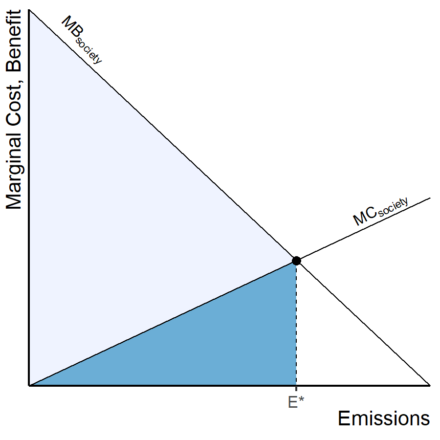
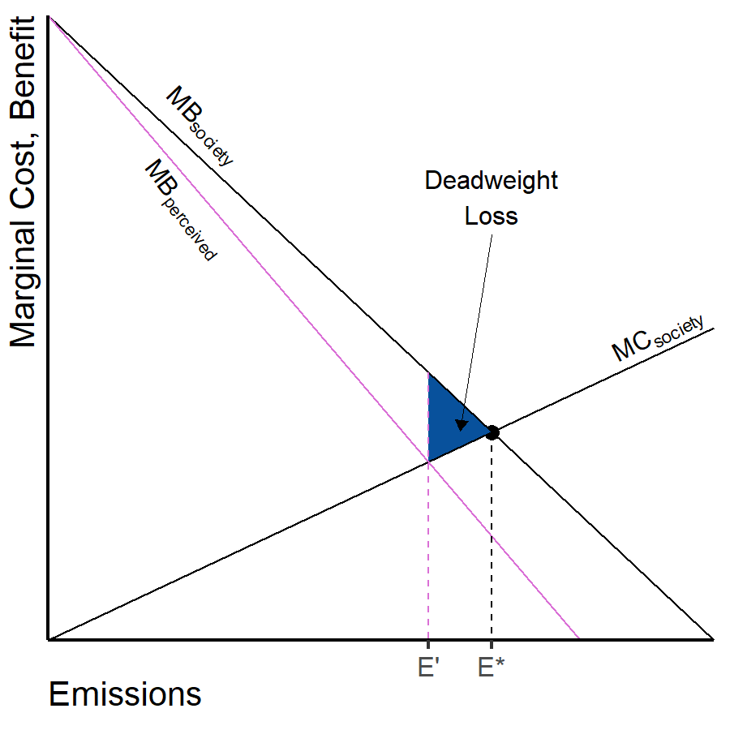
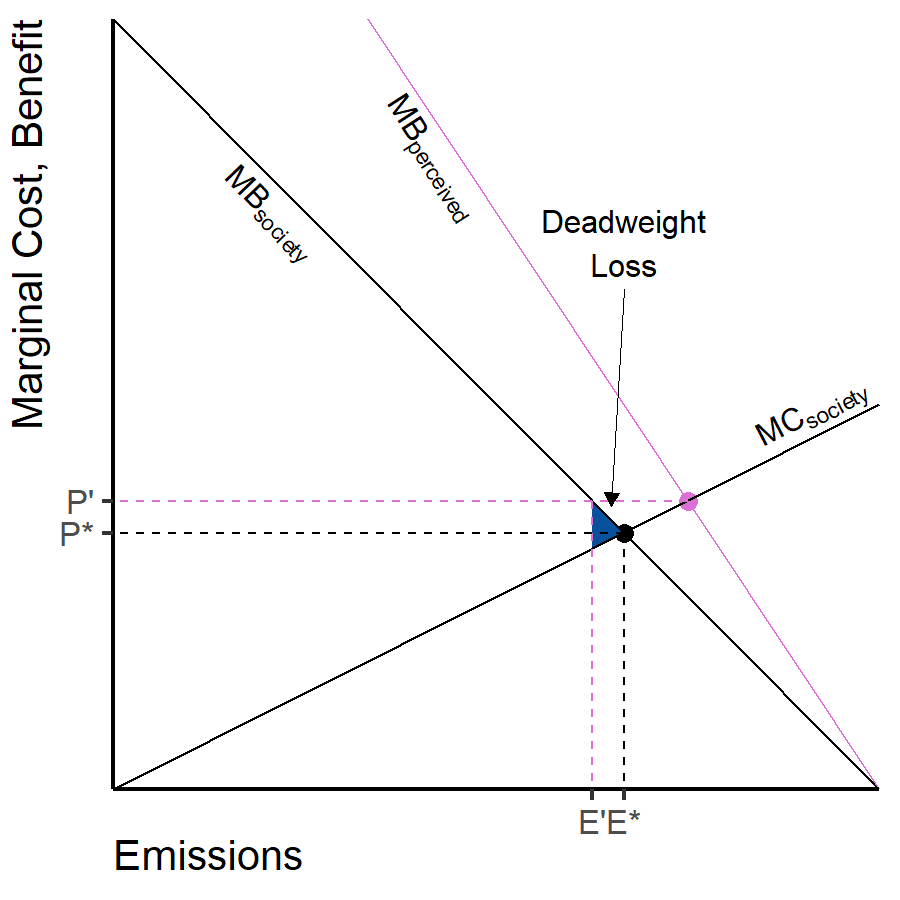

# Perspectives on Market-Based Regulations {.center}

## Market-Based Regulations {.eighty}

* Most economists (liberal & conservative) favor putting a price on
  greenhouse gas emissions.
  * {+} **Cap-and-trade:**
    * Require a permit for every ton of fossil fuels
    * Issue a limited number of permits
    * Companies can buy and sell permits
  * {+} **Carbon tax:**
    * Charge a tax on every ton of fossil fuels
    * Price equal to social cost of carbon emissions
  * {+} In principle, cap-and-trade and carbon tax are equivalent if 
    costs and benefits are known accurately.
    * M. Weitzman, 1974. "Prices vs. Quantities," _Rev. Econ. Studies_ 
      **41**, 477--491. <https://doi.org/10.2307/2296698>
    * {+} Different consequences for inaccuracies in costs or benefits.

## Considerations about Market-Based Regulations {.eighty}

* They work best when the total amount of pollution matters, but 
  it doesn't matter who emits it, or where.
  * {+} The impact is spread over large areas, regardless where the emissions 
    happen.
  * {+} Not appropriate when the biggest effects are local: 
    lead pollution, mercury from power plants, urban smog, ...
* {+} They work best when it's easy to monitor pollution and track the sources.
  * {+} Sulfur pollution (acid rain) was emitted from large power plants and
    factories.
  * {+} CO~2~ from fossil fuels: fossil fuel production is already 
    well-monitored
    * {+} If we had to monitor every car's tailpipe, it wouldn't work.
  * {+} Doesn't work for illegal dumping (pouring motor oil down sewer drains)
  * {+} The largest source of dioxin (a dangerous cancer-causing chemical) is 
    people in rural areas burning plastic trash in their back yards
* {+} Market-based regulations do not address the distribution of costs and 
  benefits:
  * One group may pay most of the costs and another may enjoy most
  of the benefits.
  * The distribution of costs may be regressive, with low-income people paying
  a disproportionate share.

## Optimum Emissions Abatement

:::::: {.columns}
::: {.column .ptop-3}
* Optimum emissions = E^\*^
* {+} EPA issues permits for E^\*^ tons of emissions
* {+} Free-trading in permits reduces emissions to E^\*^ at minimal cost
* {+} Total net benefits are maximized
:::
::: {.column}

:::
::::::

# Uncertainty and Errors {.center}

## Market-Based Regulations and Uncertainty

* Cap-and-trade:
  * Maximum quantity of pollution is known
  * Cost to polluters is uncertain
* Emissions taxes
  * Cost to polluters is known
  * Quantity of pollution is uncertain

## Imperfect Emissions Abatement {#imperfect-abatement data-transition="fade-out"}

:::::: {.columns}
::: {.column .ptop-3 .eighty}
* Optimum emissions = E^\*^
* EPA underestimates benefits of emissions (cost of cutting emissions)
  * Issues permits for E' instead of E^\*^
:::
::: {.column}

:::
::::::

## Deadweight Losses {#deadweight-losses data-transition="fade"}

:::::: {.columns}
::: {.column .ptop-3 .eighty}
* Optimum emissions = E^\*^
* EPA underestimates benefits of emissions (cost of cutting emissions)
  * Issues permits for E' instead of E^\*^
* Deadweight loss (blue triangle) = difference between **actual net benefit**
  and **optimum net benefit**.
:::
::: {.column}

:::
::::::

## Imperfect Emissions Abatement {#deadweight-losses-2 data-transition="fade"}
:::::: {.columns}
::: {.column .ptop-3 .eighty}
* Optimum emissions = E^\*^
* EPA overestimates benefits of emissions (cost of cutting emissions)
    * Issues permits for E' instead of E^\*^
:::
::: {.column}

:::
::::::

## Deadweight Loss with Carbon Tax {#deadweight-losses-tax data-transition="fade-in"}

:::::: {.columns}
::: {.column .ptop-3 .eighty}
* Optimum emissions = E^\*^
  * This corresponds to a price P^\*^
* EPA overestimates benefits of emissions (cost of cutting emissions)
  * Sets the price at P' instead of P^\*^
  * Actual emissions are where the price P' intersects the actual benefit curve
* {+} When benefit curve is linear and steeper than the cost curve, then
  taxes produce better results under uncertainty
  * {+} Taxes may be worse if:
    * The cost curve is steeper than the benefit curve
    * or if the benefit or cost curve is sharply nonlinear near the optimum
:::
::: {.column}

:::
::::::

# Market-Based Regulations in Action {.center}

## 1990 Clean Air Amendments

* {+} Acid rain, mostly from sulfate and nitrate chemicals emitted by burning 
  coal
* {+} Market-based regulation (cap-and-trade)
  * Permits sold at auction
  * Companies could buy and sell permits with each other
* {+} Environmentalists complained about selling the right to pollute
* {+} Industry groups worried permits would be too expensive

## How Things Went

* {+} Plan:
  * Gradually reduce emissions by 37% during 1990s
  * Big reductions start in 2000 to reduce pollution 70%
* {+} Predicted costs:
  * Industry: 
    * Regulation would cost \$3--7 billion per year in 1990s, 
    * \$7--25 billion per year after 2000
  * EPA: 
    * \$1.9--5.5 billion per year
* {+} Actual costs:
  * $0.8 billion per year during 1990s
  * $1 billion per year after 2000.
  * Emission reductions met 1999 goals in 1995, four years ahead of schedule.

## Broader Patterns in Environmental Regulation

* {+} An economic study of the costs of environmental regulations found:
  * 50% cost at least 25% less than predicted
  * 40% cost roughly as much as predicted
  * 10% cost at least 25% more than predicted
* {+} A 2017 audit of the Clean Air Act by the Office of Management and Budget 
  under President Donald Trump found that out of 55 clean-air regulations
  they studied, 
  * 46 had benefits that were greater than the costs 
  * Only 2 had costs greater than the benefits.
* {+} A 2003 report from the Office of Management and Budget under President
  George H.W. Bush found that clean-air regulations produced benefits between
  3 and 4 times greater than the costs of compliance.

# Discuss different approaches to policy {.center}

# Emissions Trading In Detail {.center}

## Emissions Trading In Detail {data-transition="fade-out"}

:::::: {.columns style="margin-top:100px;"}
::: {.column .ptop-3}
* What is the optimum amount of emissions?
* What is the total (gross) cost of emissions?
* What is the total (gross) benefit to society?
* What is the net benefit?
:::
::: {.column}

| CO~2~ emissions| Marginal cost| Marginal benefit|
|---------------:|-------------:|----------------:|
|               0|           ---|              ---|
|               1|            20|              120|
|               2|            40|               90|
|               3|            60|               60|
|               4|            80|               30|
|               5|           100|                0|
:::
::::::

## Marginal and Cumulative Costs & Benefits {data-transition="fade-in"}

::: {.mtop-3}

| CO~2~ emissions| Marginal cost| Marginal benefit| Gross cost| Gross benefit| Net benefit|
|---------------:|-------------:|----------------:|----------:|-------------:|-----------:|
|               0|           ---|              ---|          0|             0|           0|
|               1|            20|              120|         20|           120|         100|
|               2|            40|               90|         60|           210|         150|
|               3|            60|               60|        120|           270|         150|
|               4|            80|               30|        200|           300|         100|
|               5|           100|                0|        300|           300|           0|
:::

* Gross (cumulative) costs and benefits are the sum of marginal 
  costs and benefits from zero to the current level.
* Net benefit is the gross benefit minus the gross cost.
* {+} What is the optimal number of permits to issue?
* {+} What is the optimal emissions tax?

## Two Companies {.eighty}

::::::::: {.columns .ptop-3}
:::::: {.column width="25%"}

| Emissions|  MB|
|---------:|---:|
|         0| ---|
|         1| 100|
|         2|  80|
|         3|  60|
|         4|  40|
|         5|  20|

::: {.mtop-1}

| Emissions|  MB|
|---------:|---:|
|         0| ---|
|         1| 125|
|         2| 100|
|         3|  75|
|         4|  50|
|         5|  25|
:::
::::::
:::::: {.column width="25%"}

| Emissions|  MC|
|---------:|---:|
|         0| ---|
|         1|  20|
|         2|  40|
|         3|  60|
|         4|  80|
|         5| 100|
|         6| 120|
|         7| 140|
|         8| 160|
|         9| 180|
|        10| 200|
::::::
:::::::::

## Two Companies {.eighty}

::: {.mtop-3}

| Emissions|Company |  MB|  MC| Gross Benefits| Gross Costs| Net Benefits|
|---------:|:-------|---:|---:|--------------:|-----------:|------------:|
|         1|B       | 125|  20|            125|          20|          105|
|         2|A       | 100|  40|            225|          60|          165|
|         3|B       | 100|  60|            325|         120|          205|
|         4|A       |  80|  80|            405|         200|          205|
|         5|B       |  75| 100|            480|         300|          180|
|         6|A       |  60| 120|            540|         420|          120|
|         7|B       |  50| 140|            590|         560|           30|
|         8|A       |  40| 160|            630|         720|          -90|
|         9|B       |  25| 180|            655|         900|         -245|
|        10|A       |  20| 200|            675|        1100|         -425|
:::

* {+} Benefits depend on which company produces the emissions
* {+} Costs only depend on the total emissions
* {+} Put emissions in descending order of marginal benefit.
* {+} What is the optimum emissions level?
* {+} What is the optimum emissions tax?
