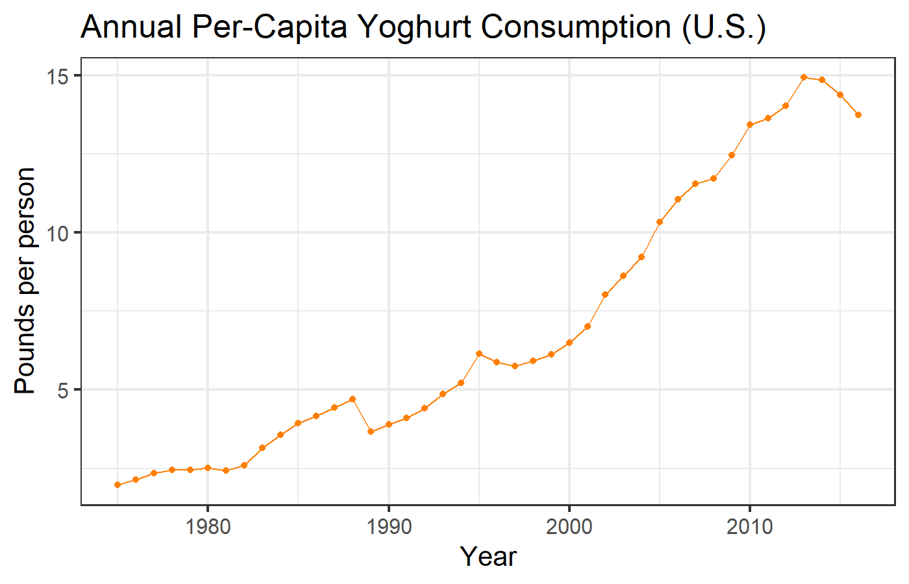

# Review of Market-Based Regulations {.center}

## Marginal and Cumulative Costs & Benefits {data-transition="fade-in"}

::: {.mtop-3}

| CO~2~ emissions| Marginal cost| Marginal benefit| Gross cost| Gross benefit| Net benefit|
|---------------:|-------------:|----------------:|----------:|-------------:|-----------:|
|               0|           ---|              ---|          0|             0|           0|
|               1|            20|              120|         20|           120|         100|
|               2|            40|               90|         60|           210|         150|
|               3|            60|               60|        120|           270|         150|
|               4|            80|               30|        200|           300|         100|
|               5|           100|                0|        300|           300|           0|
:::

* Gross (cumulative) costs and benefits are the sum of marginal 
  costs and benefits from zero to the current level.
* Net benefit is the gross benefit minus the gross cost.
* {+} What is the optimal number of permits to issue?
* {+} What is the optimal emissions tax?

## Two Companies {.eighty}

::::::::: {.columns .ptop-3}
:::::: {.column width="25%"}

| Emissions|  MB|
|---------:|---:|
|         0| ---|
|         1| 120|
|         2| 100|
|         3|  80|
|         4|  60|
|         5|  40|

::: {.mtop-1}

| Emissions|  MB|
|---------:|---:|
|         0| ---|
|         1| 130|
|         2| 104|
|         3|  78|
|         4|  52|
|         5|  26|
:::
::::::
:::::: {.column width="25%"}

| Emissions|  MC|
|---------:|---:|
|         0| ---|
|         1|  21|
|         2|  42|
|         3|  63|
|         4|  84|
|         5| 105|
|         6| 126|
|         7| 147|
|         8| 168|
|         9| 189|
|        10| 210|
::::::
:::::::::

## Two Companies {.eighty}

::: {.mtop-3}

| Emissions|Company |  MB|  MC| Gross Benefits| Gross Costs| Net Benefits|
|---------:|:-------|---:|---:|--------------:|-----------:|------------:|
|         1|B       | 130|  21|            130|          21|          109|
|         2|A       | 120|  42|            250|          63|          187|
|         3|B       | 104|  63|            354|         126|          228|
|         4|A       | 100|  84|            454|         210|          244|
|         5|A       |  80| 105|            534|         315|          219|
|         6|B       |  78| 126|            612|         441|          171|
|         7|A       |  60| 147|            672|         588|           84|
|         8|B       |  52| 168|            724|         756|          -32|
|         9|A       |  40| 189|            764|         945|         -181|
|        10|B       |  26| 210|            790|        1155|         -365|
:::

* {+} Benefits depend on which company produces the emissions
* {+} Costs only depend on the total emissions
* {+} Put emissions in descending order of marginal benefit.
* {+} What is the optimum emissions level?
* {+} What is the optimum emissions tax?

# Discounting: Should we spend more today to offset damages in the future? {#Introduction .center .eighty}

## Should we pay $100 for a bond today that will pay $1000 in 50 years? {#net-present-value-1 .eighty data-transition="fade-out"}

* What would you expect to earn if you invested \$100 today in something else?
  * "_**Opportunity cost**_"
* {+} Compounding interest:
  $$
  V_{\text{future}} = V_{\text{present}} \times (1 + r)^n,
  $$
  where:
  * _V_ is value
  * _r_ is interest rate (4% &rarr; _r_ = 0.04)
  * _n_ is number of years
* {+} Rule of 72:
  * The number of years to double your investment is roughly 
    72 / (percent interest rate)

## Should we pay $100 for a bond today that will pay $1000 in 50 years? {#net-present-value-2 .eighty data-transition="fade-out"}

* What would you expect to earn if you invested \$100 today in something else?
* Assume real interest rate is 4%
  * Compounding interest:
    $$
    V_{\text{future}} = V_{\text{present}} \times (1 + r)^n,
    $$

    :::{.fragment}
    $$
    \begin{align}
    V_{\text{present}} &= \$100\\
    V_{\text{future}} &= V_{\text{present}} \times (1 + r)^n\\
    &= \$100 \times 1.04^{50}\\
    &= \$711.
    \end{align}
    $$
    :::
* {+} $\color{darkgreen}{\$1000 > \$711}$, so it's a 
  good deal.

## Should we pay $100 for a bond today that will pay $1000 in 50 years? {#net-present-value-3 .eighty data-transition="fade-out"}

* Formula for net present value (NPV) is the inverse of the interest formula:

$$
\begin{align}
V_{\text{future}} &= V_{\text{present}} \times (1 + r)^n\\
V_{\text{present}} &= \frac{V_{\text{future}}}{(1 + r)^n}
\end{align}
$$

::: {.fragment}
$$
\begin{align}
V_{\text{future}} &= \$1000\\
V_{\text{present}} &= \frac{\$1000}{1.04^{50}}\\
&= \frac{\$1000}{7.11}\\
&= \color{darkgreen}{\$141 > \$100}.
\end{align}
$$
:::

## Different Discount Rates

* Higher rate (10%)

  $$
  V_{\text{present}} = \frac{V_{\text{future}}}{(1 + {\color{red}{r}})^n}
  = \frac{1000}{1.{\color{red}{10}}^{50}}
  = \color{red}{\$9 < \$100}
  $$

* Lower rate (1%)

  $$
  V_{\text{present}} = \frac{V_{\text{future}}}{(1 + {\color{darkgreen}{r}})^n}
  = \frac{1000}{1.{\color{darkgreen}{01}}^{50}}
  = \color{darkgreen}{\$608 > \$100}
  $$

# Future Generations {.center}

## Should we spend money today to offset damages in the future? {#today-vs-future}

::: {.fragment style="margin-top:25px;margin-bottpm:25px;"}
### How much is it worth to us **today** to avoid climate disruption **in 100 years**?
:::

{style="width:1400px;"}

------

* {+} How much is the welfare of your children worth, relative to your own 
  welfare?
* {+} Your grandchildren?
* {+} Your great-grandchildren?
* {+} Your great-great grandchildren?
* {+} Your great^3^ grandchildren?
* {+} At what great^n^ do we stop?

## Assume each future generation is worth half of the previous generation

::: {style="margin-top:50px;"}
$$ 1 + \frac{1}{2} + \frac{1}{2^2} + \frac{1}{2^3} + \cdots = 2 $$
:::
::: {.fragment style="vertical-align:middle;text-align:center;margin-top:50px;font-size:200%;"}
{style="height:600px;vertical-align:middle;"} = {style="height:600px;vertical-align:middle"}
:::

## Assume each generation is equal

::: {style="margin-top:300px;"}
$$ 1 + 1 + 1 + 1 + \cdots = {\Huge \infty} $$
:::

## Valuing the present (high discount rate)

::: {style="margin-top:100px;"}
* {+} We're poor relative to the future!
* {+} Don't take from the poor (that's us) to give to the rich 
  (future generations)
* {+} But if we apply this to **spatial** inequalities that exist **now** ... 
  justifies massive wasteful transfers from rich to poor
:::

# Rates Matter! {.center}

## Stern vs. Nordhaus {#stern-nordhaus-1 data-transition="fade-out"}

{style="width:1400px;margin-top:162px;border:none;box-shadow:none"}

## Stern vs. Nordhaus {#stern-nordhaus-2 data-transition="fade-in"}

{style="width:1400px;margin-top:50px;border:none;box-shadow:none"}

## Consumption elasticity $\eta$

:::::: {.columns}
::: {.column .eighty}
* {+} Proportional rate at which marginal utility of consumption is reduced as 
  consumption increases (_**What**?_)
* {+} Giving $100 to someone in poverty adds more to total well-being than 
  giving $100 to Jeff Bezos
* {+} High $\eta$: Value current consumption, strong benefits for redistribution 
  from rich to poor
* {+} Low $\eta$: Value future consumption, weak benefits for redistribution 
  from rich to poor
:::
::: {.column .fragment}

* Stern: $\eta = 1$
* Nordhaus: $\eta = 2$

:::
::::::

## Time discount rate $\rho$

:::::: {style="text-align:left;"}

> * How do we value future welfare, relative to our own?
> * $\rho = 0$: All generations equal
> * $\rho > 0$: Future generations count less than our own
> * $\rho < 0$: Future generations count more than our own

::: {.fragment style="margin-top:50px;"}

* Stern: $\rho = 0.1\%$
* Nordhaus: $\rho = 1.5\%$

:::
::::::

## Per-capita consumption growth rate, $g$

:::::: {.columns}
::: {.column style="width:49%;vertical-align:middle"}

* Stern: $g = 1.3\%$
* Nordhaus: $g = 1.3\%$

:::
::: {.column style="width:49%;vertical-align:middle"}

:::
::::::

## Real return on capital $r$

* Potential of capital to create value
* High $r$ &rarr; Wait and reduce emissions in the **future** (capital yield is 
  higher in future)
* Low $r$ &rarr; Reduce emissions in the **present** (future damages likely to 
  exceed future output)

## Stern vs. Nordhaus {#stern-nordhaus-3 data-transition="fade-in" data-background="assets/images/stern_v_nordhaus_2.jpg" data-background-size="1400px" data-background-position="center"}

:::::: {.columns .fragment style="margin-top:600px;margin-left:0px;margin-right:0px;padding:0px;padding-left:100px;padding-right:100px;margin-top:700px;"}

::: {.column style="width:35%;text-align:center;vertical-align:bottom;"}
$$
\begin{aligned}
r &= 0.1 + 1 \times 1.3\\
  &= 1.4 
\end{aligned}
$$
:::
::: {.column style="width:28%;"}

:::
::: {.column style="width:35%;text-align:center;vertical-align:bottom;"}
$$
\begin{aligned}
r &= 1.5 + 2 \times 1.3\\
  &= 4.1
\end{aligned}
$$
:::
::::::

# Discount Rates and Decarbonization {.center}

## Discount Rates and Decarbonization {.eighty}

* {+} Investing $10 million in wind today produces $100 million in real value 
  50 years from now
  * {+} Rate of 1%: $V_{\text{present}} = \frac{\$100 \text{M}}{1.01^{50}}
    = \$61 \text{M} > \$10 \text{M}$ 
    {style="height:50px;vertical-align:middle;border:none;"}

  * {+} Rate of 4%: $V_{\text{present}} = \frac{\$100 \text{M}}{1.04^{50}} 
    = \$14 \text{M} > \$10 \text{M}$ 
    {style="height:50px;vertical-align:middle;border:none;"}
  * {+} Rate of 7%: $V_{\text{present}} = \frac{\$100 \text{M}}{1.07^{50}} 
    = \$3 \text{M} < \$10 \text{M}$ 
    {style="height:100px;vertical-align:middle;border:none;"}

# Stern vs. Nordhaus on Implications of Discount Rate {.center}

## Nordhaus {.eighty}

:::::: {.columns}
::: {.column style="width:60%"}
> ... we need to use a discount rate that reflects the actual market 
> opportunities that societies face, not an abstract definition of equity taken 
> out of the context of market realities.
:::
::: {.column style="width:39%;vertical-align:top;"}

{style="height:550px;vertical-align:top"}

:::
::::::

## Stern {.eighty data-transition="fade-out"}

:::::: {.columns}
::: {.column style="width:39%;vertical-align:top;"}

{style="height:550px;"}

:::
::: {.column style="width:60%"}

> ... the benefits of strong early action far outweigh the economic costs of
> not acting.

> ... even at moderate levels of warming, all the evidence ... shows that
> climate change will have serious impacts on world output, on human life,
> and on the environment.

[Stern Review, pp. xv&ndash;xvi]{style="font-size:60%;color:darkgray;"}

:::
::::::

## Stern {.eighty data-transition="fade-in"}

:::::: {.columns}
::: {.column style="width:39%;vertical-align:top;"}

{style="height:550px;"}

:::
::: {.column style="width:60%"}

> ... we should go beyond the narrow framework of social welfare functions to
> consider other ethical approaches, including those involving rights and
> sustainability.

> ... disaggregated approach to consequences --- looking at different dimensions,
> places, and times --- and a broad ethical approach.

:::
::::::
