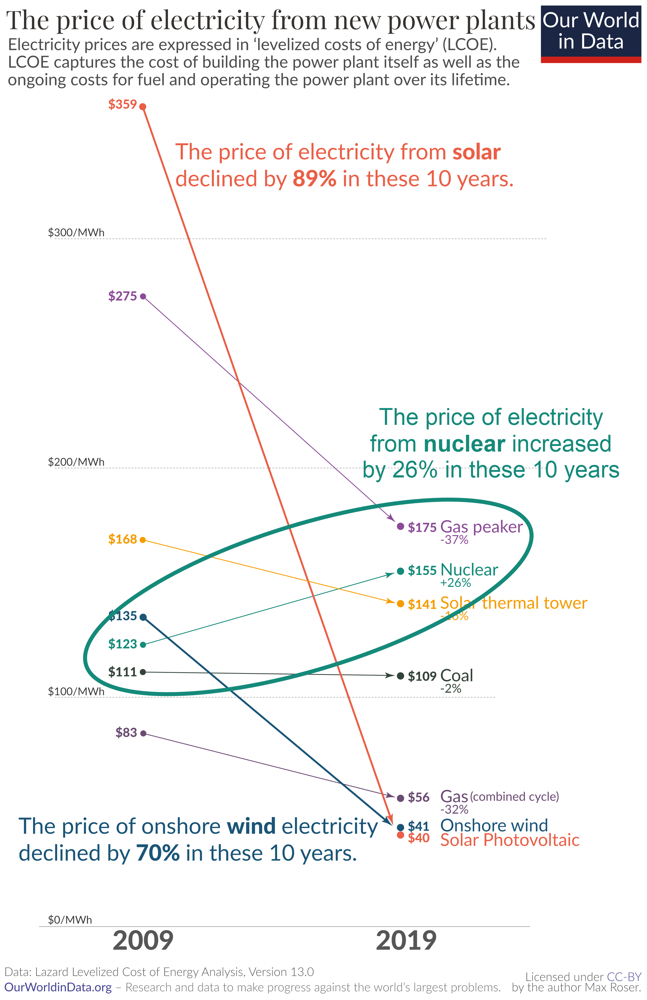

# Reviewing Emissions Regulation Game {.center}

## Review of Game {#game_review .seventyfive}

* Command and Control:
  * Each company emits the same amount

    ::: {style="color:#8080FF;"}
    * {+3} 1: 14 total, 
      7 each
    * {+3} 2: 26 total, 
      13 each
    :::
* {+1} Cap-and-trade:
  * Give each company equal permits.
  * Let them trade

    ::: {style="color:#8080FF;"}
    * {+4} 1: 7 permits each, 
      Alpha buys 2 for 
      $64
    * {+4} 2: 13 permits each, 
      Alpha buys 0 for 
      $0
    :::
* {+2} Carbon Tax:
  * Put a price on CO~2~ emissions
  * Each company can emit as much as it wants to
  * But it must pay the tax on every ton.

    ::: {style="color:#8080FF;"}
    * {+5} 1: $28/ton
    * {+5} 2: $52/ton
    :::

# Default { .eighty data-transition="fade-out" data-state="skip_slide"}

## Default { .eighty data_transition="fade-in"}

<!-- html table generated in R 4.0.4 by xtable 1.8-4 package -->
<!-- Wed Apr 14 02:02:53 2021 -->
<table border=1>
<tr> <th> Actor </th> <th> Emissions </th> <th> Profit </th> <th> Cost </th> <th> Net </th>  </tr>
  <tr> <td align="center"> Alpha </td> <td align="center"> 15 </td> <td align="right"> $630 </td> <td align="right">  </td> <td align="right"> $630 </td> </tr>
  <tr> <td align="center"> Beta </td> <td align="center"> 15 </td> <td align="right"> $420 </td> <td align="right">  </td> <td align="right"> $420 </td> </tr>
  <tr> <td align="center"> Society </td> <td align="center">  </td> <td align="right">  </td> <td align="right"> &minus;$930 </td> <td align="right"> &minus;$930 </td> </tr>
  <tr> <td align="center"> Total </td> <td align="center"> 30 </td> <td align="right"> $1050 </td> <td align="right"> &minus;$930 </td> <td align="right"> $120 </td> </tr>
   </table>

:::{.fragment style="color:#8080FF;"}
**Deadweight loss = $456 million**
:::

### Optimal
<!-- html table generated in R 4.0.4 by xtable 1.8-4 package -->
<!-- Wed Apr 14 02:02:53 2021 -->
<table border=1>
<tr> <th> Actor </th> <th> Emissions </th> <th> Profit </th> <th> Cost </th> <th> Net </th>  </tr>
  <tr> <td align="center"> Alpha </td> <td align="center"> 9 </td> <td align="right"> $540 </td> <td align="right">  </td> <td align="right"> $540 </td> </tr>
  <tr> <td align="center"> Beta </td> <td align="center"> 7 </td> <td align="right"> $308 </td> <td align="right">  </td> <td align="right"> $308 </td> </tr>
  <tr> <td align="center"> Society </td> <td align="center">  </td> <td align="right">  </td> <td align="right"> &minus;$272 </td> <td align="right"> &minus;$272 </td> </tr>
  <tr> <td align="center"> Total </td> <td align="center"> 16 </td> <td align="right"> $848 </td> <td align="right"> &minus;$272 </td> <td align="right"> $576 </td> </tr>
   </table>

## Command & Control (Group 1) {.eighty}
<!-- html table generated in R 4.0.4 by xtable 1.8-4 package -->
<!-- Wed Apr 14 02:02:53 2021 -->
<table border=1>
<tr> <th> Actor </th> <th> Emissions </th> <th> Profit </th> <th> Cost </th> <th> Net </th>  </tr>
  <tr> <td align="center"> Alpha </td> <td align="center"> 7 </td> <td align="right"> $462 </td> <td align="right">  </td> <td align="right"> $462 </td> </tr>
  <tr> <td align="center"> Beta </td> <td align="center"> 7 </td> <td align="right"> $308 </td> <td align="right">  </td> <td align="right"> $308 </td> </tr>
  <tr> <td align="center"> Society </td> <td align="center">  </td> <td align="right">  </td> <td align="right"> &minus;$210 </td> <td align="right"> &minus;$210 </td> </tr>
  <tr> <td align="center"> Total </td> <td align="center"> 14 </td> <td align="right"> $770 </td> <td align="right"> &minus;$210 </td> <td align="right"> $560 </td> </tr>
   </table>

:::{.fragment style="color:#8080FF;"}
**Deadweight loss = $16 million**
:::

### Optimal
<!-- html table generated in R 4.0.4 by xtable 1.8-4 package -->
<!-- Wed Apr 14 02:02:53 2021 -->
<table border=1>
<tr> <th> Actor </th> <th> Emissions </th> <th> Profit </th> <th> Cost </th> <th> Net </th>  </tr>
  <tr> <td align="center"> Alpha </td> <td align="center"> 9 </td> <td align="right"> $540 </td> <td align="right">  </td> <td align="right"> $540 </td> </tr>
  <tr> <td align="center"> Beta </td> <td align="center"> 7 </td> <td align="right"> $308 </td> <td align="right">  </td> <td align="right"> $308 </td> </tr>
  <tr> <td align="center"> Society </td> <td align="center">  </td> <td align="right">  </td> <td align="right"> &minus;$272 </td> <td align="right"> &minus;$272 </td> </tr>
  <tr> <td align="center"> Total </td> <td align="center"> 16 </td> <td align="right"> $848 </td> <td align="right"> &minus;$272 </td> <td align="right"> $576 </td> </tr>
   </table>

## Cap & Trade (Group 1) {.eighty}
<!-- html table generated in R 4.0.4 by xtable 1.8-4 package -->
<!-- Wed Apr 14 02:02:54 2021 -->
<table border=1>
<tr> <th> Actor </th> <th> Permits </th> <th> Bought </th> <th> Sold </th> <th> Emissions </th> <th> Price </th> <th> Profit </th> <th> Cost </th> <th> Net </th>  </tr>
  <tr> <td align="center"> Alpha </td> <td align="center"> 7 </td> <td align="right"> 2 </td> <td align="right">  </td> <td align="right"> 9 </td> <td align="right"> &minus;$64 </td> <td align="right"> $540 </td> <td align="right">  </td> <td align="right"> $476 </td> </tr>
  <tr> <td align="center"> Beta </td> <td align="center"> 7 </td> <td align="right">  </td> <td align="right"> 2 </td> <td align="right"> 5 </td> <td align="right"> $64 </td> <td align="right"> $240 </td> <td align="right">  </td> <td align="right"> $304 </td> </tr>
  <tr> <td align="center"> Society </td> <td align="center">  </td> <td align="right">  </td> <td align="right">  </td> <td align="right">  </td> <td align="right">  </td> <td align="right">  </td> <td align="right"> &minus;$210 </td> <td align="right"> &minus;$210 </td> </tr>
  <tr> <td align="center"> Total </td> <td align="center"> 14 </td> <td align="right"> 2 </td> <td align="right"> 2 </td> <td align="right"> 14 </td> <td align="right">  </td> <td align="right"> $780 </td> <td align="right"> &minus;$210 </td> <td align="right"> $570 </td> </tr>
   </table>

:::{.fragment style="color:#8080FF;"}
**Deadweight loss = $6 million**
:::

### Optimal
<!-- html table generated in R 4.0.4 by xtable 1.8-4 package -->
<!-- Wed Apr 14 02:02:54 2021 -->
<table border=1>
<tr> <th> Actor </th> <th> Emissions </th> <th> Profit </th> <th> Cost </th> <th> Net </th>  </tr>
  <tr> <td align="center"> Alpha </td> <td align="center"> 9 </td> <td align="right"> $540 </td> <td align="right">  </td> <td align="right"> $540 </td> </tr>
  <tr> <td align="center"> Beta </td> <td align="center"> 7 </td> <td align="right"> $308 </td> <td align="right">  </td> <td align="right"> $308 </td> </tr>
  <tr> <td align="center"> Society </td> <td align="center">  </td> <td align="right">  </td> <td align="right"> &minus;$272 </td> <td align="right"> &minus;$272 </td> </tr>
  <tr> <td align="center"> Total </td> <td align="center"> 16 </td> <td align="right"> $848 </td> <td align="right"> &minus;$272 </td> <td align="right"> $576 </td> </tr>
   </table>

## Carbon Tax (Group 1): $28/ton {.eighty}
<!-- html table generated in R 4.0.4 by xtable 1.8-4 package -->
<!-- Wed Apr 14 02:02:54 2021 -->
<table border=1>
<tr> <th> Actor </th> <th> Emissions </th> <th> Tax </th> <th> Profit </th> <th> Cost </th> <th> Net </th> <th> Rebate </th> <th> Net with Rebate </th>  </tr>
  <tr> <td align="center"> Alpha </td> <td align="center"> 10 </td> <td align="right"> &minus;$280 </td> <td align="right"> $570 </td> <td align="right">  </td> <td align="right"> $290 </td> <td align="right"> +$238 </td> <td align="right"> $528 </td> </tr>
  <tr> <td align="center"> Beta </td> <td align="center"> 7 </td> <td align="right"> &minus;$196 </td> <td align="right"> $308 </td> <td align="right">  </td> <td align="right"> $112 </td> <td align="right"> +$238 </td> <td align="right"> $350 </td> </tr>
  <tr> <td align="center"> Society </td> <td align="center">  </td> <td align="right"> +$476 </td> <td align="right">  </td> <td align="right"> &minus;$306 </td> <td align="right"> $170 </td> <td align="right"> &minus;$476 </td> <td align="right"> &minus;$306 </td> </tr>
  <tr> <td align="center"> Total </td> <td align="center"> 17 </td> <td align="right">  </td> <td align="right"> $878 </td> <td align="right"> &minus;$306 </td> <td align="right"> $572 </td> <td align="right">  </td> <td align="right"> $572 </td> </tr>
   </table>

:::{.fragment style="color:#8080FF;"}
**Deadweight loss = $4 million**
:::

### Optimal
<!-- html table generated in R 4.0.4 by xtable 1.8-4 package -->
<!-- Wed Apr 14 02:02:54 2021 -->
<table border=1>
<tr> <th> Actor </th> <th> Emissions </th> <th> Profit </th> <th> Cost </th> <th> Net </th>  </tr>
  <tr> <td align="center"> Alpha </td> <td align="center"> 9 </td> <td align="right"> $540 </td> <td align="right">  </td> <td align="right"> $540 </td> </tr>
  <tr> <td align="center"> Beta </td> <td align="center"> 7 </td> <td align="right"> $308 </td> <td align="right">  </td> <td align="right"> $308 </td> </tr>
  <tr> <td align="center"> Society </td> <td align="center">  </td> <td align="right">  </td> <td align="right"> &minus;$272 </td> <td align="right"> &minus;$272 </td> </tr>
  <tr> <td align="center"> Total </td> <td align="center"> 16 </td> <td align="right"> $848 </td> <td align="right"> &minus;$272 </td> <td align="right"> $576 </td> </tr>
   </table>

# Command & Control (Group 2) { .eighty data-transition="fade-out" data-state="skip_slide"}

## Command & Control (Group 2) { .eighty data_transition="fade-in"}

<!-- html table generated in R 4.0.4 by xtable 1.8-4 package -->
<!-- Wed Apr 14 02:02:54 2021 -->
<table border=1>
<tr> <th> Actor </th> <th> Emissions </th> <th> Profit </th> <th> Cost </th> <th> Net </th>  </tr>
  <tr> <td align="center"> Alpha </td> <td align="center"> 13 </td> <td align="right"> $624 </td> <td align="right">  </td> <td align="right"> $624 </td> </tr>
  <tr> <td align="center"> Beta </td> <td align="center"> 13 </td> <td align="right"> $416 </td> <td align="right">  </td> <td align="right"> $416 </td> </tr>
  <tr> <td align="center"> Society </td> <td align="center">  </td> <td align="right">  </td> <td align="right"> &minus;$702 </td> <td align="right"> &minus;$702 </td> </tr>
  <tr> <td align="center"> Total </td> <td align="center"> 26 </td> <td align="right"> $1040 </td> <td align="right"> &minus;$702 </td> <td align="right"> $338 </td> </tr>
   </table>

:::{.fragment style="color:#8080FF;"}
**Deadweight loss = $238 million**
:::

### Optimal
<!-- html table generated in R 4.0.4 by xtable 1.8-4 package -->
<!-- Wed Apr 14 02:02:54 2021 -->
<table border=1>
<tr> <th> Actor </th> <th> Emissions </th> <th> Profit </th> <th> Cost </th> <th> Net </th>  </tr>
  <tr> <td align="center"> Alpha </td> <td align="center"> 9 </td> <td align="right"> $540 </td> <td align="right">  </td> <td align="right"> $540 </td> </tr>
  <tr> <td align="center"> Beta </td> <td align="center"> 7 </td> <td align="right"> $308 </td> <td align="right">  </td> <td align="right"> $308 </td> </tr>
  <tr> <td align="center"> Society </td> <td align="center">  </td> <td align="right">  </td> <td align="right"> &minus;$272 </td> <td align="right"> &minus;$272 </td> </tr>
  <tr> <td align="center"> Total </td> <td align="center"> 16 </td> <td align="right"> $848 </td> <td align="right"> &minus;$272 </td> <td align="right"> $576 </td> </tr>
   </table>

## Cap & Trade (Group 2) {.eighty}
<!-- html table generated in R 4.0.4 by xtable 1.8-4 package -->
<!-- Wed Apr 14 02:02:54 2021 -->
<table border=1>
<tr> <th> Actor </th> <th> Permits </th> <th> Bought </th> <th> Sold </th> <th> Emissions </th> <th> Price </th> <th> Profit </th> <th> Cost </th> <th> Net </th>  </tr>
  <tr> <td align="center"> Alpha </td> <td align="center"> 13 </td> <td align="right">  </td> <td align="right">  </td> <td align="right"> 13 </td> <td align="right">  </td> <td align="right"> $624 </td> <td align="right">  </td> <td align="right"> $624 </td> </tr>
  <tr> <td align="center"> Beta </td> <td align="center"> 13 </td> <td align="right">  </td> <td align="right">  </td> <td align="right"> 13 </td> <td align="right">  </td> <td align="right"> $416 </td> <td align="right">  </td> <td align="right"> $416 </td> </tr>
  <tr> <td align="center"> Society </td> <td align="center">  </td> <td align="right">  </td> <td align="right">  </td> <td align="right">  </td> <td align="right">  </td> <td align="right">  </td> <td align="right"> &minus;$702 </td> <td align="right"> &minus;$702 </td> </tr>
  <tr> <td align="center"> Total </td> <td align="center"> 26 </td> <td align="right">  </td> <td align="right">  </td> <td align="right"> 26 </td> <td align="right">  </td> <td align="right"> $1040 </td> <td align="right"> &minus;$702 </td> <td align="right"> $338 </td> </tr>
   </table>

:::{.fragment style="color:#8080FF;"}
**Deadweight loss = $238 million**
:::

### Optimal
<!-- html table generated in R 4.0.4 by xtable 1.8-4 package -->
<!-- Wed Apr 14 02:02:54 2021 -->
<table border=1>
<tr> <th> Actor </th> <th> Emissions </th> <th> Profit </th> <th> Cost </th> <th> Net </th>  </tr>
  <tr> <td align="center"> Alpha </td> <td align="center"> 9 </td> <td align="right"> $540 </td> <td align="right">  </td> <td align="right"> $540 </td> </tr>
  <tr> <td align="center"> Beta </td> <td align="center"> 7 </td> <td align="right"> $308 </td> <td align="right">  </td> <td align="right"> $308 </td> </tr>
  <tr> <td align="center"> Society </td> <td align="center">  </td> <td align="right">  </td> <td align="right"> &minus;$272 </td> <td align="right"> &minus;$272 </td> </tr>
  <tr> <td align="center"> Total </td> <td align="center"> 16 </td> <td align="right"> $848 </td> <td align="right"> &minus;$272 </td> <td align="right"> $576 </td> </tr>
   </table>

## Carbon Tax (Group 2): $52/ton {.eighty}
<!-- html table generated in R 4.0.4 by xtable 1.8-4 package -->
<!-- Wed Apr 14 02:02:55 2021 -->
<table border=1>
<tr> <th> Actor </th> <th> Emissions </th> <th> Tax </th> <th> Profit </th> <th> Cost </th> <th> Net </th> <th> Rebate </th> <th> Net with Rebate </th>  </tr>
  <tr> <td align="center"> Alpha </td> <td align="center"> 10 </td> <td align="right"> &minus;$280 </td> <td align="right"> $570 </td> <td align="right">  </td> <td align="right"> $290 </td> <td align="right"> +$238 </td> <td align="right"> $528 </td> </tr>
  <tr> <td align="center"> Beta </td> <td align="center"> 7 </td> <td align="right"> &minus;$196 </td> <td align="right"> $308 </td> <td align="right">  </td> <td align="right"> $112 </td> <td align="right"> +$238 </td> <td align="right"> $350 </td> </tr>
  <tr> <td align="center"> Society </td> <td align="center">  </td> <td align="right"> +$476 </td> <td align="right">  </td> <td align="right"> &minus;$306 </td> <td align="right"> $170 </td> <td align="right"> &minus;$476 </td> <td align="right"> &minus;$306 </td> </tr>
  <tr> <td align="center"> Total </td> <td align="center"> 17 </td> <td align="right">  </td> <td align="right"> $878 </td> <td align="right"> &minus;$306 </td> <td align="right"> $572 </td> <td align="right">  </td> <td align="right"> $572 </td> </tr>
   </table>

:::{.fragment style="color:#8080FF;"}
**Deadweight loss = $126 million**
:::

### Optimal
<!-- html table generated in R 4.0.4 by xtable 1.8-4 package -->
<!-- Wed Apr 14 02:02:55 2021 -->
<table border=1>
<tr> <th> Actor </th> <th> Emissions </th> <th> Profit </th> <th> Cost </th> <th> Net </th>  </tr>
  <tr> <td align="center"> Alpha </td> <td align="center"> 9 </td> <td align="right"> $540 </td> <td align="right">  </td> <td align="right"> $540 </td> </tr>
  <tr> <td align="center"> Beta </td> <td align="center"> 7 </td> <td align="right"> $308 </td> <td align="right">  </td> <td align="right"> $308 </td> </tr>
  <tr> <td align="center"> Society </td> <td align="center">  </td> <td align="right">  </td> <td align="right"> &minus;$272 </td> <td align="right"> &minus;$272 </td> </tr>
  <tr> <td align="center"> Total </td> <td align="center"> 16 </td> <td align="right"> $848 </td> <td align="right"> &minus;$272 </td> <td align="right"> $576 </td> </tr>
   </table>

# Summary of Deadweight Losses { .eighty data-transition="fade-out" data-state="skip_slide"}

## Summary of Deadweight Losses { .eighty data_transition="fade-in"}

 

<!-- html table generated in R 4.0.4 by xtable 1.8-4 package -->
<!-- Wed Apr 14 02:02:55 2021 -->
<table border=1>
<tr> <th> Group </th> <th> Default </th> <th> Command &amp; Control </th> <th> Cap &amp; Trade </th> <th> Tax </th>  </tr>
  <tr> <td align="center"> Group 1 </td> <td align="right"> 456 </td> <td align="right"> 16 </td> <td align="right"> 6 </td> <td align="right"> 4 </td> </tr>
  <tr> <td align="center"> Group 2 </td> <td align="right"> 456 </td> <td align="right"> 238 </td> <td align="right"> 238 </td> <td align="right"> 126 </td> </tr>
   </table>

:::::: {.columns}
::: {.column .fragment}
**Group 1:**

  * EPA had good estimates of optimum emissions
  * Very small deadweight losses
  * {+} Cap & Trade was better than Command & Control
  * {+} Taxes performed best
:::
::: {.column .fragment}
**Group 2:**

  * EPA had poor information, made poor estimates of optimum emissions
  * {+} Even so, deadweight losses from very inefficient regulations were much 
    smaller than with no regulations
:::
::::::

::: {.mtop-2}
* {+} For both groups, taxes gave the lowest deadweight losses
:::

## Summary of Net Profit/Cost {.seventyfive}

 

### Group 1

<!-- html table generated in R 4.0.4 by xtable 1.8-4 package -->
<!-- Wed Apr 14 02:02:55 2021 -->
<table border=1>
<tr> <th>  </th> <th> Default </th> <th> Cmd & Ctrl </th> <th> Cap & Trade </th> <th> Tax </th> <th> Tax & Rebate </th>  </tr>
  <tr> <td align="center"> Alpha profit </td> <td align="right"> 630 </td> <td align="right"> 462 </td> <td align="right"> 476 </td> <td align="right"> 290 </td> <td align="right"> 528 </td> </tr>
  <tr> <td align="center"> Beta profit </td> <td align="right"> 420 </td> <td align="right"> 308 </td> <td align="right"> 304 </td> <td align="right"> 112 </td> <td align="right"> 350 </td> </tr>
  <tr> <td align="center"> Social cost </td> <td align="right"> -930 </td> <td align="right"> -210 </td> <td align="right"> -210 </td> <td align="right"> 170 </td> <td align="right"> -306 </td> </tr>
  <tr> <td align="center"> Total </td> <td align="right"> 120 </td> <td align="right"> 560 </td> <td align="right"> 570 </td> <td align="right"> 572 </td> <td align="right"> 572 </td> </tr>
   </table>

 

### Group 2

<!-- html table generated in R 4.0.4 by xtable 1.8-4 package -->
<!-- Wed Apr 14 02:02:55 2021 -->
<table border=1>
<tr> <th>  </th> <th> Default </th> <th> Cmd & Ctrl </th> <th> Cap & Trade </th> <th> Tax </th> <th> Tax & Rebate </th>  </tr>
  <tr> <td align="center"> Alpha profit </td> <td align="right"> 630 </td> <td align="right"> 624 </td> <td align="right"> 624 </td> <td align="right"> 102 </td> <td align="right"> 310 </td> </tr>
  <tr> <td align="center"> Beta profit </td> <td align="right"> 420 </td> <td align="right"> 416 </td> <td align="right"> 416 </td> <td align="right"> 4 </td> <td align="right"> 212 </td> </tr>
  <tr> <td align="center"> Social cost </td> <td align="right"> -930 </td> <td align="right"> -702 </td> <td align="right"> -702 </td> <td align="right"> 344 </td> <td align="right"> -72 </td> </tr>
  <tr> <td align="center"> Total </td> <td align="right"> 120 </td> <td align="right"> 338 </td> <td align="right"> 338 </td> <td align="right"> 450 </td> <td align="right"> 450 </td> </tr>
   </table>

# Thermal Electricity Generation {#thermal-sec .center data-state="skip_slide"}

## Thermal Electricity Generation {#thermal-generation .eighty}

{style="height:550px;margin-bottom:0;"}

::: {style="font-size:80%;margin-top:0"}

* Coal, nuclear:
    * Heat boils water
    * Steam spins turbine
    * Turbine turns generator, makes electricity
* Thermodynamics limits efficiency
    * Coal plant: 33% 
      efficient
    * Nuclear plant: 33% 
      efficient
    * Advanced gas plant: 43% 
      efficient

:::

## Kingston Fossil Plant (TN) {#kingston .eighty}

{height=750}

* 1450 megawatts
* 14,000 tons of coal per day (140 train cars)

## Fuel Requirements for a 1000 MW Plant {#coal-fuel .eighty}

:::::: {.columns}
::: {.column style="width:60%;padding-top:50px;vertical-align:top;margin-bottom:0"}

* Coal: 10,000 tons/day (100 rail cars)
* Diesel: 40,000 barrel/day (1 tanker/week)
* Gas: 240 million cubic feet/day
* Nuclear: 3 kg/day of ^235^U

{style="height:650px;margin:0;"}

:::
:::{.column style="width:39%;"}

{style="height:900px;"}

:::
::::::

## Watts Bar Nuclear Plant {#watts-bar}

::: {.eighty style="margin-bottom:0;"}

{style="margin-bottom:0;height:800px;"}

* 2300 megawatts (two units)
* 2.3 tons enriched uranium per year

:::

## Nuclear Reactor {#reactor .eighty}

{style="height:900px;"}

## Getting Energy from Nuclear Fission {#fission .seventyfive}

::: {style="text-align:left"}

* Nuclear chain reactions produce lots of energy
* Natural uranium:
    * ^238^U (99.3%): won't fission
    * ^235^U ( 0.7%): will fission
    * Must enrich natural uranium:
        * Reactor fuel: 3--5% ^235^U
        * Bomb: >80% ^235^U
    * 1 ounce enriched uranium produces as much heat as 2--3 tons coal

:::
::: {.fragment style="text-align:left"}
    
* Other fissionable substances:
    * ^239^Pu (plutonium)
        * Can be produced by hitting ^238^U with a neutron
        * Byproduct of uranium chain reactions
        * **Breeder reactors**
    * ^233^U
        * Produced by hitting ^232^Th with a neutron
        * **Thorium reactors**

:::

# Feasibility of Nuclear Power {#feasibility-sec .center}

## Feasibility of Nuclear Power {#feasibility .eighty}

* Nuclear is much safer than coal or gas
    * Properly operating coal power plants in the U.S. alone kill more people in 
      one month than all the nuclear reactor accidents in history in the entire world.
* The biggest challenges are:
    * Irrational public fear
    * Cost
        * In early 2000s, forecast of "nuclear renaissance"
        * Costs of natural gas, wind, and solar fell much faster than anyone imagined
        * New nuclear plants went way over-budget, behind schedule
    * Investor fears:
        * Costs of nuclear much less predictable than other technologies
        * Accidents are far more costly than other technologies

## Industry View {#industry-view}

> Exelon, the nation’s biggest nuclear utility, 
> with 17 plants, estimates that new nuclear 
> plants are **more expensive than any other energy 
> source** except [solar] photovoltaic. 
> ---Washington Post, 3/16/2011

## Investor View {#investor-view}

> Wall Street learned [from Three-Mile Island] that a group of licensed 
> operators no worse than any other could transform a 
> **billion-dollar asset** into a **two billion dollar clean-up**
> in ninety minutes 
> ---Peter A. Bradford, 
> Former Commissioner, Nuclear Regulatory Commission 
> Senate Testimony 3/24/2009

# Recent Trends in Nuclear {#trends .center}

## Recent Trends {#recent-trends data-transition="fade-out"}

{height=905 style="margin-bottom:0;padding-bottom:0;"}

## Recent Trends {#recent-trends-2 data-transition="fade-in"}

{height=905 style="margin-bottom:0;padding-bottom:0;"}

## New Power Plants for 2018--2019 {#new-plants}

{style="height:950px;"}

## Power Plants Retiring in 2018--2019 {#retiring-plants}

{style="height:950px;"}

## Trends in Electricity {#electricity-trends}

#### Growth Rates

|  Coal|  Gas| Nuclear| Hydro| Renewables|
|-----:|----:|-------:|-----:|----------:|
| -7.8%| 4.7%|    0.3%|  0.2%|      11.3%|

# Promise for Nuclear {#nuclear-promise-sec .center}

## Promise for Nuclear {#nuclear-promise .ninety}

* China, Russia, and India are investing heavily in nuclear:
    * 19 reactors under construction in China, 7 in Russia, 6 in India
* Private sector is investing heavily:
    * 30 research and development projects
    * $1.3 billion in private investment
    * TerraPower (founded by Bill Gates)
    * Interest in standardized small modular reactors (SMR)
        * Intrinsically safe
        * Benefits of mass production: learning, economies of scale
        * Many sites don't need 1000--2000 megawatts

## Challenges for Nuclear {#nuclear-challenges .ninety}

:::::: {.columns}
::: {.column}
* Currently nuclear is very expensive
  * {+1} French Flamanville 3 reactor:
    * {+} Started construction 2007
    * {+} Planned launch: 2012
    * {+} Budget: $4 billion
    * {+} Now estimated to launch 2022 
      * 10 years late
    * {+} Current budget: $20 billion 
      * 5 times original
* {+} But as renewables become a greater fraction of all power, 
  intermittency becomes a greater, more expensive challenge.
* {+} Fear is a great challenge.
:::
::: {.column}
{.fragment data-fragment-index="1" style="width:100%;"}
:::
::::::
