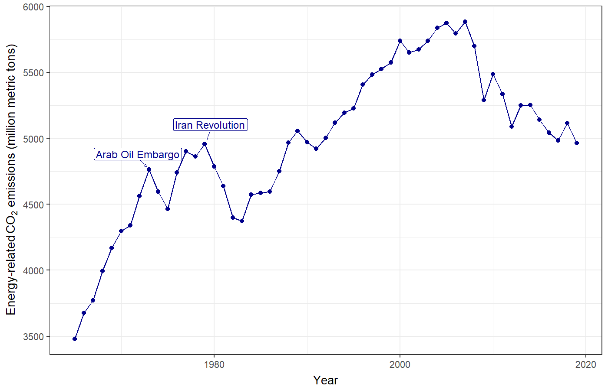
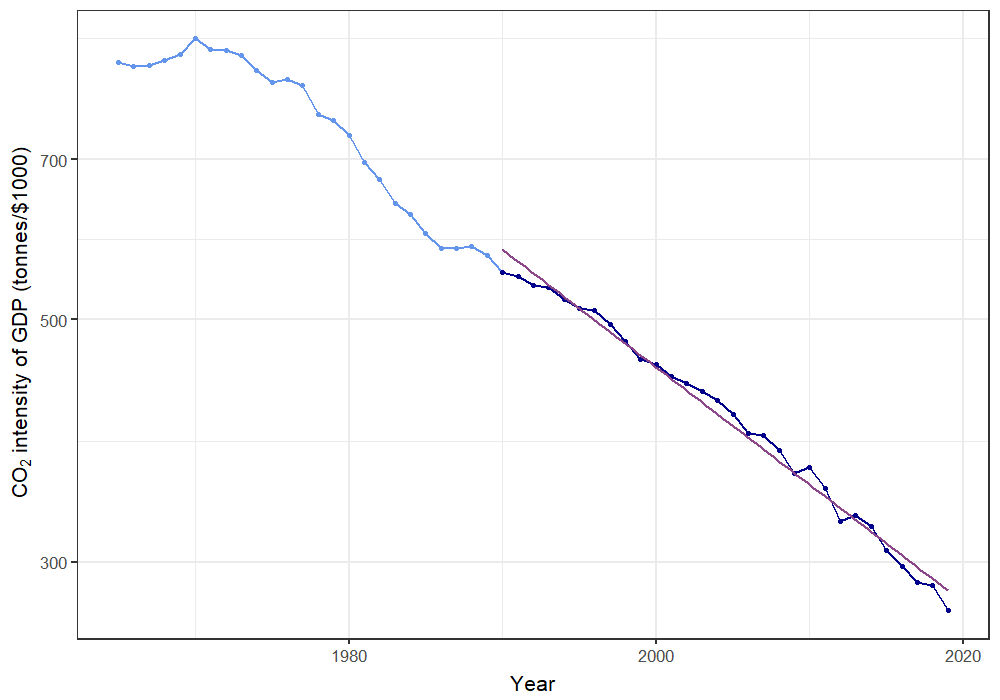
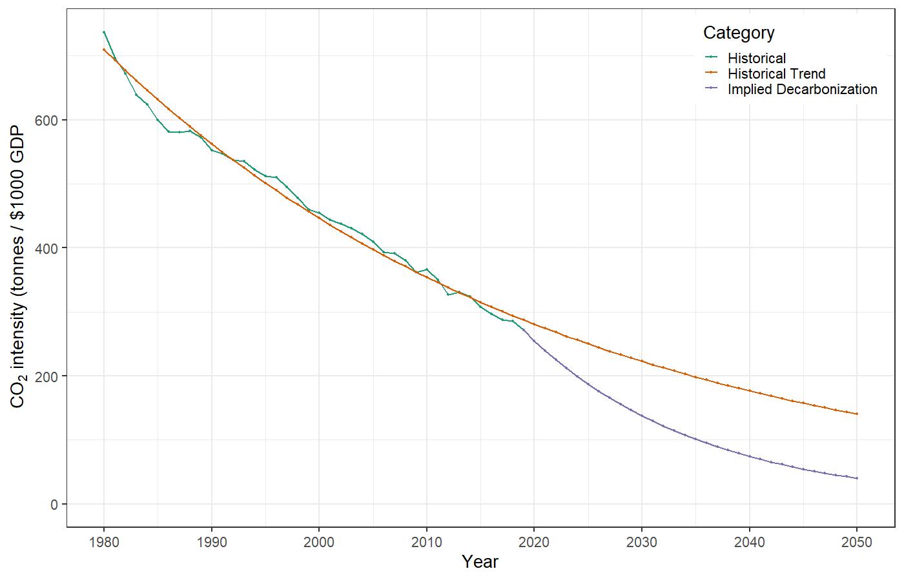
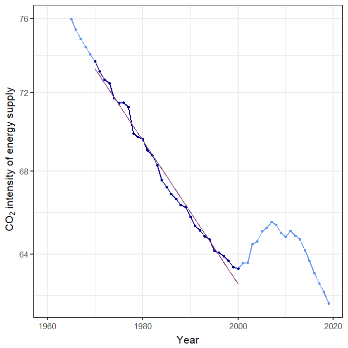

# Challenges of Decarbonization {#challenges .center}

## Challenges of Decarbonization {#challenges-outline}

* How hard will it be to reduce CO~2~ emissions?
  * {+} Nordhaus:
    * What technology can replace fossil fuels?
    * What policies can stimulate innovation, investment, production, purchase of clean technology?
  * {+} Pielke:
    * The biggest challenge is cost: $RE < C$
    * Make clean technology cheaper than fossil fuels and the problem is solved.

## Perspective: US CO~2~ Emissions {#us-emissions .ninety}

## Rate of Decarbonization {#decarbonization-rate .ninety}

::: {.eighty}

* {+} 2009 policy goal: US emissions 83% less than 2005 by 2050
* {+} _ef_ must drop by 6.2% per year
* {+} Actual rate has been about 2.3% per 
>   year

:::

## Implied Decarbonization {#implied-decarbonization}

## Cost of Decarbonization {#decarb-cost .eightyfive}

::: {.credit .bare}
Lazard: 
[_Levelized Cost of Energy and Levelized Cost of Storage 2020_](https://www.lazard.com/perspective/levelized-cost-of-energy-and-levelized-cost-of-storage-2020/) 
report.
:::

# Pielke's Views {#pielke .center}

## Tax on death? {#death-tax}

* What do you think of Pielke's argument?

::::::{.fragment .bare .mtop-3}
{style="height:800px;"}

:::{.credit}
Image credit: [Brandon Merritt, West Virginia Center on Budget & Policy](https://wvpolicy.org/raising-the-tobacco-tax-for-health-and-wealth/)
:::
::::::

## Challenge of decarbonizing {#challenge}

::: {.seventy style="margin:0;position:relative;top:-2rem;"} 
* {+} Trend in _e_ (1980--present): -0.9% per year.
* {+} Trend in _f_ (1970--2000): -0.5% per year.
  * {+} Trend reversed in 2000, but rapid decrease since around 2008.
* {+} So far: Decarbonization driven much more by efficiency than clean energy.
* {+} Rebound: greater efficiency &rarr; more consumption.
:::

## Energy Poverty {#energy-poverty .eighty}

::::::{.bare .mtop-3}
{height=750}

:::{.credit}
Photo credit: [Rebecca Blackwell, Associated Press](https://thelede.blogs.nytimes.com/2007/07/20/squinting-at-the-future-in-an-airport-parking-lot/)
:::
::::::

* {+} 1.1 billion people (17% of planet) lack access to electricity
* {+} Over 3 billion (38%) lack clean cooking facilities
* {+} In many nations in Africa and Asia 80--95% of the population is energy-poor.

:::{.notes}
Students walk for miles to read and study by the lights at the airport parking lot in Conakry Guinea.
:::

# Nordhaus's Perspective {#nordhaus-sec .center}

## Innovation {#innovation-pv}

::::::{.bare .mtop-3}
{style="height:900px;"}

:::{.credit}
Source: Paul Maycock, [Bloomberg New Energy Finance](https://www.climateinvestmentfunds.org/sites/cif_enc/files/knowledge-documents/bnef_2019-10-30_isa-cif_report-final_002.pdf)
:::
::::::

::: {.fragment style="position:relative;top:-54rem;font-size:60%;width:35%;left:46%;color:darkblue;background:white;"}
* Price has dropped from $80/Watt in 1976 to $0.22/Watt in 2019.
* Dropped 99.7% (a factor of 360) in 43 years
:::

## Innovation Policy {#innovation-policy .eighty}

::::::::::::{.columns}
:::::::::{.column}
* {+1} Knowing price of CO~2~ will rise provides incentive to invest in R&D
* {+2} Valley of Death:
  * {+3} Technology looks promising in laboratory
  * {+4} Potential for big profits
  * {+5} Many years, lots of money to turn laboratory device into product
    * {+6} Product development might fail
    * {+7} Product might not sell
    * {+8} Competitors might copy product
    * {+9} Valley of death
  * {+10} Double externality
    1. Inventors don't get all the value of their inventions
    2. Polluters don't pay the costs of pollution
  * {+11} Government support to cross valley of death
:::::::::
:::::::::{.column .ptop-3}
::::::{.bare .fragment fragment-index="2"}
{style="width:900px;"}

:::{.credit}
Image: Osawa & Miyazaki, Asian Journal of Technology Innovation **14**, 93 (2006) doi: [10.1080/19761597.2006.9668620](https://doi.org/10.1080/19761597.2006.9668620)
:::
::::::
:::::::::
::::::::::::

# Pielke's Policy Proposal {#pielke-policy-sec .center}

## Pielke's Policy Proposal: {#pielke-proposal}

* {+} Competition within government
* {+} Public-works model
* {+} Demonstration projects
* {+} Government as consumer of energy innovations
  * Federal government is the largest consumer of energy in the U.S.
    * 350,000 buildings
    * 600,000 vehicles
* {+} $5/ton carbon tax ($0.04 per gallon gas)
  * invest in clean-energy R&D
* {+} Monitor progress
* {+} Develop "plan B" (geoengineering)

## Obliquity {#obliquity .center}

* Appeal to people who don't care about climate change
  * Cheaper energy
  * Reduce pollution (smog, etc.)
  * Reduce dependence on foreign oil
